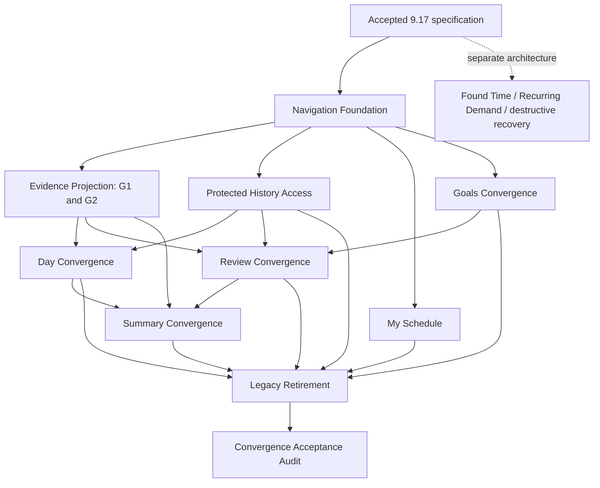

# Task 9.17 — Planner / Summary Product Convergence & Mobile UX Specification V1 — RESULT

Status: COMPLETE (specification and audit only)

Audit date: 2026-09-20

## 1. Executive Summary

**PRODUCT DESIGN DECISION:** Converge on two primary destinations: **Planner** for operating a schedule and **Summary** for understanding it. Planner opens the current canonical day; Calendar, My Schedule, Goals, and Review Plan are subordinate destinations. Today becomes a shortcut to the same Day Worksurface. This is a specification, not an implemented migration.

**REPOSITORY EVIDENCE:** Existing commands support constructive planning, correction, explicit publication, execution, and independent measured Progress. Useful controls are distributed across Month, contextual planning settings, Review Schedule/Preview, Today, and Summary. General Sleep editing and Goal Structure authoring lack ordinary product entry points. General historical reporting exists as an unmounted component. Found Time is not an established end-to-end capture workflow.

**PRODUCT DESIGN DECISION:** Begin with a bounded navigation/layout foundation that preserves existing mounts and lazy boundaries. No new canonical read model is required to start that compatibility shell. A selected-day evidence projection is required before the Day Worksurface replaces Today/selected-day semantics. HistoricalPlan recovery can occur during the bounded **Protected History Access** slice, before historical workflow convergence is accepted; it need not block shell scaffolding. Neither shell scaffolding nor a renamed tab closes the recovery gap.

**REPOSITORY EVIDENCE:** Build, bundle policy, 49 relevant UI tests, and whitespace validation pass. Current initial gzip remains **168,185 / 170,000 bytes**, leaving **1,815 bytes**. Disposable browser observations at 320, 390, 768, and 1280 CSS px establish substantial navigation/scroll burden, not a universal overflow defect. Only this RESULT is added.

## 2. Scope and Governing Architecture

**ACCEPTED ARCHITECTURE:** The architecture charter and Complete Architecture Specification govern semantic ownership. Tasks 9.10–9.16 establish first-class Sleep intent, derivation, feasibility, planning, correction, publication, execution, history, and explicit legacy conversion. This product specification must consume those owners without redefining them. Teach/Plan/Live/Learn remain responsibility boundaries, not four required tabs.

Evidence labels apply to every paragraph/table under a labeled introduction until another label appears. **REPOSITORY EVIDENCE** means current source, test, or command evidence; **DOGFOOD EVIDENCE** means the preserved report, not independently reproduced incident truth; **ACCEPTED ARCHITECTURE** means accepted domain constraints; **PRODUCT DESIGN DECISION** means proposed behavior; **DEFERRED** means intentionally outside implementation scope; **UNKNOWN** means evidence does not establish the answer.

**REPOSITORY EVIDENCE — source register** (paths relative to this RESULT; cited E numbers throughout):

| ID | Evidence and scope |
|---|---|
| E1 | [DayFrameApp.tsx](../../../code/src/ui/DayFrameApp.tsx), [PlannerSurface.tsx](../../../code/src/ui/PlannerSurface.tsx): primary tabs, mode mounts, manual editor, profiles, backup/recovery, component-local navigation |
| E2 | [MonthlyPlannerSurface.tsx](../../../code/src/ui/MonthlyPlannerSurface.tsx), [queryMonthlyPlanner.ts](../../../code/src/core/monthlyPlanner/queryMonthlyPlanner.ts), [DayVisualizer.tsx](../../../code/src/ui/DayVisualizer.tsx): date grid, selected day, current evidence limitations |
| E3 | [SetupScreen.tsx](../../../code/src/ui/SetupScreen.tsx), [CommitmentSection.tsx](../../../code/src/ui/CommitmentSection.tsx), [setupDraft.ts](../../../code/src/ui/setupDraft.ts): scoped setup draft, advanced fields, lifecycle commits |
| E4 | [GoalSection.tsx](../../../code/src/ui/GoalSection.tsx), [GoalPlanningSection.tsx](../../../code/src/ui/GoalPlanningSection.tsx), [constructivePlanningWorkflow.ts](../../../code/src/state/constructivePlanningWorkflow.ts): ordinary Goal and planning paths |
| E5 | [goal.ts](../../../code/src/core/goals/goal.ts), [goalStructure.ts](../../../code/src/core/planning/goalStructure.ts), [goalDemand.ts](../../../code/src/core/planning/goalDemand.ts), [goalFeasibility.ts](../../../code/src/core/planning/goalFeasibility.ts): exact Goal/Structure/Demand semantics |
| E6 | [ScheduleReviewPanel.tsx](../../../code/src/ui/ScheduleReviewPanel.tsx), [PlanningReviewPanel.tsx](../../../code/src/ui/PlanningReviewPanel.tsx), [planningScopeQuery.ts](../../../code/src/state/planningScopeQuery.ts), [publicationEligibility.ts](../../../code/src/state/publicationEligibility.ts): review, coverage, shared readiness |
| E7 | [PreviewScreen.tsx](../../../code/src/ui/PreviewScreen.tsx), [acceptedDecisionPresentation.ts](../../../code/src/ui/acceptedDecisionPresentation.ts): Friction, grouped corrections, Try/Accept, decision inspection/removal, holiday annotation |
| E8 | [TodaySurface.tsx](../../../code/src/ui/TodaySurface.tsx), [todayQuery.ts](../../../code/src/state/todayQuery.ts), [HistoricalPlanReportingSection.tsx](../../../code/src/ui/HistoricalPlanReportingSection.tsx), [ExecutionReportControl.tsx](../../../code/src/ui/ExecutionReportControl.tsx): publication-based reporting |
| E9 | [HistoricalIntelligenceSummary.tsx](../../../code/src/ui/HistoricalIntelligenceSummary.tsx), [GoalActivitySummary.tsx](../../../code/src/ui/GoalActivitySummary.tsx), [GoalProgressSummary.tsx](../../../code/src/ui/GoalProgressSummary.tsx): retrospective projections and seven-civil-day initial window |
| E10 | [GoalMeasurementSection.tsx](../../../code/src/ui/GoalMeasurementSection.tsx), [GoalProgressReportingSection.tsx](../../../code/src/ui/GoalProgressReportingSection.tsx): independent measurement and observation commands |
| E11 | [dayFrameStore.ts](../../../code/src/state/dayFrameStore.ts), [types.ts](../../../code/src/state/types.ts), [capacitySurface.ts](../../../code/src/state/capacitySurface.ts): store facades, Sleep authoring, canonical Capacity |
| E12 | [historicalPlanSurface.ts](../../../code/src/state/historicalPlanSurface.ts), [schedulePublication.ts](../../../code/src/state/schedulePublication.ts): immutable publication, commit certainty, protected-source operations |
| E13 | [SleepHistorySection.tsx](../../../code/src/ui/SleepHistorySection.tsx), [sleepHistoryQuery.ts](../../../code/src/state/sleepHistoryQuery.ts), [sleepExecutionCommand.ts](../../../code/src/state/sleepExecutionCommand.ts): Sleep reporting/history |
| E14 | [LegacySleepConversionSection.tsx](../../../code/src/ui/LegacySleepConversionSection.tsx), [legacySleepConversion.ts](../../../code/src/core/sleep/legacySleepConversion.ts): explicit reviewed conversion |
| E15 | [dayFrameUi.css](../../../code/src/ui/dayFrameUi.css), [package.json](../../../code/package.json), [check-bundle.mjs](../../../code/scripts/check-bundle.mjs): responsive rules, tooling, bundle gate |
| E16 | [Task 9.8C RESULT](TASK_9.8C_POST_DOGFOOD_PRODUCT_REACHABILITY_AUDIT_RESULT.md), [Task 9.9 RESULT](TASK_9.9_PRE_MIGRATION_CORRECTNESS_AUTHORITY_CONVERGENCE_V1_RESULT.md): incident qualifications and correctness convergence |
| E17 | [Task 9.16 RESULT](TASK_9.16_FIRST_CLASS_SLEEP_LEGACY_CONVERSION_PRODUCT_TRANSITION_V1_RESULT.md), [Sleep ADR](../../adr/ADR_FIRST_CLASS_SLEEP_DOMAIN_AND_PERSISTENCE_FOUNDATION.md): Sleep transition and predecessor validation |
| E18 | [Charter](../../architecture/ARCHITECTURE_CHARTER.md), [Complete specification](../../architecture/DAYFRAME_COMPLETE_ARCHITECTURE_SPECIFICATION_v1.0.0.md): governing authority |
| E19 | [Dogfood PDF](../../../DayFrame_Dogfood_Pass_02_Findings_Hydration.pdf): 78 older findings; corrected 9.8C incident descriptions take precedence |
| E20 | This audit's build, tests, baseline comparison, isolated DOM measurements and eight visually inspected screenshots, documented in §§96,108–111 |

No routing package, engine, persistence schema, source component, dependency, or architectural owner is changed.

## 3. Pre-Audit Repository State

**REPOSITORY EVIDENCE:** Baseline HEAD is `c0cc9ae2ae68af626e64747539a417f10df1cf3a`. The working tree was already extensively dirty: tracked engine/state/UI/architecture modifications, untracked first-class Sleep implementation and tests, Task 9.8–9.16 specifications/results, the dogfood PDF, and the supplied in-repository Task 9.17 specification. These are inputs, not this task's changes.

Before writing this RESULT, a SHA-256 inventory captured **930 tracked/untracked, nonignored files**. Exact baseline status and HEAD are in `/tmp/dayframe-917-baseline/status.txt` and `head.txt`; hashes are in `hashes.json`. Ignored build output is excluded from source accounting. No AGENTS.md was found in the repository search. The audit does not commit, reset, stash, restore, or normalize any prior work. End-of-task hash comparison, rather than the aggregate dirty diff, identifies this task's sole addition.

## 4. Current Primary Navigation Audit

**REPOSITORY EVIDENCE (E1):** The primary navigation is Planner / Today / Summary. Planner has Month, Commitment Library, Work Pattern, Review Schedule, and Goals and planning. Goals opens the Month contextual planning workspace; it is a real global Planner entry but remains coupled to Planning Settings. Profile, backup/import, local-clear, durability, and protected active/profile controls occupy a prominent shared shell region.

`currentScreen`, `plannerMode`, `monthPlanWorkspace`, selected preview range, pending Friction target, and `preservedMonthView` are React state. There is no current route contract for browser-addressable Goal/day/history targets. The app already preserves some Month context; claiming every return resets the calendar would be false. The target must replace scattered navigation orchestration without moving it into domain persistence.

## 5. Current Product Surface Inventory

**REPOSITORY EVIDENCE:** The complete major-surface inventory and exact one-per-row dispositions are in §76; current mount paths and authority families are cross-indexed in §§77–80. It includes shared administration, Month and selected day, Day Visualizer, contextual Daily Workspace, four Setup scopes, ordinary and advanced Commitment editors, both Work modes, conversion, Goals, measurement/Progress, Goal planning, both review panels, Preview correction/detail, accepted decisions, Today, Summary subviews, and implemented but unmounted historical/execution components.

First-class Sleep authoring, Goal Structure authoring, Capacity overview, Found Time capture, and protected HistoricalPlan recovery are separately identified as command-only or absent product surfaces. This distinction prevents a tested component or callable API from being mistaken for an ordinary navigation path.

## 6. Current Capability Inventory

**REPOSITORY EVIDENCE:** Existing capabilities divide into authored intent (Work, Commitments, manual Events, Goals, measurements, finite Goal Demand), planning evaluation/decisions/realization, immutable publication, outcome reporting, and retrospective projections. Setup/profile persistence, backup/restore, durability feedback, and protection are capabilities too, even though they should not dominate ordinary navigation.

§77 is the capability preservation ledger, independent of component names. It assigns current and target reachability, mobile paths, owners, migration slices, and parity evidence. Missing product capabilities are labeled; none is assumed to be supplied merely by merging screens.

## 7. Current Authority / Read Model Consumption

**REPOSITORY EVIDENCE (E2,E6,E8,E9,E11–14):** Month projects authored/manual and available generated evidence; Planning Review distinguishes derived schedule, realized facts, accepted liabilities, Proposals, and publication coverage. Its `derivedSchedule` union is Work/Commitment; the Month “sleep” classification is legacy `category === "sleep"`, not proof of first-class Sleep timeline coverage. Today consumes immutable publication plus execution; Summary consumes historical intelligence, Goal activity/Progress, and separate Sleep history. Capacity derives through the planning foundation when supplied; its compatibility fallback to Preview is not the current product architecture to copy.

**ACCEPTED ARCHITECTURE:** First-class Sleep is not an ordinary scheduled block. Publication, actual Sleep, current Sleep intent, and accepted placement have separate authority. The consumption matrix in §79 prohibits flattening them into one editable “event.”

## 8. Current Action / Command Reachability

**REPOSITORY EVIDENCE (E1,E4,E6–14):** Reachable commands include setup save/generate, manual Event lifecycle mutations, Goal lifecycle/linking, finite Demand authoring/evaluation, Proposal accept/reject and realization retry, SuggestedFix Try and PlanDecision acceptance/removal, explicit publication, Today execution, Goal measurement/observation reporting, Sleep actual reporting, conversion, backup/import/profiles, and local clear.

Unreached through ordinary production mounts: generic historical date reporting, dedicated execution-history/summary components, general Sleep requirement authoring, Goal Structure commands, and HistoricalPlan protected-source export/recheck/abandonment. `exportProtectedSource` and `recheckProtectedSource` read/compare evidence; recheck does **not** repair or unlock it. `abandonProtectedHistoricalPlan` clears history after verifying the protected source is unchanged. These are not three equivalent recovery buttons. See §80 for command-level contracts.

## 9. Current Mobile UX Audit

**REPOSITORY EVIDENCE (E15,E20):** At 320/390/768/1280 px the sampled fresh-state pages had no document-level horizontal overflow. Phone navigation occupies large stacked cards before useful content; at 320 px Goals plus Planning Settings measured 5,188 px total document height, Month 3,652 px, and Summary 4,105 px. These are selected states, not timing/performance benchmarks. Later-width Planner samples retained the Goals workspace, so their heights are not comparable with the first clean Month sample.

The app has responsive grids and real touch buttons; it is not desktop-only. Remaining risks include global advanced expansion, long mapped lists, raw-minute fields, a large read-only day timeline, and operational controls in Summary. The hidden unplanned-Sleep action measured 24 px high when inspected in DOM; closed disclosure geometry is a risk signal, not a physical touch test. §95 separates confirmed observations from untested keyboard/overlay risks.

## 10. Current Accessibility Audit

**REPOSITORY EVIDENCE (E2,E3,E6,E8,E15):** Existing positives include named navigation, pressed states, labeled forms, Month grid/row/column semantics, keyboard day navigation, focusable selected-day headings, loading/status announcements, and disclosure buttons. Month does not require double-click. Source inspection found no required hover-only workflow in the audited major components.

**UNKNOWN:** This audit does not certify screen-reader output, contrast ratios, zoom/reflow across all populated states, native mobile keyboard behavior, or dialog focus containment. Repeated verbose live regions and nested context headings merit testing rather than an unsupported accessibility pass. §§70,107 define acceptance evidence; responsive fitting alone is insufficient.

## 11. Current Architecture-Language Audit

**REPOSITORY EVIDENCE (E1,E6–9):** `PlanningReviewPanel` renders “Canonical planning review,” “Selected-day planning truth,” and exclusive-end ranges. Review exposes planning-data/Preview coverage and generated/Try distinctions. Summary uses “Scheduling realization” and authoritative plan-history explanations. Today describes the published current user-day. These can preserve correct information while burdening ordinary use.

**PRODUCT DESIGN DECISION:** “Canonical,” “truth,” and storage-authority terminology belong in technical details, not section titles. “Proposal” is acceptable with a short explanation; “Commitment,” “Goal,” “Sleep,” and “Progress” are useful product concepts. “Generated” may explain a refresh, but should not be the primary category of a normal activity. The full vocabulary and classification matrix is §90; internal identifiers remain unchanged.

## 12. Dogfood Finding Reconciliation

**DOGFOOD EVIDENCE (E19):** The 78 PDF findings describe the earlier product. **REPOSITORY EVIDENCE (E16,E17):** 9.8B/C, 9.9, and 9.10–9.16 materially changed that baseline. The following reconciliation covers every numbered PDF finding; exact incident closure is not inferred from later passing tests.

| PDF findings | Current reconciliation | Target / disposition |
|---|---|---|
| 1–4 | Work-relative physical-footprint and corrective safety regressions addressed in 9.9; original incident configurations unavailable | Preserve current engine boundaries; UNKNOWN original root cause |
| 5–9 | Both repeating sequences and dated segments remain supported; boundary/week overrides are not equivalent across modes | My Schedule Work Pattern; rotation helpers are bounded interaction work |
| 10–12 | “Baseline Sleep Commitment” recommendation superseded by accepted first-class Sleep architecture | First-class Sleep editor; explicit legacy conversion only |
| 13–16 | Commitment duration remains raw minutes; selected editor exists, global advanced fields remain | Human duration and per-item complete editing |
| 17–19 | Planner Goals entry and hours/minutes Goal planning now exist; Goal Structure UI still absent | Dedicated Goals destination, Structure authoring slice |
| 20–21 | Goal target date is optional; planning Demand has a finite horizon, no repeating Demand rule | Keep undated Goals; defer new ongoing/recurring planning semantics |
| 22–25 | Constructive path is now mounted and exercised by tests; Capacity overview remains missing | Preserve evaluate/Proposal/accept/realize; add Summary Capacity |
| 26 | “Plan” remains overloaded | Explicit vocabulary, §73 |
| 27–28 | Correction entry and grouped Friction exist; bulk acceptance is not established | Review Plan attention and per-occurrence command flow |
| 29–33 | Manual Goal linking exists in Goal detail; Event editor has no equivalent selector; no automatic duration-to-Progress bridge | Defer true Found Time capture contract; expose lawful manual association separately |
| 34–38 | Durable outcomes and Summary work; generic past-day reporting component is not mounted | Reuse reporting in Day Worksurface, maintain immutable targets |
| 39–41 | Summary metrics expand evidence; current default is seven civil days | Clear drill-down affordance, bounded lists, canonical-day default |
| 42–46 | Missing and protected publication are distinct; Today and selected day remain separate | Quiet true-empty attention; explicit unavailable states; shared day surface |
| 47–51 | Month selection/manual Events work without Preview; complete selected-day reporting and Found Time do not | Continuous calendar; logging-only support within actual authority |
| 52 | Static Preview holiday annotations exist; no external calendar import established | Preserve static facts, defer ingestion architecture |
| 53–56 | Range controls/large Preview tower remain; initial fixture showed May 4–6 while browsing September | Contextual range, Month navigation, retire tower only after parity |
| 57–61 | Architecture-heavy vocabulary remains in mounted components | Vocabulary matrix and technical-detail disclosure |
| 62–69 | Three primary destinations and duplicated Planner entries remain; Goals entry exists but embeds settings | Two-surface navigation, My Schedule, reusable day and direct Goals |
| 70–71 | Some attention is already conditional; long lists persist | Omit known-empty noise; group, filter, paginate evidence |
| 72–78 | Existing persistence, deterministic derivation, outcomes, Summary, Friction, independent Events and Month are foundations | Preserve with regression and capability parity, not replacement logic |

**DOGFOOD EVIDENCE:** Corrected 9.8C adds beforeWork problems across shifts, approximately 18 Night Shift **afterWork** failures, 11 Sleep boundary failures, October 2/16 transitions, apparent realized-work displacement, and HistoricalPlan protection. **UNKNOWN:** The original profile/build/raw incident state is not available here for causal replay. 9.9 fixes and first-class Sleep invariants do not prove the precise incident diagnosis. Preserve these qualifications through migration.

## 13. Target Product Mental Model

**PRODUCT DESIGN DECISION:** Planner answers “What happens, when, and what can I change?” Summary answers “What has happened, what room do I have, and how are my Goals going?” The same Goal/day can be opened from either, but operational edits return to Planner with originating Summary context preserved. A small utilities entry houses profiles, backup/restore, and recovery; it is not a third primary product destination.

The default launch is Planner/current canonical day with a compact month control. Calendar is always navigable. A badge distinguishes Published schedule from Unpublished changes; the product never relies on the user understanding an internal evidence class to avoid an unsafe action.

## 14. Planner Responsibility

**PRODUCT DESIGN DECISION:** Planner owns navigation and workflow composition: Calendar/Day, My Schedule (Work Pattern, Sleep, Commitments), Goals, and Review Plan. Day Add offers the supported manual Event workflow and unplanned Sleep reporting; Found Time is added only after its capture contract gate. Attention links carry day, subject, and review context. Planner owns neither interval generation nor readiness calculation nor historical truth.

A compact header exposes current date, Today, Calendar, Add, and a contextual Review entry. My Schedule and Goals are explicit destinations, not hidden under one day's advanced settings. Do not render every destination's editor below the calendar.

## 15. Summary Responsibility

**PRODUCT DESIGN DECISION:** Summary presents Capacity, Goals, accepted planning, Progress, History, and meaningful attention/recommendations. It leads with a bounded overview and explicit coverage. Drill-downs preserve Goal/day/evidence identity. “Edit Goal,” “Resolve conflict,” and “Record outcome” open Planner at the relevant context. Reading more history stays in Summary.

**ACCEPTED ARCHITECTURE:** Measured Progress, scheduled intent, execution outcomes, and Sleep actuals are not interchangeable metrics. A missing report is unknown actual behavior; unavailable Capacity is not zero available minutes. No new recommendation engine or AI advice is implied.

## 16. Day Worksurface Specification

**PRODUCT DESIGN DECISION:** Define one reusable Day Worksurface keyed by canonical owner-day label, with an independently supplied evaluation instant and selected publication identity where relevant. Header: human date, Today/Past/Future, compact actual day interval, active Work cycle/transition when meaningful, and evidence/coverage status. Body: agenda first; optional visual timeline; item detail; compact attention. Footer/context actions: Add, report, review, or edit subject as lawful.

Include Work, first-class required Sleep, Commitments, realized Goal work and executable support, protected buffers as non-executable context, manual Events, execution outcomes, and Friction. Separate published schedule from unpublished changes rather than silently replacing historical geometry. Pending Proposals and accepted-but-unrealized intent belong in planning detail, not fake scheduled cards. Found Time has an explicitly gated future place.

**REPOSITORY EVIDENCE:** Current SelectedDayWorkspace, PlanningReviewPanel, TodaySurface, and HistoricalPlanReportingSection supply complementary behavior, not a ready-made interchangeable read model. Required projection gap G1 is specified in §82.

## 17. Past-Day Mode

**PRODUCT DESIGN DECISION:** Past-day default shows immutable published schedule and reported outcomes as known at the selected history cutoff. Calendar → date → item → Record outcome / Change outcome / Remove report is the ordinary path. Select superseded publication evidence only through labeled historical detail; report subjects retain the exact lawful publication identity. A current setup edit cannot rewrite the past card.

If no publication exists, say “No published schedule for this day”; authored manual facts can remain visible in a separate labeled layer. If protected, retain the date and show recovery access. Do not generate a backdated Preview to manufacture an execution target. Past manual-event editing changes authored calendar data, not already published snapshots or past execution.

## 18. Current-Day Mode

**PRODUCT DESIGN DECISION:** Current-day mode resolves Today using the canonical day resolver at the actual evaluation instant, not civil midnight. Published items show outcome actions and existing time groupings; unpublished changes show Review, not Complete. Manual facts without publication remain independently visible. Required Sleep detail explains planned Sleep versus reported actual Sleep and protected buffers.

Updating the clock may refresh the current-day shortcut; it must not unexpectedly move a user browsing a different date or editing a form. At a day boundary, offer the new Today context without discarding a draft. Existing execution commands decide eligibility and reject invalid future actual times.

## 19. Future-Day Mode

**PRODUCT DESIGN DECISION:** Future-day mode supports inspection, authored Event changes, Goal links, My Schedule contextual edits, planning review, and explicit publication. It may show an existing published schedule alongside newer unpublished changes. Hide inapplicable execution shortcuts; do not allow the presentation to infer an outcome for future work. Show which part of the date is beyond planning coverage without blocking navigation.

A selected future month does not mutate a planning horizon. “Plan this period” opens an explicit range review; it does not generate or publish on a calendar tap.

## 20. Today Convergence

**PRODUCT DESIGN DECISION:** Retire Today as a primary tab only after the shared day surface supports its full published-item and Sleep reporting behavior, protection states, corrections/retractions, canonical orientation, and accessibility. During transition Today is a compatibility entry to its existing consumer. After parity, all Today shortcuts resolve the current canonical day and open Planner/Day.

**ACCEPTED ARCHITECTURE:** Do not replace Today query's evaluation timestamp with a fake timestamp representing an arbitrary past day; that changes both day resolution and what history/outcomes are knowable. G1 accepts selected day separately from real as-of.

## 21. Calendar Specification

**PRODUCT DESIGN DECISION:** Calendar is date navigation independent of Preview. It works with no generation, stale generation, partial/outside coverage, publication, and execution history. Tap/click selects a day with an explicit accessible Open day action where layout requires it; keyboard provides the same transition. Today returns to current canonical day. Navigating months does not write authored state or compute every day's complete schedule.

Preserve distinct scopes: displayed Calendar month; PlanningDataHorizon for available planning inputs; ProposalHorizon for a particular finite planning request; ReviewScope for inspecting evidence; Preview generation range; PublicationRange for an explicit immutable write. User labels may be simpler, but adapters must preserve inclusivity/exclusivity and typed owners.

## 22. Month Specification

**PRODUCT DESIGN DECISION:** Month retains stable weekday columns, Previous month / Next month / Today, a selected-date state, and sparse indicators for Work, items, attention, and evidence availability. Cell labels include date and meaningful counts; do not compress a schedule timeline or a row of operation buttons into each cell. Use a text legend for status, not color alone.

On phones, selecting a date opens or scrolls to one agenda, with a clear Back to calendar context. On tablet/desktop, calendar and selected day may share columns. Month remains a bounded grid even when browsing years. Static existing holiday annotations can move into calendar details without inventing external calendar ownership.

## 23. Canonical Day Orientation

**PRODUCT DESIGN DECISION:** Show “Sunday, Sep 20 · Today” and, when nonmidnight or overnight context matters, a compact interval such as “Day runs noon–noon next day.” Obtain exact boundaries from the canonical resolver or frozen published timing, as appropriate. Overnight Work/Sleep labels include the next civil date; item clipping is a view operation, not a new owner.

**ACCEPTED ARCHITECTURE:** DST days need not be 24 elapsed hours. Do not calculate owner labels by slicing ISO dates, shift day windows by a fixed 24-hour duration, or infer historical boundaries from today's settings. Show a clear interval-unavailable state if required timing context cannot be established.

## 24. Cycle / Transition Presentation

**REPOSITORY EVIDENCE (E3,E16):** Work supports repeating sequences and manual dated segments. Manual segments can override boundary/week start; repeating entries do not provide equivalent segment overrides. Effective resolution falls back to global scheduling preferences.

**PRODUCT DESIGN DECISION:** Present one Work Pattern concept with explicit “Repeating rotation” and “Dated periods” modes preserving both meanings. Show cycle name, start/end, applicable shift/off day, effective boundary/week start, and a compact transition marker when these change. Keep month columns stable while showing “Night cycle begins; work week starts Sunday.” Do not infer missing holidays, transition rules, or automatic bridging Work.

## 25. My Schedule Specification

**PRODUCT DESIGN DECISION:** My Schedule is a list of three summaries: Work Pattern, Sleep, Commitments. Each opens a focused editor page; the parent summarizes enabled intent and meaningful attention. Planning period is adjacent to Work Pattern as a link to Review range settings. Advanced technical detail belongs inside the relevant object.

Saving intent preserves existing lifecycle/revision/incarnation rules and marks derived planning stale where the canonical command does so. It does not automatically generate, accept, or publish. General app utilities and protected-history access remain separate from routine schedule teaching.

## 26. Work Pattern Product Specification

**PRODUCT DESIGN DECISION:** Work Pattern starts with “Repeating rotation” or “Dated work periods,” shared shift definitions, and an effective-date summary. Repeating authoring should support runs of shift/off days and repeat/copy previews as pure draft operations over existing entries; show resulting sequence length and start date before save. Dated segments expose their actual ranges and overlap/validity errors. Do not silently convert one mode into the other.

**DEFERRED:** New overlapping-cycle precedence, recurrence expressiveness, or inferred transition semantics require architecture work. Bulk draft helpers are permissible only if they produce already valid canonical data; otherwise the slice must expose current entry editing faithfully.

## 27. Day Boundary Product Placement

**PRODUCT DESIGN DECISION:** Place Day boundary and Week starts on in Work Pattern's visible schedule-orientation section. Show global default and effective segment override separately; allow “Use default” only where the domain supports it. Explain “Your DayFrame day starts at…” with a concrete overnight example. Link from a day header to the applicable configuration without requiring advanced-field discovery.

Saving a boundary change affects future/current derivation under existing rules; it does not relabel immutable published history or recorded actual owner-day identity. Planning Range can be nearby without being represented as part of boundary authority.

## 28. Sleep Product Specification

**REPOSITORY EVIDENCE (E11,E13,E14):** General `authorSleepRequirement`/`deleteSleepRequirement` exist, but no ordinary create/edit form is mounted. Conversion is mounted in Commitment Library/full Setup; Today and Summary provide actual Sleep reporting. These are three different workflows.

**PRODUCT DESIGN DECISION:** My Schedule → Sleep summarizes required duration, before/after protection, weekdays, effective dates, and clock-window or Work-relative rule with off-day fallback. Open a dedicated hours/minutes editor using existing revisioned intent. Show accepted-placement review and typed infeasible/search-incomplete/protected context separately. Save invokes the canonical author command; removal requires explicit impact confirmation, never silent reduction to optional Commitment priority.

Legacy Sleep candidates appear as an optional “Convert older Sleep setup” action leading to the existing review → explicit cutover → confirm workflow. Preserve strict future cutover, lineage, unsupported-case explanations, and retained history. A converted source must not be recreated as a second ordinary Sleep authority. Conversion and recovery stay lazy.

## 29. Commitment Product Specification

**PRODUCT DESIGN DECISION:** Commitments describes recurring obligations distinct from Goals and first-class Sleep. List title, human duration, recurrence, enabled state and important placement constraint. One Commitment opens one complete editor. Show essential title, duration, recurrence, placement and enabled state first; keep required placement distinctions visible. Advanced detail includes buffers, priority, pin/resource/composition fields where currently supported.

Preserve template and recurrence lifetime pairing, shared-template relationships, enabled flags, Work-relative conditions, and existing unsupported advanced values. Do not drop an advanced value because the simplified form cannot edit it. Historical legacy Sleep Commitments remain identifiable as legacy; do not relabel old snapshots as first-class Sleep.

## 30. Commitment Authoring / Editing UX

**PRODUCT DESIGN DECISION:** Add opens a full-page phone form, focused on title. Choose duration in hours/minutes, recurrence with selected weekdays or the actual advanced recurrence type, placement with clear labels, and buffers when needed. Save shows validation next to affected fields and keeps the draft on failure. Advanced options expand for this item only. Back asks about a dirty local draft; Cancel never invokes an authority command.

**REPOSITORY EVIDENCE (E3):** The bounded CommitmentSection already edits one item; global Advanced Commitment Fields still exposes collections. Migration must merge the supported field union, not replace the existing bounded editor with a more limited form. Delete is separated from Save, names the object and scope, and retains existing lifecycle guards; published history is not deleted as a side effect.

## 31. Human Time / Duration Input Specification

**PRODUCT DESIGN DECISION:** Use hours/minutes for activity duration, buffers, Sleep duration, Goal effort, and elapsed actual time where appropriate. Preserve canonical integer minutes. Keep editable text locally until commit/blur to avoid destroying partial input. Normalize nonnegative minute overflow: 8 h 60 m → 9 h 0 m; decrementing total 8 h 0 m by one minute → 7 h 59 m. Reject negative totals, fractional values where unsupported, NaN, and domain-limit violations; do not silently clamp.

Native clock/time inputs express wall time, date inputs owner/civil dates as explicitly labeled, and elapsed-duration fields physical minutes. Numeric inputs request a suitable numeric keyboard; text titles remain text. Show normalized values before authoritative submission. Do not coerce an empty field to zero. Sleep actual timezone/fold ambiguity must preserve existing timestamp/offset validation rather than guess from planned geometry.

## 32. Recurrence UX Specification

**PRODUCT DESIGN DECISION:** Reuse visual patterns, not semantic recurrence objects. Work rotation means a dated repeating shift sequence or dated segments. Commitment recurrence preserves its existing frequency, start/end and conditions. Sleep has effective revisions and applicable weekdays plus a placement rule. Goal Demand has a finite horizon and session cadence; it is not a Commitment recurrence.

For weekday sets provide labeled, pressed-state day controls and shortcuts Every day / Weekdays / Weekends as explicit draft set changes. Summarize “Mon, Wed, Fri” in text. More complex legacy recurrence remains visible as supported advanced data; no automatic conversion to weekday sets. Recurring Goal Demand is deferred.

## 33. Goals Product Specification

**PRODUCT DESIGN DECISION:** Planner → Goals lists active Goals first with search/status filters, Add Goal, detail, and archived/completed disclosure. Detail separates Outcome, Planning intent, Structure, Scheduled work, and recorded Progress. Create the Goal outcome first; planning intent is a subsequent explicit save/evaluation step, preserving separate owners and failure handling. A Goal can exist without a target date or Demand.

Goal detail supports edit, complete, archive, reactivate, supporting-item links, measurement setup and value reporting. Summary links to this editor for operational changes. A scheduled Goal card opens the same Goal context; Goal access is no longer contingent on Daily Workspace or generated Preview.

## 34. Goal Structure Product Specification

**REPOSITORY EVIDENCE (E5,E11):** Structure supports `contains`, `contributesTo`, and `dependsOn` relationships, Goal/milestone targets, required/optional containment, nonaggregating contributions, dependency eligibility, and manually satisfied milestones. Surface commands create/revise/retire relationships and create/revise milestones; ordinary Structure authoring is not mounted.

**PRODUCT DESIGN DECISION:** Goal → Structure presents children and milestones first, with advanced contribution/dependency relationships explained explicitly. Use canonical validation for cycles, targets, revisions, and eligibility. A child is not automatically a recurring task; completing a child does not invent numeric parent Progress. Show blocked planning dependencies using existing eligibility output. This is a bounded reachability slice, not a new decomposition engine.

## 35. Goal Planning Intent Vocabulary

**PRODUCT DESIGN DECISION:** “Plan work toward this Goal” names Demand authoring. Fields read “Total effort,” “Planning period,” “Session length,” “Number of sessions” when applicable, “Priority,” and “Allow a smaller plan” only where the actual satisfaction policy permits. Explain support activities and protected buffers when editing a resource footprint.

Outcome describes what the Goal means; planning intent requests time; accepted planning commits to an offered option; scheduled work is realized placement; Progress is measured evidence. Keep these as separate panels and explicit steps, including when one operation fails after another succeeds.

## 36. Goal Effort UX

**REPOSITORY EVIDENCE (E4,E5):** GoalPlanningSection already has hours/minutes, finite dates, total/session-count cadence, splittable/indivisible session shape and satisfaction choices. Its current minute control has a 59 maximum; a consistent normalization contract is still useful across forms.

**PRODUCT DESIGN DECISION:** 10 h and 20 h total effort are direct minute representations. “5 sessions × 1 hour” can faithfully represent a finite Demand with requested effort 300 minutes, sessionCount 5, and splittable minimum/preferred/maximum 60 minutes (with an appropriate existing satisfaction policy). It must not use one indivisible 300-minute session or imply a weekly repeat rule. Present the derived total and validate the exact combination through current feasibility semantics. Infeasible placement remains an honest outcome, not a promise to schedule five sessions.

## 37. Ongoing / Recurring Goal Limitations

**REPOSITORY EVIDENCE (E5):** `GoalV1.targetDate` is optional and status can remain active. Thus an undated persistent Goal is representable today. `GoalDemandIntentV1` requires a bounded user-day interval; cadence is total or sessionCount, not a weekly/monthly renewal rule.

**DEFERRED:** Automatically renewed effort, rolling recurring Demand, carryover, credit across iterations, and ongoing planning policy require explicit architecture. Do not simulate infinity with a distant date or duplicate Commitments. The UI may support an undated Goal with an explicitly finite planning request; label the boundary clearly. This is more precise than declaring all “ongoing Goals” unsupported.

## 38. Scheduled Goal Work Presentation

**PRODUCT DESIGN DECISION:** A scheduled Goal work card shows activity/Goal title, actual scheduled start/end, “Part of [Goal],” accepted planning iteration/date, current versus retained/superseded context, publication state, and outcome status. Primary detail actions: View Goal, Adjust planning (navigates to review), and subject-eligible Complete / Partial / Didn't do it. Support activities have their own executable role; protected buffers are labeled time protection and never reportable work.

Use immutable snapshot lineage for historical cards and durable realized-fact lineage for current planning. A card may clip visually to the day while detail shows the complete original interval. Do not expose raw allocation IDs as the explanation.

## 39. Goal Planning Provenance Presentation

**PRODUCT DESIGN DECISION:** Describe lineage as “From the planning option accepted on [date]” with Goal title and period; distinguish “Accepted, scheduling incomplete,” “Scheduled,” and “Earlier accepted planning.” Advanced detail may show exact Proposal/accepted-allocation/realized-fact/publication references for diagnosis.

**ACCEPTED ARCHITECTURE:** Editing Demand does not retroactively relabel retained realized facts as belonging to the new request. Supersession and applicability must come from canonical records/review output. UI must not infer currentness from matching titles or interval equality. G2 in §82 covers a canonical lineage presentation projection before the new aggregate Summary claims these distinctions.

## 40. Found Time Specification

**PRODUCT DESIGN DECISION:** Found Time means unexpected actual activity invested in a Goal, not a constructive Proposal, generic future manual Event, or automatic measured Progress. Intended eventual path: Day → Add → Found Time → Goal → actual start/duration and notes → review provenance → explicit record → inspect activity; optional measured-value reporting is separate.

**REPOSITORY EVIDENCE (E1,E5,E8,E10,E16):** Existing adjacent mechanisms are manual Event authoring, Goal link commands, published planned-target execution, and manual quantity observations. Goal linking alone neither publishes the Event nor records an unscheduled actual session nor credits Progress. No complete Found Time capture command/UI contract was established.

**DEFERRED:** Enable that Found Time action only after a bounded architecture task defines durable actual identity, owner day, Goal association snapshot, corrections/retractions, history and optional measurement attribution. During convergence provide “Add event” and independent “Record Goal value” with accurate descriptions; do not pass them off as implemented Found Time. Unplanned Sleep is already a distinct lawful subject and is not a generic Found Time substitute.

## 41. Manual Event Specification

**PRODUCT DESIGN DECISION:** Day → Add event opens a date-context form for title and existing all-day/timed semantics. Save/change/delete calls `mutateManualEvent`, preserving source incarnation. Delete is confirmed by named item; it changes authored calendar data, never existing historical snapshots. Show stale planning and review implications separately.

Goal association can reuse `linkCommitment` with manualEvent source identity, but event save and Goal-link save are distinct commands: report partial success honestly and allow retry without duplicate Event creation. Published provenance is frozen at publication. Past Event authoring does not become actual reporting; future Event authoring does not become Found Time. Keep these distinctions visible in the editor and its confirmation.

## 42. Execution Reporting Specification

**ACCEPTED ARCHITECTURE / PRODUCT DESIGN DECISION:** Use a common visible action family—Complete, Partial, Didn't do it—only for eligible subjects. Published Work, Commitments, manual Events and realized Goal/support work retain existing target materialization and generic execution validation. First-class published Sleep uses `recordSleepExecution`; unplanned Sleep uses its own subject. Protected buffers are excluded.

Show planned time and actual report separately. Sleep completed/partial requires explicit actual start and elapsed duration; planned Sleep duration must never be copied into actual evidence automatically. Skipped planned Sleep does not invent actual time. Corrections and retractions append evidence against the current head and retain original publication identity. A stale head, unavailable history or protected execution source blocks the dependent write with a specific explanation.

## 43. After-the-Fact Reporting

**PRODUCT DESIGN DECISION:** Calendar → past day → published item → Report outcome; if already reported, Change outcome / Remove report. Open a focused form, keep date/subject visible, submit to the existing subject-specific command, refresh the canonical outcome, and return focus to the originating card. Sleep history uses the retained batch/snapshot target and actual-time rules.

**REPOSITORY EVIDENCE (E8):** HistoricalPlanReportingSection already reads a selected publication day and materializes generic targets; no production shell mount exists. It can be reused after G1 supplies coherent date/as-of/evidence selection. Do not simply mount every old panel below Month; one day surface must coordinate the evidence labels and reporting eligibility.

## 44. Review Plan Specification

**PRODUCT DESIGN DECISION:** Review Plan is a contextual page for an explicit period. Order: readiness and critical blockers; available constructive options; accepted planning/scheduling status; conflicts and corrective decisions; publication review. Preserve all current ScheduleReviewPanel and Preview command capabilities. A default selected-day/week review can expand to a custom period, but the displayed publication range must always be explicit.

Pending Proposals are offers, not automatically publication blockers; unrealized accepted liabilities are a different state. Try results are not publishable accepted authority. Review labels explain these differences without dumping raw policy enums. Loading/unavailable state cannot briefly flash “Ready.”

## 45. Constructive Planning Presentation

**PRODUCT DESIGN DECISION:** Goal planning evaluation produces a result with typed reasons and, where available, a recorded Proposal. Review shows the Goal, requested/possible effort, dates, session/support/buffer effects, alternatives, and explicit Accept / Reject. Accept revalidates current dependencies; distinguish acceptance saved from realization completed. If realization fails, retain the acceptance and offer the lawful realization retry instead of accepting again.

After successful realization, show scheduled work and the next explicit Generate/Review/Publish steps as required by existing orchestration. No offer, accepted allocation, or realized fact is itself a publication or a Progress observation.

## 46. Corrective Planning Presentation

**PRODUCT DESIGN DECISION:** Needs attention → conflict → explanation of affected subject/interval → Suggested correction → Try → inspect result → Accept. Keep Try clearly provisional; abandonment of the screen does not imply acceptance. A setup or dependency change invalidates a stale candidate and requires a fresh Try/review. Accepted decisions retain inspect/remove/retry-durability behavior where lawful.

First-class Sleep placement correction preserves duration and buffers, accepted proof and applicability review. It cannot offer omit, shorten, or waive protection as cosmetic alternatives. Constructive Proposal decisions and corrective PlanDecisions remain different commands and identities under the same Review Plan destination.

## 47. Planning Readiness Presentation

**REPOSITORY EVIDENCE (E6):** `publicationBlockers` includes incomplete planning coverage, missing/stale/range-mismatched Preview, unresolved Friction, unrealized accepted allocation, protected/unavailable historical authority, Try Preview, and materialization failure. Sleep foundation has satisfied/notConfigured/notApplicable, infeasible, searchIncomplete, invalid/protected/contextIncomplete distinctions. They cannot all become “No time.”

**PRODUCT DESIGN DECISION:** Hierarchy: “Ready to publish” only on canonical eligibility; “Needs attention” for actionable conflicts/placement review; “Planning incomplete” for missing coverage, refresh or realization; “History unavailable—publication paused” for protected/unverified history. Multiple blockers remain available as a short grouped list. Warnings and pending offers are distinguishable from blockers. Render canonical codes through a copy adapter; never reimplement policy in React.

## 48. Publication UX

**PRODUCT DESIGN DECISION:** Publish lives at the end of Review Plan, with a compact persistent action only after the reviewed range and blockers are visible. Immediately before submission show inclusive human date range, current source freshness, unresolved warnings, accepted work/required Sleep coverage, and that publication records an immutable schedule for reporting. A deliberate Publish action is sufficient confirmation; avoid a second generic “Are you sure?” that adds no information.

Command submission carries the source fingerprint and fresh timestamp/range. On source change, rereview. On known precommit failure, preserve the draft and allow the appropriate retry. On verification failure after commit or uncertain commit, say the schedule may already be saved, pause republishing, and open history status/recovery. Success refreshes the published Day Worksurface. Save and Generate never silently publish.

## 49. Preview Retirement Plan

**PRODUCT DESIGN DECISION — Preview capability disposition:**

| Existing capability (E7) | Replacement / gate |
|---|---|
| Date tower and selected range navigation | Calendar and explicit Review scope; retire tower only after keyboard/touch parity |
| Work/Commitment/manual schedule detail and read-only visualizer | Day agenda/detail; optional timeline |
| Add/Edit Event, Edit Commitment, Edit Work | Contextual Day → existing owner editor |
| Unplaced/attention, grouped repeated Friction, severity counts and filters | Review Plan attention groups with per-occurrence detail |
| SuggestedFix Try and explicit acceptance | Corrective review, unchanged commands |
| Accepted decision status, removal and durability retry | Review Plan → Accepted corrections |
| Generation feedback, stale/range warnings, no-Preview state | Single contextual review status and appropriate refresh action |
| Static holiday annotations | Calendar/day informational facts; preserve local helper |
| Raw provenance/debug detail | Optional technical details; not a primary navigator |

No useful command is designated obsolete. Only duplicate navigation/presentation is retired. Keep the lazy Preview compatibility mount until every ledger row passes; a renamed route alone is insufficient.

## 50. Planning Range Product Placement

**PRODUCT DESIGN DECISION:** Put planning-period controls in Review Plan and a contextual link in Work Pattern. Default to a bounded period derived through existing scope APIs; explain “Plan work for these dates.” Show advanced coverage/horizon detail on demand. Month navigation remains independent and can offer an explicit “Review this period” transition.

Adapters must convert the legacy inclusive Preview end to exclusive domain ranges using existing helpers; display inclusive human endpoints. Do not merge PlanningDataHorizon, ProposalHorizon, ReviewScope and PublicationRange merely because a single current form happens to give them similar dates. The old short initial range requires explanatory UX, not a hidden automatic change on navigation.

## 51. Friction / Needs-Attention Presentation

**PRODUCT DESIGN DECISION:** “Needs attention” is the broad entry; “Schedule conflict” names actual incompatibility. Not every unknown/protected/coverage state is a conflict. A compact count opens groups with affected item, date, reason, and available next action. Known zero conflicts removes the panel; protected or incomplete knowledge keeps a concise explicit status.

A day links directly to its subject/conflict in Review Plan. If the referenced Friction no longer exists, explain that the schedule changed and show the current review—never accept a stale suggestion using the old visible index.

## 52. Repeated-Friction Mobile Strategy

**PRODUCT DESIGN DECISION:** For many similar conflicts, group by canonical kind, source and offered remedy, with count and date span. Open one occurrence by default, filter dates/subjects, and reveal more on demand. Editing the underlying Commitment/Sleep/Work rule is a separate authored operation followed by regeneration/review.

**REPOSITORY EVIDENCE (E7):** Preview already has grouped pattern disclosures, but also renders per-day detail; the problem is excessive simultaneous presentation, not total absence of grouping. **DEFERRED:** No new bulk acceptance command. “Review similar” may navigate occurrences; each accepted correction must retain the existing Friction → SuggestedFix → Try → PlanDecision validation and explicit user authority.

## 53. Summary Capacity Specification

**PRODUCT DESIGN DECISION:** Summary Capacity shows the selected bounded period, available time, protected/unavailable time, and coverage certainty using `queryCapacity`/foundation outputs. Drill-down shows daily intervals and why they are unavailable. Do not sum overlapping protected intervals inside UI; consume canonical totals/interval classifications. Infeasible Sleep, search-incomplete, protected authority and incomplete context must remain distinct.

**REPOSITORY EVIDENCE (E11):** A canonical Capacity surface exists but no full Summary overview is mounted. Reuse it rather than subtracting visible calendar cards from 24 hours. Operational links open the relevant Work/Sleep/Commitment/Goal in Planner. Capacity is prospective derived knowledge, not historical actual availability or Goal Progress.

## 54. Summary Goals Specification

**PRODUCT DESIGN DECISION:** Summary Goals displays measured Progress where configured, scheduled work, recorded activity and incomplete planning as separately labeled facts. Start with active Goals and filters; expose completed/archived Goals by choice. Selecting a Goal opens its reflective drill-down with measurement scope, history coverage and provenance.

An unmeasured Goal says “No measurement configured,” not “0% complete.” “Edit Goal” opens Planner/Goals with a return context. Do not invent risk scores; show concrete existing facts such as unrealized accepted work or unmet requested effort.

## 55. Summary Allocations Specification

**PRODUCT DESIGN DECISION:** Summarize accepted planning by Goal and period: current accepted request, scheduled amount, unrealized accepted intent, and earlier accepted planning. Expand to sessions and support/protection detail only on request. Keep durable accepted IDs/revisions behind human-readable lineage.

**REPOSITORY EVIDENCE (E6,E11):** Existing review covers actionable Proposals, accepted liabilities and realized facts; a complete current/superseded lineage overview is not established by simply concatenating those lists. G2 supplies that bounded projection before the new Summary asserts currentness or supersession. No chronological guess based on display order is acceptable.

## 56. Summary Progress Specification

**PRODUCT DESIGN DECISION:** Progress overview shows the current measurement definition, latest effective measured value, target/unit, observation date and coverage; detail reveals observation history/corrections/retractions. Execution outcomes and time spent remain separate activity evidence. Existing manual quantity reporting expects cumulative measured values; label “Current measured value,” not “Add this session,” unless a future policy defines increment semantics.

Measurement setup/revision/restart/stop and observation create/correct/retract remain reachable in Planner Goal detail. Summary can link there with return context. Sleep actual duration and completed Goal work must never silently increase measured Goal Progress.

## 57. Summary History Specification

**REPOSITORY EVIDENCE (E9):** Current Summary defaults to today plus the preceding six civil dates. It already has bounded date inputs, coverage, realization/outcome details, Goal activity/Progress and Sleep history; it is not an absent history engine.

**PRODUCT DESIGN DECISION:** Default to the last seven canonical owner days ending at current canonical day, with explicit dates and Today marked partial where applicable. This uses existing bounded range capability without inventing a new week metric. Offer “This work week” only through effective week-start resolution; retain custom ranges. Historical `asOf` is explicit in advanced detail. Multi-year navigation loads bounded windows, not all history on mount.

## 58. Summary Recommendations / Attention Specification

**REPOSITORY EVIDENCE:** The audited Summary has retrospective projections; no general recommendation engine or AI recommendation workflow was established. Current Friction and readiness are operational attention, not learned advice.

**PRODUCT DESIGN DECISION:** Omit the Recommendations section when there is no meaningful supported recommendation. Display actionable existing attention summaries only with provenance and a link to Planner. Unknown/protected evidence remains visible independently; it cannot disappear because recommendations are empty. No LLM response acquires scheduling authority.

## 59. Empty-State Discipline

**PRODUCT DESIGN DECISION:** Known absence should reduce UI. Hide zero-conflict panels; use one compact “Nothing scheduled” only when coverage proves it; show onboarding for no Goals/Commitments/Sleep setup; distinguish “No reports yet” from “No published schedule.” Loading, protected and incomplete states always retain explicit information. The complete matrix is §93.

Do not repeat the same missing-coverage warning in Month, day, review and a global banner simultaneously. Keep the most local explanation and a concise shared status link where useful.

## 60. Progressive Disclosure Strategy

**PRODUCT DESIGN DECISION:** Default hierarchy is summary → affected group → single item → provenance. Goal sessions, Friction occurrences, historical evidence and conversion source JSON expand only when requested. Source/authority diagnostic text stays available for troubleshooting. Required semantic choices—such as Work-relative Sleep off-day behavior or explicit publication—must not be hidden under “Advanced.”

Current violations include simultaneous Month/selected-day/planning truth, Goals plus full planning preferences, shared administrative panels, per-day Preview towers and global advanced Commitment collections. Migration removes duplication only after preserving the useful actions.

## 61. Mobile Information Density Strategy

**PRODUCT DESIGN DECISION:** Phone defaults use an agenda list, compact calendar cells, concise Goal/Commitment rows and grouped attention. A row leads to one detail page; do not place every input and audit field inside every list card. Counts and filters precede expansion. Use wrapping text with meaningful labels; do not ellipsize the only conflict reason or confirmation scope.

One page owns vertical scrolling. Avoid fixed-height nested panes on phones. Desktop can show side-by-side panels but must retain the phone's sequence and actions. Density is measured by useful information and decision burden, not merely fitting all columns.

## 62. Touch Interaction Strategy

**PRODUCT DESIGN DECISION:** Primary touch controls use the established button family with practical hit area and separation validated on narrow phones; no new arbitrary CSS token is mandated here. Tiny adjacent Accept/Reject/Delete controls fail the gate even if technically clickable. Destructive actions live in a separate section or confirmation step and name their subject.

Tap, keyboard Enter/Space, and clear text actions cover every required operation. Swipes, hover and double-click can enhance navigation only when equivalent visible controls exist. Native disclosure summaries need the same practical target treatment as buttons.

## 63. One-Handed Workflow Strategy

**PRODUCT DESIGN DECISION:** Prioritize Today, Calendar, Add and contextual item outcome actions for frequent one-handed use. Day detail places its next action near the current item; editors keep Save reachable; Review can keep its explicit final Publish action in a bounded footer. Rare destructive administration stays out of that action region.

Persistent controls reserve layout space, respect safe areas and keyboard/zoom changes, and never cover the final agenda row, validation text, or a confirmation button. Do not make every navigation item sticky or duplicate authoritative actions at both ends with inconsistent state.

## 64. Mobile Form Strategy

**PRODUCT DESIGN DECISION:** Forms use one column on phones, visible labels, appropriate native text/date/time/numeric controls, human durations and grouped fieldsets. Essential choices precede optional details. Preserve draft values while validation fails; show an error summary linked to affected fields plus local explanations. Include object name and recovery action.

Save/Cancel remains reachable with the virtual keyboard. Long Work/Goal/conversion forms are pages, not cramped modal bodies. A successful Goal save followed by failed Demand save is reported as partial workflow completion, preserving both identities. Forms do not fabricate transactions across independent stores.

## 65. Mobile Overlay / Dialog Strategy

**PRODUCT DESIGN DECISION:** Use inline disclosure for small explanatory details; a short sheet for choosing Add action; a focused page/full-screen mobile editor for Work, Sleep, Commitment, Goal planning, publication review, conversion and recovery. Use a dialog for a short consequential confirmation, with title, consequence, Cancel and an explicit action name.

Dialogs trap focus while open, support Escape where safe, restore focus on close, and remain usable with keyboard/zoom. Closing a pending authoritative operation does not cancel its durable commit; surface the eventual result and refresh. Desktop may use a side panel but must not alter command semantics.

## 66. Navigation / Back Behavior

**PRODUCT DESIGN DECISION:** Planner → Day returns to the same month/date; Goal returns to its list or originating day; My Schedule editor returns to the same object list; Review detail returns to the same scope/group; Summary drill-down returns to the same range/filter. Browser Back and visible Back follow the same semantic stack.

Dirty local forms offer Stay / Discard draft; no automatic save. After a submitted command, Back preserves its outcome and refreshes affected projections. Internal destination changes carry validated identifiers, not component DOM selectors. A missing/deleted target yields a contextual not-found message and parent link.

## 67. Planner Context Preservation

**PRODUCT DESIGN DECISION:** Session navigation retains selected day, displayed month, Goal/object selection, review scope, Summary range/filter, expanded item and sensible scroll/focus return. Context survives ordinary internal navigation; a reload can recover URL-addressable destinations without turning ephemeral state into authority.

Drafts remain local to a controlled editing session and are not serialized into URLs. Derived query output is refreshed against current sources after return. Never restore a prior “Ready” flag, Try candidate, accepted decision or stale source fingerprint merely because the navigation stack retained it.

## 68. Desktop Enhancement Strategy

**PRODUCT DESIGN DECISION:** At larger widths allow Calendar + Day side by side, a contextual inspector, wider Summary comparisons, and more visible provenance columns. Keyboard shortcuts may navigate Today/month/items after basic keyboard parity exists. Use the same forms and commands, not a separate desktop workflow.

No essential operation depends on a right-hand panel, hover tooltip, drag interaction or double-click. Phone users can inspect the same original interval, publication version, Goal lineage and failure reason through detail.

## 69. Responsive Equivalence

**PRODUCT DESIGN DECISION:** Validate narrow 320–360 px, typical 390–430 px, tablet 768 px, and desktop ≥1024 px; this audit sampled 320/390/768/1280. §89 specifies capability-by-capability equivalents. Phones use sequential pages, tablet may pair overview/detail, desktop may enrich visible metadata. All use the same authority owners and typed commands.

A flow that works at 390 but overflows at 320 is not complete. A responsive card with an unavailable critical action is not parity. Touch, keyboard, state recovery, and explanation quality are separate checks.

## 70. Accessibility Requirements

**PRODUCT DESIGN DECISION:** Require semantic heading order and landmarks, programmatic names for calendar cells and icons, explicit form labels, grouped controls, visible focus, predictable focus after navigation, and errors associated through accessible descriptions. Status must use text as well as color. Announce asynchronous completion succinctly without rereading entire changing lists.

Respect reduced-motion preferences if transitions are introduced. Keep native keyboard behavior and logical tab order. Calendar grid navigation must remain usable without pointer input. Long detail pages need a meaningful title and return focus target. Touch size does not replace contrast, screen-reader, reflow and keyboard validation.

## 71. Error Presentation Strategy

**PRODUCT DESIGN DECISION:** Translate typed failures into object + condition + next action. Example: “Workout cannot fit before this shift with its buffers. Edit its timing or review another correction.” Preserve source-specific uncertainty: “Sleep placement search did not finish” differs from “No permitted Sleep placement was found.”

Keep user-entered data on validation failure. Do not show stack traces or raw storage payloads by default. On uncertain durable results, do not claim failure or encourage duplicate writes; refresh/recheck the authoritative state. §92 specifies the required conditions and recovery actions.

## 72. User-Facing Vocabulary

**PRODUCT DESIGN DECISION:** Primary vocabulary: My Schedule, Work Pattern, Sleep, Commitments, Goals, Calendar, Day, Review Plan, Needs attention, Published schedule, Progress and Available time. “DayFrame day” receives one concise explanation near nonmidnight orientation. “Found Time” is reserved for actual Goal activity once its capture semantics exist.

Technical vocabulary remains valid in documentation and optional provenance. §90 contains the internal→user mapping, location, explanation and classification. Do not globally replace code strings or rename domain types to achieve copy convergence.

## 73. Plan Terminology Decision

**PRODUCT DESIGN DECISION:** **Planning** is the process of requesting/evaluating time. A **planning option** (Proposal) is an offer awaiting a decision. **Accepted planning** means the selected option is saved, possibly still awaiting scheduling. A **draft schedule** is current unpublished derived placement; **published schedule** is the immutable record used for reporting. **Review Plan** is a workflow destination, not a new stored “Plan” object.

Use bare “plan” sparingly where context is unambiguous. Do not label accepted allocation “published plan,” label a Try preview “accepted,” or label a manual Event “realized Goal work.” Dates/ranges and state badges disambiguate the ordinary journey.

## 74. Protected / Unknown State Presentation

**PRODUCT DESIGN DECISION:** Protected: “Saved history cannot be read safely. It has been preserved.” Unknown/unavailable: “We cannot determine the schedule for these dates yet.” Incomplete: “Some dates are outside the available planning data.” Pair each with a bounded next action. Disable dependent publication/reporting while retaining independent calendar browsing and lawful authored work.

**ACCEPTED ARCHITECTURE:** Never replace protected history with Preview, show unknown Capacity as zero, or render unavailable reports as “Didn't do it.” Non-destructive export may be available when backup is blocked; distinguish ordinary backup from raw protected-source evidence export.

## 75. HistoricalPlan Recovery Placement

**PRODUCT DESIGN DECISION:** Protected History Access is a lazy page reachable from Planner/Day protection, Review Plan publication blockage, Summary/History protection, and utilities. Show preserved-state status, safe source export, source recheck result and clear next guidance. Recheck compares evidence and does not promise automatic repair.

**DEFERRED:** Destructive abandonment requires an independently reviewed recovery contract accounting for published-Sleep execution references, retained history and dependent owners. Do not mount the raw clear-history command merely to make a button reachable. Export/recheck can be delivered before safe abandonment, with honest limits. Existing active/profile recovery is a different owner and must remain distinct.

## 76. Product Surface Disposition Matrix

**REPOSITORY EVIDENCE** in current-purpose/capability/problem columns; **PRODUCT DESIGN DECISION** in target/disposition/mobile columns. Locations refer to production mount paths in E1 unless explicitly unmounted. Each row has exactly one disposition. Split means capabilities intentionally go to multiple destinations; merge means one replacement consumes the useful union.

| Current Surface / location | Current Purpose | Useful Capabilities | Problems / evidence | Target Destination | Disposition | Mobile Notes |
|---|---|---|---|---|---|---|
| Primary shell / all screens | Navigation and shared status | Planner/Today/Summary, durability | Large stacked navigation and administration, E1/E20 | Planner/Summary shell + utilities | SPLIT | Compact primary navigation, context-aware back |
| Saved Setup Profiles / shared shell | Manage named setups | Save/load/delete, quarantine, retry | Dominates routine screen, E1 | Utilities → Setups | MOVE | List → detail; named destructive confirmation |
| Backup/import/local clear / shared shell | Transfer and reset | Complete V14 backup, supported imports, confirmed clear | Consequential actions beside common controls | Utilities → Data | MOVE | Dedicated page; preserve existing recovery guards |
| Active/profile protection panels / shared shell | Safe local recovery | Export/recheck/replace/abandon per owner | Technical and lengthy, E1 | Utilities with contextual protection entry | MOVE | Explicit consequences, no owner conflation |
| PlannerSurface mode header | Planner navigation | Month/Work/Commitments/Review/Goals entry | Too many duplicated peers | Planner section navigation | MERGE | Compact sections, no all-editor stack |
| MonthlyPlannerSurface | Browse/select calendar date | Arbitrary months, current day, keyboard grid, contextual edits | Includes settings/review below grid | Calendar + Day | SPLIT | Tap date; stable grid; single agenda |
| SelectedDayWorkspace / Month | Selected date agenda | Manual/Work/Commitment edits, attention links | Lacks full published outcomes/first-class Sleep evidence | Day Worksurface | MERGE | Agenda first, explicit evidence state |
| Manual Event editor / shared contextual panel | Author independent calendar facts | Create/edit/all-day or timed/delete with confirmation | Separate Goal association path; return flags spread across shell | Day → Event editor | MOVE | Focused form; retain date and command identity |
| DayVisualizer / Preview day detail | Read-only geometry | Timed overview and overlap context | Tall timeline; existing type union incomplete for new union | Optional Day timeline | MOVE | Agenda supplies equivalent text/actions |
| Daily/contextual workspace / Month | Planning/settings access | Back-to-day, Goal entry, setup scope | Goals mixed with planning preferences | Goals + My Schedule + Review settings | SPLIT | Focused destinations preserve originating day |
| SetupScreen full/planningSettings | Authored draft editing | Preferences, range, save/generate, validation | All-in-one scope and advanced collections | My Schedule + Review period | SPLIT | Save intent separately from generate |
| SetupScreen workPattern | Shift and cycle setup | Definitions, repeating sequences, dated segments, overrides | Long rotations/global expansion | My Schedule → Work Pattern | MOVE | One cycle/segment editor at a time |
| CommitmentSection / Library | Focused ordinary editor/list | Add/edit/remove recurrence-template pair, enabled/placement | Raw minutes; some advanced data separate | My Schedule → Commitments | MERGE | Complete one-item editor |
| Advanced Commitment Fields / Setup | Complete advanced setup | Buffers, priority, timing/resource and recurrence details | Global collection expansion | Per-Commitment advanced section | MERGE | Preserve fields, no global advanced tower |
| LegacySleepConversionSection / Library/full Setup | Explicit old-source conversion | Discover, review, cutover, confirm, protected reasons | Located under Commitments rather than Sleep | My Schedule → Sleep → Convert older setup | MOVE | Full page, explicit evidence review |
| General Sleep authoring / command-only | Revisioned required Sleep intent | Author/delete APIs | No ordinary editor, E11 | My Schedule → Sleep editor | MOVE | New adapter over current commands, not new domain |
| GoalSection / Goals and planning | Goal lifecycle and links | Create/edit/status/link, measurement/progress hosts | Embedded in Month settings | Planner → Goals | MOVE | List/detail, globally reachable |
| Goal Structure / command-only | Relationships/milestones | Existing Structure commands and eligibility | No mounted editor | Goal → Structure | MOVE | New bounded command adapter |
| GoalMeasurementSection / Goal detail | Measurement definition | Create/revise/restart/stop, history | Dense form within Goal detail | Goal → Measurement settings | MOVE | Explicit current definition and effect |
| GoalProgressReportingSection / Goal detail | Record measured values | Create/correct/retract, retry | Cumulative value can be mistaken for session increment | Goal → Record value | MOVE | Clear unit/value/date; separate actual activity |
| GoalPlanningSection / Goal detail | Finite planning intent/evaluation | Effort/session/priority/footprint/evaluate | Large parameter/result stack | Goal planning editor + Review offers | SPLIT | Essential choices then detail |
| PlanningReviewPanel / Month | Read-only mixed planning evidence | Evidence classes, coverage, selected-day filtering | “Truth” language, duplicate day listing | Day evidence + Review | MERGE | One canonical projection, no duplicate cards |
| ScheduleReviewPanel / Review Schedule | Offers/readiness/publication | Accept/reject, retry realization, publish | Raw coverage enums/exclusive dates | Review Plan | MERGE | Grouped blockers and explicit final action |
| ScheduledGoalFacts / review and day consumers | Realized role/provenance presentation | Goal/support/protection detail | Long fact lists | Goal work detail + accepted planning detail | MOVE | Summary then sessions/roles |
| PreviewScreen schedule/correction details / Review | Legacy date-based review | Friction, Try/Accept, decision status/removal/retry, static holidays, edits | Date tower and repeated details | Compatibility Review until replacements complete | TEMPORARILY RETAIN | Lazy; one migration interval, parity retirement |
| Preview date tower / within Preview | Date navigation | Range/day selection | Redundant with Month, long range pathology | Calendar + Review scope | RETIRE | Only after replacement navigation parity |
| Accepted-decision presentation / Preview | Inspect corrective authority | Applicability, remove/revoke, durability retry | Buried in old review | Review Plan → Accepted corrections | MOVE | Per-decision details and consequences |
| TodaySurface / primary Today | Current published schedule/outcomes | Generic/Sleep reporting, change/remove, protection | Separate destination from selected day | Day Worksurface current mode | MERGE | Keep compatibility entry until full parity |
| HistoricalPlanReportingSection / unmounted | Past published-item reporting | Date read/materialization and generic commands | Tested does not mean reachable | Day Worksurface past mode | MERGE | G1 and subject-specific adapters required |
| ExecutionHistoryPanel / unmounted | Execution evidence detail | History/quarantine/correction context | Not a shell route | Day report detail / History evidence | MERGE | Preserve evidence, avoid another primary screen |
| ExecutionSummarySection / unmounted | Aggregate execution view | Existing summary projection | Duplicates other reflective concepts | Summary outcomes | MERGE | Reuse useful query/presentation, not duplicate engine |
| HistoricalIntelligenceSummary / Summary | Historical overview | Coverage, realization, outcomes, filters | Long inline expansions, civil default | Summary overview + History detail | SPLIT | Bounded overview, deliberate drill-down |
| GoalActivitySummary / Summary | Goal-associated history | Goal selection, activity/provenance | Planner link lacks full target context | Summary → Goal history | MOVE | Carry Goal/day/evidence return state |
| GoalProgressSummary / Summary | Measurement projection | Progress/unknown/unconfigured distinctions | Needs hierarchy with activity | Summary → Goals/Progress | KEEP | Recompose, preserve read model |
| SleepHistorySection / Summary | Sleep history and actual entry | Planned/unplanned actuals, correction/retraction | Operational forms in reflective surface | Summary Sleep read view + Day reporting | SPLIT | Keep commands reachable until Day replacement |
| Capacity / state surface, no overview | Derived available/protected time | Canonical queries/foundation | No ordinary broad Summary view | Summary → Capacity | MOVE | New read-model consumer, not UI interval arithmetic |
| HistoricalPlan protected recovery / command-only | Protected source operations | Export/recheck; destructive abandonment | No ordinary path, destructive dependency risk | Protected History Access | MOVE | Safe access first; abandonment separately gated |
| Found Time capture / absent | Intended unexpected Goal activity | Adjacent manual/Goal/progress mechanisms only | No end-to-end semantic contract | Day → Add → Found Time after architecture | DEFER PENDING ARCHITECTURE | Do not enable misleading substitute |
| Ongoing/recurring Demand editor / absent | Intended renewing effort | Finite Demand and undated Goal only | No recurring Demand policy | Goal planning after architecture | DEFER PENDING ARCHITECTURE | Preserve current finite workflow |

Moving a command-only capability means a future adapter over an existing owner, not evidence of a current mount. No old surface is removed by this task.

## 77. Capability Preservation Ledger

**REPOSITORY EVIDENCE** in current reachability/owner columns; **PRODUCT DESIGN DECISION** in replacement, mobile and gate columns. Slice names are defined in §103. Conceptual depth counts start at the primary destination, not the number of clicks needed to scroll. “Absent” is not zero-depth reachability.

| Capability | Current reachability / depth | Target reachability / mobile path | Authority owner | Migration task | Required parity evidence before retirement |
|---|---|---|---|---|---|
| Browse month/select day/Today | Planner → Month → date, 1–2; no Preview required | Planner → Calendar → day; Today shortcut | Canonical day + Month query; navigation only | Navigation Foundation; Day Convergence | Month keyboard/touch, no/stale/outside Preview, return context |
| Inspect Work/Commitment/Event/day geometry | Month selected day or Preview, 2–3 | Day → item → detail; optional timeline | Authored + derived evidence, immutable history when published | Day Convergence | Same source/time/owner, full versus clipped interval |
| Add/edit/delete manual Event | Month day or Preview → editor, 2–3; generation unnecessary | Day → Add event / item → Edit | Active authored manual lifecycle | Day Convergence | Create/edit/delete/incarnation, confirm, published history unchanged |
| Associate Event/Commitment with Goal | Goals → Goal → supporting commitments, 3; reverse Event selector absent | Event → Goal link or Goal → supporting items | Goal links + authored source incarnation | Goals Convergence | Separate save/link failure, stale/missing source handling |
| Edit Work definitions/rotation/segments | Planner → Work Pattern → section, 2–3; advanced disclosures | My Schedule → Work Pattern → object | Authored setup/cycles | My Schedule | Both modes, overrides, overnight boundaries, lifecycle preservation |
| Edit day boundary/week start | Contextual Planning Settings; segment overrides in Work | My Schedule → Work Pattern → orientation | Scheduling preferences + existing overrides | My Schedule | Effective/default distinction, historical immutability |
| Edit planning/generation range | Goals/planning settings → Planning Range, 3 | Review Plan → Period; Work Pattern link | Authored range and explicit scope contracts | Review Convergence | Inclusive/exclusive conversion; no calendar side effect |
| Add/edit/remove Commitment and advanced fields | Library → item; global advanced fields, 2–3 | My Schedule → Commitments → one editor | Template/recurrence lifecycle + composition where supported | My Schedule | All existing fields retained; unknown advanced values preserved |
| Author/delete first-class Sleep | Store-only; no mounted form | My Schedule → Sleep → Edit | Revisioned SleepRequirement, Active owner | My Schedule | Create/revise/remove, effective date, protected/invalid rejection |
| Convert legacy Sleep | Library → candidate → review/confirm, 2–4 | My Schedule → Sleep → Convert older setup | Atomic ActiveV4 conversion lineage | My Schedule | Existing 9.16 conversion tests, strict cutover and idempotence |
| Create/edit/status Goal | Planner → Goals and planning → Goal, 2–3 | Planner → Goals → Add/detail | Goal authority | Goals Convergence | Lifecycle/revision/persistence, no target-date requirement |
| Author Goal Structure | Store-only | Goal → Structure → child/milestone/relationship | GoalStructure | Goals Convergence | Cycles, eligibility, revisions, no automatic Progress rollup |
| Configure/restart/stop measurement | Goal detail → measurement, 3 | Goal → Measurement settings | MeasurementDefinition | Goals Convergence | Units/target/restart semantics and retained observations |
| Record/correct/retract Progress value | Goal detail → reporting, 3 | Goal → Record value; Summary link | ProgressObservation | Goals Convergence | Cumulative value semantics, revisions/retractions, no execution credit |
| Author finite Demand/priority/footprint | Goal detail → Plan work, 3–4 | Goal → Planning intent | GoalPlanning + footprint owner | Goals Convergence | Effort/session/cadence/partial/support constraints round-trip |
| Evaluate Capacity/feasibility/competition/offer | Goal planning → Evaluate, 4 | Goal planning → Evaluate → Review option | Canonical planning queries + recorded Proposal | Goals / Review Convergence | ConstructivePlanningWorkflow test, typed no-offer explanations |
| Inspect/accept/reject Proposal | Review Schedule → option, 2–3; architecture language | Review Plan → Planning options → decide | ProposalDecision / AcceptedAllocation | Review Convergence | Fresh dependencies, explicit decision, no implicit publication |
| Inspect accepted work/retry realization | Review Schedule → accepted work, 2–3 | Review Plan → Accepted planning → retry | AcceptedAllocation + RealizedScheduleFact | Review Convergence | Acceptance survives realization failure; idempotent retry |
| Resolve Friction/Try/accept correction | Review/Preview → occurrence → suggestion, 3–4; Preview-dependent | Day attention → conflict → Try → Accept | Friction derived; SuggestedFix; PlanDecision | Review Convergence | Fresh Try, replay, physical buffers, separate constructive flow |
| Inspect/remove accepted correction/retry durability | Preview accepted decisions, 2–3 | Review Plan → Accepted corrections → detail | PlanDecision persistence | Review Convergence | Applicable/review-required/revoked states; rejection/durability |
| Generate/refresh draft schedule | Setup/Review, 1–3 | Review Plan → Refresh schedule | Derived Preview via engine | Review Convergence | No authority promotion; authored dirty-state guards |
| Explicitly publish | Review Schedule → readiness → Publish, 2–3 | Review Plan → final review → Publish | HistoricalPlan immutable batches | Review Convergence | Eligibility parity, fingerprint race, commit-certainty cases |
| Report planned generic outcome | Today → eligible item, 1–2; published plan required | Day → published item → outcome | ExecutionHistory | Day Convergence | Complete/partial/skipped, exact historical reference |
| Correct/retract generic outcome | Today → reported item, 2 | Past/current Day → item → report detail | ExecutionHistory append-only head | Day Convergence | Head conflict, correction/retraction persistence |
| Report generic past planned item | Component exists but unmounted | Calendar → past day → published item | HistoricalPlan + ExecutionHistory | Day Convergence | Real as-of separate from selected day; no Preview fallback |
| Report/correct/retract planned Sleep | Today or Summary Sleep history, 2–3 | Day → Sleep → report | PublishedSleep + Sleep execution command | Day Convergence | Explicit actual time, retained snapshot, correction lineage |
| Record unplanned Sleep | Summary → Sleep history disclosure, 2–3 | Day → Add → Actual Sleep | UnplannedSleep ExecutionHistory subject | Day Convergence | Frozen owner, explicit actual interval, no planned snapshot fabrication |
| Inspect Capacity overview | Canonical API/evaluation details; no full overview | Summary → Capacity → day | Canonical Capacity/foundation | Summary Convergence | Unknown vs zero, protected intervals, no React recomputation |
| Inspect Goal activity/Progress/history | Summary → Goal/details, 1–3 | Summary → Goals → Goal/history | GoalActivity/Progress/history queries | Summary Convergence | Independent measurements/outcomes, selected-context link |
| Inspect accepted planning lineage | Partial review/fact detail | Summary → Accepted planning → iteration | Proposal/accepted/realized lineage projection G2 | Evidence Projection; Summary | Current/superseded/retained provenance proven |
| Inspect published history/coverage/outcomes | Summary → metrics/disclosure, 1–3 | Summary → History → day/evidence | HistoricalIntelligence + HistoricalPlan | Summary Convergence | Bounded query, coverage gaps, superseded evidence |
| Static holidays | Preview generated-date annotation | Calendar/day detail | Existing static holiday helper | Day / Review Convergence | Facts stay informational; no external ingestion claim |
| Protected-history export/recheck | Store-only | Protection message → Protected History Access | HistoricalPlan physical evidence | Protected History Access | No mutation, changed/unreadable source states, no false unlock |
| Destructive historical abandonment | Store-only | Advanced recovery only after contract | HistoricalPlan + dependent authority safety | Recovery follow-up architecture | Explicit dependent-reference/backup/confirmation contract; deferred |
| Profiles/backup/import/clear and durability recovery | Shared shell, 1–3 | Utilities → Setups/Data/recovery | Existing per-owner persistence/coordinator | Navigation Foundation | Backup V14/legacy imports, profiles, clear guards, protected-source parity |
| Found Time | No established end-to-end command/path | Day → Add → Found Time only after gate | Not yet specified actual/Goal capture contract | Found Time Architecture (deferred) | Capture/correction/provenance and Progress policy before UI enablement |
| Recurring ongoing planning | No recurring Demand; Goal may be undated | Goal → finite planning now; recurrence later | GoalDemand bounded today | Recurring Demand Architecture (deferred) | Explicit renewal/carryover/lifecycle policy |

The tested but unmounted ExecutionHistoryPanel, ExecutionSummarySection and HistoricalPlanReportingSection are capability sources, not extra primary destinations. Their useful evidence/reporting features are accounted for above.

## 78. Target-Surface Responsibility Matrix

**PRODUCT DESIGN DECISION — target responsibilities:**

| Target Surface | User Question | Inputs | Actions | Must Not Own | Mobile Default |
|---|---|---|---|---|---|
| Planner | What needs doing today? | Navigation context; day/review status | Open date/Goal/setup/review | Domain state reconstruction | Current day + compact sections |
| Calendar | Which date do I want? | Month/date facts and bounded indicators | Navigate/select/Today | Planning horizon changes or full-month solving | Compact stable grid |
| Day Worksurface | What is scheduled and what happened? | G1, publication/execution, authored/derived layers | Subject detail, report, Add, contextual edit/review | Publication/actual inference | Agenda and evidence badge |
| My Schedule | What recurring structure should planning respect? | Authored Work/Sleep/Commitments | Open focused editor | Scheduling solver/history | Three summaries |
| Work Pattern | When do I work and how does my day run? | Cycles/definitions/effective preferences | Existing authored edits | New transition semantics | One pattern/period editor |
| Sleep | What Sleep must planning protect? | Requirement revisions, placement review, conversion eligibility | Author/revise/remove; explicit convert | Actual Sleep or historical rewrite | Requirement summary + Edit |
| Commitments | What obligations repeat? | Template/recurrence/composition intent | Lifecycle edit | Goal Demand or first-class Sleep | Searchable list → editor |
| Goals | What do I want to achieve and plan? | Goal/Structure/Demand/measurements | Existing owner commands | Automatic Progress from time | List → focused detail |
| Review Plan | What can I accept, fix or publish? | Canonical review/readiness, offers, Friction | Decide, Try, accept, realize, publish | Duplicate eligibility policy | Blockers → groups → final action |
| Summary | What can I learn from current knowledge? | Capacity, Goal, accepted lineage, Progress/history | Filter/drill down; link to Planner | Operational scheduling/measurement inference | Bounded overview |
| History detail | What evidence supports this result? | Immutable publication, execution/observations | Inspect, select version, link to report | Editing snapshots | Grouped dated evidence |
| Protected History Access | What was preserved and what is safe next? | Status and protected-source command results | Export/recheck; gated recovery later | Silent repair or clear | Dedicated explanatory page |
| Utilities | How do I manage local data/setups? | Existing per-owner durability/ingress | Profile/backup/import/recovery/clear | New unified storage owner | Focused menu/detail |

## 79. Authority / Read Model Matrix

**ACCEPTED ARCHITECTURE / REPOSITORY EVIDENCE — authority contract:** “Read” below means a canonical facade/projection, not arbitrary direct IndexedDB/localStorage access. Historical and derived layers must remain distinguishable in component props.

| Surface | Authored Inputs | Derived Inputs | Immutable Inputs | Commands | Forbidden Direct Reads/Writes |
|---|---|---|---|---|---|
| Calendar | Work cycle context; manual Events via Month facade | `queryMonthlyPlannerFromState`, canonical day/transition resolution | Publication coverage through projection if shown | Navigation only | No raw DB reads, no generation on month tap |
| Day | Authored manual facts and current intent context | G1 composition; review projection; Sleep resolution; visible clipping | HistoricalPlan snapshots, effective execution records, realized facts with lineage | Manual lifecycle, reporting, contextual navigation | No Preview as past truth; no interval→actual conversion |
| Work editor | Shift definitions/cycles/global/segment preferences | Effective-preference preview and validation | None mutated | `commitAuthoredSetupTransaction` | No direct replacement bypassing incarnation/conversion guards |
| Sleep editor | SleepRequirement revision history | Effective requirement and foundation/placement review | Conversion lineage/source snapshots for detail | `authorSleepRequirement`, `deleteSleepRequirement`, review/convert legacy | No generic Commitment substitute, no actual-time write |
| Commitment editor | Template/recurrence, existing support/resource intent | Current projection/validation | Historical provenance read-only | Authored lifecycle transaction | No ID-only source matching; no global overwrite of unrelated lifetimes |
| Goal detail / Structure | Goal, relationships, milestones, measurement definitions | Eligibility and link availability | Definition/revision and observation history | Goal lifecycle/links; Structure commands | No child-completion numeric rollup |
| Goal planning | Demand, priority, footprint associations | Demand projection, Capacity, feasibility, competition, allocation | Recorded Proposal and decisions/accepted lineage when inspected | Create/revise Demand/priority/footprints, evaluate/record Proposal | No UI allocation engine or implicit acceptance |
| Review constructive | Current Goal/Demand references | `queryPlanningReview`, canonical freshness | ProposalDecision, AcceptedAllocation, RealizedScheduleFact | Accept/reject Proposal, realize/retry | No accepted-intent→publication shortcut |
| Review corrective | Authored sources of affected occurrence | Friction/SuggestedFix, Try result, decision applicability | Accepted/revoked PlanDecision evidence | Apply Try; accept/remove decision | No UI-generated fix authority or silent bulk correction |
| Publication review | Current planning inputs through facade | Shared eligibility/materialization and source fingerprint | Existing HistoricalPlan batches/day coverage | `publishScheduleRange` | No direct historical write, no treating Try as accepted |
| Summary Capacity | Current setup through Capacity service | `queryCapacity`, foundation, protected intervals | Accepted claims/realized fact references as required | Read/filter; navigate to owner | No subtracting rendered cards from a presumed 24 h day |
| Summary Goals/Progress | Goal/measurement definition | `queryGoalProgress`, GoalActivity | ProgressObservation and execution provenance | Read/drill down; navigate to reporting | No execution duration → measured Progress |
| Summary accepted planning | Current Goal labels through facade | G2 lineage/coverage projection | Proposal/decision/accepted/realized historical identities | Read/filter | No title/date-based supersession inference |
| Summary History/Sleep | No current setup substitution for frozen facts | Historical completion/realization/GoalActivity; `querySleepHistory` | HistoricalPlan, ExecutionHistory, Sleep snapshots | Read/filter; Planner reporting link | No current resolver rewriting historical owner/timing |
| Protected History Access | None | Typed ingress/durability status | Raw protected physical evidence | `exportProtectedSource`, `recheckProtectedSource` | No normalization/repair on read; no destructive API by default |
| Utilities | Profiles/authored state through existing facades | Durability/restore validation | Complete backup and owner evidence | Existing profile/backup/restore/clear coordinator | No new “app state” authority or navigation in backups |

Preview is disposable derived state throughout. Realized Goal facts are durable scheduled evidence with accepted lineage; they are neither ordinary authored manual Events nor immutable publication by themselves. Progress measurements and actual execution remain independent owners.

## 80. Action Authority Matrix

**REPOSITORY EVIDENCE** for existing command names/owners; **PRODUCT DESIGN DECISION** for placement, confirmation and presentation. Future adapters must use the actual typed signature, not infer arguments from this compact table.

| Action / surface | Command invoked | Authority mutated | Required freshness / revalidation | Confirmation | Failure state |
|---|---|---|---|---|---|
| Save Work/Commitment / My Schedule | `commitAuthoredSetupTransaction` built via setup lifecycle | Active authored setup | Current incarnations, transaction validation, conversion relationships | Explicit Save; named delete confirmation | Field/object errors, protected/session-only durability retained |
| Save Sleep / My Schedule | `authorSleepRequirement` | Revisioned SleepRequirement in Active | Current expected revision/lifetime/effective interval validation | Explicit Save and changed rule summary | Invalid/revision/protected reason; preserve draft |
| Delete Sleep / My Schedule | `deleteSleepRequirement` | Current Sleep lifetime, conversion tombstone where applicable | Current identity/revision guard | Named removal and planning impact | Reject stale/protected; no source resurrection |
| Convert older Sleep / Sleep | `reviewLegacySleepConversion`, then `convertLegacySleepToFirstClass` | Atomic conversion+requirement+retired recurrence | Fresh review fingerprint, history ready, strict future cutover and dependencies | Explicit reviewed mapping and checkbox/Confirm | Protected/unsupported/stale/write rejection; never half-converted |
| Add/edit/delete Event / Day | `mutateManualEvent` | Authored manual Events | Source incarnation and valid interval/lifecycle | Save; separate Delete confirm | Validation/durability; published snapshot unchanged |
| Goal CRUD/status / Goals | `createGoal`, `updateGoal`, `completeGoal`, `archiveGoal`, `reactivateGoal` | Goal authority | Expected revision, ingress, current Goal | Explicit Save/status action | Conflict/protected/persistence; keep actual saved state |
| Link supporting item / Goal or Event | `linkCommitment`, `unlinkCommitment` | Goal source-incarnation links | Goal revision and live link availability | Explicit link/unlink | Missing/replaced source or Goal conflict; separate from Event save |
| Structure / Goal | `createRelationship`, `reviseRelationship`, `retireRelationship`, `createMilestone`, `reviseMilestone` | GoalStructure | Expected revisions, target validity/cycle/eligibility constraints | Explicit relationship/milestone save/remove | Explain invalid dependency; no fallback invented relation |
| Plan effort / Goal | `createDemand` / `reviseDemand`, priority and footprint commands | GoalPlanning / footprint authority | Current Goal/Demand/association revisions | Explicit save; Evaluate distinct | Partial multi-command progress stated honestly |
| Evaluate / Goal planning | Existing constructive planning orchestration; derive/record Proposal | Derived analysis; recorded Proposal only | Fresh bounded Capacity/Goal/Structure/Demand/resource evidence | Explicit Evaluate | Typed noProposal/blocked/unavailable/invalidHorizon |
| Accept/Reject option / Review | `acceptProposalOption` / `rejectProposal` | ProposalDecision, AcceptedAllocation on acceptance | Proposal revision/option/current dependencies | Explicit reviewed Accept or Reject | Stale/dependency/protected rejection; no silent alternative |
| Schedule accepted work / Review | `realizeAcceptedAllocation` | RealizedScheduleFact and accepted realization state | Current accepted lineage and foundation | Existing explicit workflow/retry; no reaccept | Acceptance saved but realization incomplete |
| Try correction / Review | `applySuggestedFixToPreview` | Disposable Preview only | Current Friction/suggestion, geometry and dependencies | Try is explicitly provisional | Not applied/stale; acceptance unavailable |
| Accept correction / Review | `acceptPlanDecision` with canonical candidate | PlanDecision | Fresh Try proof/current sources; Sleep proof when relevant | Explicit Accept after result inspection | Invalid candidate/protected/durability, preserve truth |
| Remove correction / Review | `removePlanDecision` | Decision removal/revocation semantics | Exact decision and current guards | Show affected decision/impact; confirm | Protected/rejected; refresh applicability |
| Refresh schedule / Review | `generatePreview` | Derived Preview only | Valid saved authored setup and current sources | Explicit Generate/Refresh | Typed setup/foundation error; no publication |
| Publish / Review | `publishScheduleRange` | HistoricalPlan batch/day records | Fresh shared eligibility, source fingerprint, recheck at commit | Explicit final Publish with range | Blocked, precommit failure, postcommit unverified, uncertain all distinct |
| Generic report / Day | `recordExecution` | ExecutionHistory assertion | Materialized published target + input validation | Explicit outcome submission | Unavailable/protected/invalid target; no Preview fallback |
| Generic change/remove / Day | `correctExecutionRecord`, `retractExecutionRecord` | Append-only execution correction/retraction | Exact current head and immutable subject | Explicit save; Remove report confirmation | Head changed/protected/durability |
| Planned/unplanned Sleep actual / Day | `recordSleepExecution` | Sleep assertion/correction/retraction in ExecutionHistory | Full historical linkage/ready guard, head, actual interval and frozen owner | Explicit actual report; removal confirmation | Invalid actual/time/subject or protected history |
| Measurement settings / Goal | `createMeasurementDefinition`, `reviseMeasurementDefinition`, `restartMeasurement`, `stopMeasuringGoal` | MeasurementDefinition | Expected revision and policy/unit validation | Explicit change; explain restart/stop scope | Conflict/protected; existing observations retained |
| Measured value / Goal | `createProgressObservation`, `correctProgressObservation`, `retractProgressObservation` | ProgressObservation | Current definition/revision/policy and observation head | Explicit value; remove confirmation | Invalid value/revision/definition/protection |
| Found Time / future Day | No established end-to-end command | DEFERRED | Must define durable actual/Goal identity and correction first | Future explicit capture | Action not presented as currently functional |
| Export/recheck protected history | `exportProtectedSource`, `recheckProtectedSource` | None | Current physical evidence read/compare | Explicit export/recheck, no destructive consent | NotAvailable/sourceChanged/sourceUnreadable/noProtectedSource |
| Destructive historical recovery | `abandonProtectedHistoricalPlan` exists, not approved product wiring | Deletes HistoricalPlan | Requires future dependency-safe contract beyond raw command | Future explicit destructive recovery consent | DEFERRED; no clear as a generic Retry |
| Profiles/data / Utilities | Existing save/load/delete/profile recovery, `exportBackupV14`, `importBackupFile`, `clearLocalData` | Existing independent owners/coordinator | Existing ingress/durability/revision/restore guards | Preserve named replacement/delete/clear confirmations | Partial or protected outcome remains typed, no false success |

## 81. Read Model Reuse

**PRODUCT DESIGN DECISION:** Reuse `queryPlanningReview` plus shared publication eligibility for review/readiness; the current Today consumer for current published truth; `getHistoricalPlanDay`/range and canonical execution materialization for selected history; `querySleepHistory` and `recordSleepExecution` for immutable Sleep/actual provenance; historical completion/realization and Goal activity queries for Summary; `queryGoalProgress`/observation history for measurements; `queryCapacity` and constructive orchestration for planning; Month query and canonical day/preference resolvers for calendar context.

`presentPlanningReview`, readiness copy and duration helpers may be adapted for presentation, but cannot become a second solver or storage owner. Canonical projections may be composed in the state/query layer to produce view-ready discriminated evidence. React chooses disclosure, order and language, not authority, eligibility or lineage.

## 82. Read Model Gaps

**PRODUCT DESIGN DECISION — bounded gaps, not speculative selectors:**

| Gap / user question | Existing sources | Why insufficient | Required derived output | Authority restrictions / prerequisite |
|---|---|---|---|---|
| G1 Selected-day evidence: “What was published, what is changing, and what may I report on this date?” | Month query, `queryPlanningReview`, `queryToday`, historical day/targets, Sleep resolution/history, execution projection | Today only accepts evaluation instant; Month lacks full published outcomes and first-class Sleep; review derived union does not expose all Sleep day geometry | Selected owner label independent of as-of; canonical/frozen timing; explicit authored/derived/realized/published layers; full and clipped intervals; first-class Sleep/buffers; subject-specific report targets; no-publication/protected/unknown distinctions | Pure facade/projection over owners, no history fabrication or fake-time Today query. Required before Day replacement, not before compatibility shell |
| G2 Accepted-planning lineage: “Which Goal planning iteration produced this work and is it still current?” | Proposal/decisions/accepted allocations, realized facts, Goal/Demand revisions, existing review | Current review supplies actionable offers/liabilities/facts but not complete current/superseded/retained lineage classification for a Summary | Bounded Goal/period projection with exact origin chain, explicit currentness/applicability/unknown, scheduled/unrealized amounts, historical retention | No timestamp/title heuristics; if records cannot establish supersession, return unknown and require authority clarification. Required before new accepted-planning Summary, not shell |

**REPOSITORY EVIDENCE:** Capacity, Progress, historical intelligence and Sleep history already have canonical read models; no new pre-shell replacement is justified. Effective cycle/boundary/week context already has resolvers; a formatting adapter is not a new semantic read model. Protection already has typed status/export/recheck APIs; UX access is the principal gap, while safe destructive recovery is a separate contract question.

**DEFERRED:** Found Time and recurring Demand are missing semantics, not read-model gaps. Do not disguise new authority as “just a selector.”

## 83. Proposed Component Architecture

**PRODUCT DESIGN DECISION:** Proposed hierarchy keeps a small eager shell and lazy feature destinations:

```text
AppShell (Planner | Summary; Utilities entry; navigation context)
├── PlannerRoot (date header + section navigation)
│   ├── CalendarSurface (bounded month)
│   ├── DayWorksurface (G1 → agenda → subject detail/report adapter)
│   ├── MyScheduleSurface [lazy]
│   │   ├── WorkPatternEditor
│   │   ├── SleepRequirementEditor → LegacyConversion [lazy]
│   │   └── CommitmentList → CompleteCommitmentEditor
│   ├── GoalsSurface [lazy]
│   │   └── GoalDetail → Structure / Planning / Measurement [lazy]
│   └── ReviewPlanSurface [lazy]
│       ├── Readiness + ConstructiveOptions
│       ├── AcceptedPlanning + CorrectiveReview
│       └── PublicationReview
├── SummarySurface [lazy]
│   ├── Overview → Capacity / Goals / AcceptedPlanning
│   └── Progress / History / SleepDetail [lazy where cost warrants]
└── Utilities [lazy] → Profiles / Data / ProtectedHistoryAccess [lazy]
```

These are responsibility names, not a mandate to create one file per box. Current facades own commands; components receive narrow capabilities and typed projections. Shared subject cards must not normalize distinct execution subjects into a fabricated generic record. Retain error boundaries and loading states at destination boundaries.

## 84. Mobile Component Composition

**PRODUCT DESIGN DECISION:**

| Component | Phone default → detail | Desktop enhancement | Scroll / sticky contract | Navigation |
|---|---|---|---|---|
| Shell | Compact two-destination nav | Same nav, wider context | Page owns scroll; optional reserved bottom nav | Unified semantic stack |
| Calendar | Grid → selected agenda | Grid beside day | No inner vertical scroll | Back retains month/date |
| Day | Agenda → item/report page | Context inspector/timeline | One page; bounded Add/Today region | Return to item and evidence layer |
| My Schedule | Three summaries → editor | Summary/editor pairing | Editor scroll; reachable Save, no covered errors | Back to object list |
| Goals | Filtered list → sections/detail | Goal list beside selected detail | Page scroll; lazy detail tabs/disclosures | Preserve Goal and originating day |
| Review Plan | Readiness → one option/conflict | Summary and comparison pane | Page scroll; final-action footer only at review step | Scope/group return context |
| Summary | Overview → bounded drill-down | Wider charts/comparison | Page scroll; no operational sticky buttons | Preserve range/filter/evidence |
| Conversion/recovery | Dedicated step/page | Wider evidence/impact comparison | Page scroll; explicit final confirmation | Never dismiss into false success |

## 85. Route / State Architecture

**REPOSITORY EVIDENCE (E1):** Current routing is React state with preservation callbacks and no router dependency. **PRODUCT DESIGN DECISION:** Introduce a bounded typed navigation controller before changing the primary shell. Use native URL/history integration where useful; no new framework is required. A URL identifies a view, never an authority mutation.

| State class | Examples | Storage / rules |
|---|---|---|
| URL-addressable view | Planner day, Goal ID, My Schedule section, Review scope, Summary Goal/history range | Validated route parameters; current product version need not persist old internal component names |
| Session navigation | Displayed month, return stack, selected item, scroll/focus, summary filter | In-memory/session view context; not domain backup |
| Component local | Unsaved form strings, expanded advanced section, busy state, confirmation | Local draft; dirty-back guard; no URL secrets |
| Authored persistent | Work/Sleep/Commitment intent, Goal/Demand/measurement definitions | Existing commands/owners only |
| Derived | Readiness, Capacity, visible day grouping, freshness | Requery/cache by source dependencies; never authoritative saved flags |
| Immutable/durable evidence | Publication, execution/observation revisions, accepted lineage | Existing facades; navigation references only |

A route transition must not remount a form into silent data loss or change command arguments through stale closures. Revalidate owner IDs/incarnations/revisions at action time.

## 86. Deep-Linking Assessment

**PRODUCT DESIGN DECISION:** Support internal deep links to day, Goal, conflict review context, and Summary Goal history. Native history/URL can encode date, Goal ID and bounded scope without a routing dependency. Conflict IDs are derived and may disappear: resolve against current review and show “This conflict has changed” rather than acting on stale data. Published detail links carry exact evidence identity when selecting a retained version.

**REPOSITORY EVIDENCE:** Current Summary's generic Open Planner callback does not carry the full selected historical target. The navigation foundation must add typed targets. Browser refresh/deep-link loading should show a loading/protected/not-found state while owners initialize, not default to a different Goal or silently publish/generate.

## 87. Required Mobile Workflow Specifications

**PRODUCT DESIGN DECISION — required mobile walkthroughs:** Each flow must pass at 320–360 and 390–430 px with touch and visible keyboard alternatives. Common Back behavior preserves its starting date/Goal/range; a failure preserves input and shows the typed reason. None relies on hovering or double-clicking.

| Flow | Step-by-step target path | Authority / success evidence | Failure / small-screen contract |
|---|---|---|---|
| A Start the day | Open app → Planner/current canonical day → Published schedule → eligible item → Complete/Partial/Didn't do it → submit | Publication-derived target; execution or Sleep command; refresh effective outcome | No publication leads to Review guidance, protected leads to recovery; actual Sleep input remains explicit |
| B Browse another day | Planner → Calendar → Previous/Next month or Today → tap date → Open day/agenda → Back | Navigation only; chosen canonical day and independent evidence coverage | Calendar usable without Preview; Back preserves month and selected cell |
| C Add Commitment | Planner → My Schedule → Commitments → Add → title/duration/recurrence/placement → optional advanced → Save | Existing authored lifecycle; saved item summary and stale planning status | One-column fields, errors near field, no global advanced expansion |
| D Edit Sleep | Planner → My Schedule → Sleep → Edit → rule/duration/buffers/weekdays/effective date → Save → Review link | `authorSleepRequirement`; new revision and canonical staleness/applicability result | Current gap requires editor slice; no generic Commitment fallback or automatic publish |
| E Create Goal | Planner → Goals → Add → outcome/title/optional target → Save Goal → optional Planning intent → finite effort/period/session → Save | Goal and Demand are separate successful commits | If Demand fails retain created Goal; human hours/minutes; no forced end date on Goal |
| F Constructive acceptance | Goal planning → Evaluate → Review Plan option → inspect dates/effort/support → Accept → inspect realization → retry only if needed | Fresh Proposal decision; accepted authority distinct from realized scheduling | Stale option requires reevaluation; protected/incomplete reason is readable; no implicit publish |
| G Resolve conflict | Day Needs attention → group → occurrence → correction → Try → inspect changed schedule → Accept | Current Friction/SuggestedFix then PlanDecision; accepted applicability shown | No-fit/stale Try cannot be accepted; same per-occurrence flow for repeated groups |
| H Publish | Planner → Review Plan → period/readiness → inspect blockers/warnings and draft → Publish → published day | Fresh fingerprint, explicit HistoricalPlan result | Disabled dependent action with reason; uncertain commit goes to status/recovery, not blind retry |
| I Found Time | Intended: Day → Add → Found Time → choose Goal → actual activity → review → Record | DEFERRED capture contract; no current command is misrepresented as supporting it | Until contract, provide accurately named Event/value workflows separately; no automatic Progress |
| J Historical reporting | Calendar → past day → select published item/version → Record/Change/Remove report → submit → inspect effective outcome | Exact immutable target and execution head; Sleep uses own command | No publication/protected remain explicit; preserve day and report draft on failure |
| K Review progress | Summary → Goals/Progress → Goal → measurement and activity drill-down → optional Edit/Record link into Planner → Back | Canonical Progress and history projections, independent evidence | No measurement shows guidance, protected/unknown is not zero; retain Summary range |
| L Protected historical authority | Day/Review/Summary protection → Protected History Access → inspect explanation → Export source → Recheck → read result → return | Read-only physical evidence/status operations, no repair claim | Source changed/unreadable stays protected; abandonment unavailable until separately safe; no data-clear shortcut |

Supplementary required parity: Event create/edit/delete/link; unplanned Sleep actual reporting; Goal Structure/measurement lifecycle; accepted-decision inspection/removal; setup profiles, backup/import and clear remain reachable through their focused pages. Their contracts are §§77–80, not desktop-only exceptions.

## 88. Desktop Workflow Enhancements

**PRODUCT DESIGN DECISION:** Desktop may show month/day simultaneously, Goal list beside detail, offer comparison beside accepted planning, and wider historical metrics. Optional keyboard accelerators can navigate month/day and open an item; they must not invoke Accept/Publish/Delete without the same explicit review.

A visual timeline can enhance agenda reading, but the text list remains complete for keyboard/screen-reader use and narrow screens. Resizing must preserve selected date, draft and current review target; it must not duplicate mounted command forms or issue a second query/write merely because two panels become visible.

## 89. Responsive Capability Matrix

**PRODUCT DESIGN DECISION — target responsive parity; not a claim of current implementation:**

| Capability | Narrow Phone | Typical Phone | Tablet | Desktop | Same Authority? |
|---|---|---|---|---|---|
| Calendar | Sparse grid → agenda | Grid → agenda with more context | Optional paired day | Paired grid/day | Yes; Month/day query |
| Day Worksurface | Agenda → item page | Agenda → detail | Optional inspector | Inspector/timeline | Yes; G1 and original owners |
| Work Pattern | One pattern/segment form | Same, more preview text | Optional list/detail | Rotation preview beside form | Yes; both existing modes |
| Sleep | Dedicated requirement editor | Same + richer summary | Optional summary beside form | Requirement/impact side by side | Yes; SleepRequirement |
| Commitments | List → complete item editor | Same + compact filters | List/detail possible | Wider list/detail | Yes; template/recurrence lifecycle |
| Goals | List → Goal sections | Same + richer summary | Optional list/detail | Persistent selected Goal | Yes; Goal/Structure/Demand |
| Review Plan | Readiness → one offer/detail | Same with comparison disclosure | Two-pane optional | Side-by-side comparisons | Yes; review projection/commands |
| Friction correction | Group → occurrence → Try/Accept | Same | Group and detail | More simultaneous context | Yes; SuggestedFix/PlanDecision |
| Publication | Full-page final review/action | Same | Review with side summary | Summary beside draft | Yes; immutable publication |
| Execution reporting | Item → focused outcome form | Same | Inline/detail form | Inspector form | Yes; subject-specific commands |
| Found Time | Gated future capture page | Same gate | Same gate | Same gate | Contract deferred on all widths |
| Capacity Summary | Totals/status → day intervals | Same + compact chart | Wider breakdown | Comparison chart/table | Yes; canonical Capacity |
| Goal Summary | Compact Goal rows → detail | Same | Optional grid/list | Additional visible metadata | Yes; Goal/Progress projections |
| History | Bounded groups → evidence | Same | Comparison/detail | Wider evidence view | Yes; immutable history queries |
| Recovery/data utilities | Dedicated page/confirmation | Same | Optional impact panel | More diagnostic detail | Yes; existing owners and deferred destructive gate |

## 90. Vocabulary Matrix

**REPOSITORY EVIDENCE** identifies current/internal vocabulary; **PRODUCT DESIGN DECISION** proposes wording. Classification: P = appropriate product term; A = acceptable advanced term; L = architecture leakage in ordinary primary copy. “Keep internal” is yes throughout; this is not a type rename.

| Internal Term | Proposed User Term | Visible Where | Explanation Needed? | Keep Internal Name? | Classification |
|---|---|---|---|---|---|
| Commitment | Commitment | My Schedule/day | Brief recurring-obligation explanation | Yes | P |
| Goal | Goal | Planner/ Summary | Outcome versus planned work | Yes | P |
| SleepRequirement / Sleep | Sleep | My Schedule/day | Required rule vs actual Sleep | Yes | P |
| ShiftCycle/shift configuration | Work Pattern | My Schedule | Repeating rotation vs dated periods | Yes | P |
| Authored schedule grouping | My Schedule | Planner | Work, Sleep, Commitments | Yes | P |
| Plan | Context-specific draft schedule/accepted planning | Day/Review | State badge required | Yes | P if qualified |
| Planning review | Review Plan | Planner | Review then explicitly publish | Yes | P |
| Proposal | Planning option | Review/Goal planning | Offered, not yet accepted | Yes | A; Proposal in details |
| Allocation | Planned time / allocation details | Review/Summary detail | Assigned versus accepted | Yes | A |
| AcceptedAllocation | Accepted planning | Review/Summary | May still need scheduling | Yes | A |
| Realization | Scheduling accepted work | Review | Accepted intent → scheduled facts | Yes | L as primary title |
| Scheduling realization (history metric) | How work appeared in the schedule | Summary history | Scheduled/unplaced/omitted/blocked evidence | Yes | A in technical detail |
| Friction | Schedule conflict / Needs attention | Day/Review | State actual affected condition | Yes | L as default entry |
| SuggestedFix | Suggested correction | Conflict detail | Try is provisional | Yes | P translated |
| PlanDecision | Accepted correction | Review detail | Applies only where still valid | Yes | A |
| Found Time | Found Time | Future Day Add | Unexpected actual Goal work; gated | Yes | P once supported |
| Progress | Progress | Goal/Summary | Measured values, not scheduled minutes | Yes | P |
| Capacity | Available time | Summary/Goal evaluation | Bounded period and certainty | Yes | A; Capacity subtitle possible |
| Published Plan | Published schedule | Day/History/Review result | Immutable record for reporting | Yes | P |
| DayFrame Day / user-day | DayFrame day, then Day | Date orientation | Nonmidnight interval once/contextually | Yes | P with explanation |
| canonical | Omit qualifier; use date/subject name | Ordinary headings | Technical details only | Yes | L |
| truth | Schedule / planning status | Day/Review | Preserve evidence distinctions via badges | Yes | L |
| generated | Draft schedule / refreshed schedule | Review/status | Not published | Yes | A |
| template | Commitment title; “legacy Sleep Commitment” where needed | Historical card | Source kind only in provenance | Yes | L as activity label |
| planning range | Planning period | Review + Work link | Independent of calendar month | Yes | P after clarification |
| unplaced | Could not be scheduled | Attention | Reason and next action | Yes | A |
| HistoricalPlan | Saved schedule history | Protection/history | Not the current draft | Yes | L |
| stored historical authority | Preserved saved history | Recovery | Why it cannot be read safely | Yes | L |
| derived publication-readiness policy | Ready to publish / Needs attention | Review | Show actual blocker reason | Yes | L |
| publication coverage | Dates with a published schedule | History/review detail | Missing vs unavailable | Yes | A |
| published plan evidence | Published schedule details | History detail | Version/as-of when needed | Yes | A |
| support activity | Preparation / support activity title | Goal work detail | Executable role if applicable | Yes | P |
| protected buffer | Protected time before/after | Day/detail | Not an executable activity | Yes | P translated |
| protected/unknown/incomplete | Preserved but unavailable / unknown / partial coverage | Local status | Recovery or coverage explanation | Yes | P; never “empty” |

## 91. Mobile Interaction Matrix

**REPOSITORY EVIDENCE** for current behavior; **PRODUCT DESIGN DECISION** for target/enhancement. Risks from source inspection are not claims of reproduced device failures.

| Interaction | Current Behavior | Mobile Risk | Target Behavior | Desktop Enhancement |
|---|---|---|---|---|
| Day selection | Month buttons and keyboard grid | Large navigation above grid | Tap selects, explicit day entry, retain month | Paired selected day; optional double-click shortcut |
| Add event | Contextual manual editor | Return context spread across state flags | Day Add → focused form → same day | Side editor |
| Edit Commitment | Focused basic editor plus global advanced collection | Editing wrong object in long expansion | One complete item editor | List beside editor |
| Duration entry | Commitment raw minutes; Goal hours/minutes | Mental arithmetic/inconsistent overflow | Shared human duration contract | Same control |
| Clock time entry | Native time/datetime fields | Keyboard/offset ambiguity | Wall clock distinct from elapsed actual duration | More visible timezone help |
| Recurrence | Weekday checks/advanced types, separate Work modes | Crowded controls and hidden semantics | Labeled sets/shortcuts; preserve distinct domain forms | Wider rotation preview |
| Goal effort | Hours/minutes, session parameters | Dense parameter form | Total effort first, advanced shape when needed | Optional side summary |
| Proposal review | Review panel lists offers/details | Long list/accidental adjacent decisions | Group by Goal/period; detail then Accept/Reject | Comparison panel |
| Conflict review | Grouped Friction plus date-by-date detail | Duplicate long lists | Group → one occurrence → Try/Accept | Simultaneous explanation and result |
| Publication | Review readiness and button | Raw enums/exclusive end, deep scroll | Human range/status and explicit final action | Side summary |
| Execution reporting | Today item controls; Sleep also Summary | Past generic path absent, actual fields dense | Day subject-specific report form | Inline inspector |
| Large-list navigation | Mapped lists/disclosures | Expanding everything grows page | Counts, filters, bounded pages, stable item keys | More rows, same boundaries |
| Back navigation | React callbacks and partial month preservation | No coherent browser route/return contract | Typed navigation stack + focus/draft guard | Same history plus shortcuts |
| Advanced setup | Global Expand All/Collapse All | Excess scrolling/unrelated edits | Per-object disclosure | Optional batch preview, not batch authority |
| Recovery | History APIs unmounted; other recovery panels global | Wrong owner/destructive shortcut | Dedicated status-driven page | More technical evidence at once |

## 92. Error-State Matrix

**REPOSITORY EVIDENCE** in current column (E3,E4,E6–14); **PRODUCT DESIGN DECISION** in target/action columns. Exact code/reason remains available to the presentation adapter.

| Condition | Current Presentation | Target User Message/State | Recovery Action | Surface |
|---|---|---|---|---|
| Stale Preview | Stale warnings and readiness blocker | “Your schedule needs refreshing after these changes.” | Save valid draft, Refresh, review again | Day/Review |
| Planning coverage incomplete | Coverage enums/range warnings | “Planning data does not cover all these dates.” | Inspect coverage; explicitly adjust period/input | Review |
| Sleep infeasible | Sleep foundation/planning blocked reasons | “Required Sleep cannot fit within the current rules.” | Inspect conflict and edit rule or lawful correction | Sleep/Review |
| Sleep search incomplete | Typed deterministic search status; coarse downstream copy in some UI | “Sleep placement could not be fully checked.” | Inspect context and rerun supported evaluation; no no-fit claim | Sleep/Review |
| Accepted placement review required | Decision applicability / Sleep proof state | “This accepted Sleep placement needs review after changes.” | Inspect current proof; re-Try/accept or remove lawfully | Review |
| Schedule conflict | Preview Friction title/message/fixes | Subject, date and exact incompatibility | Try suggested correction or edit source | Day attention/Review |
| Proposal unavailable | Goal result reasons/noProposal | “No planning option is available for this request” + typed cause | Edit finite request, resolve missing/protected foundation, reevaluate | Goal/Review |
| Publication blocked | Canonical readiness disables Publish | “Cannot publish yet” + grouped blockers | Navigate to each blocker; refresh eligibility | Review |
| Publication uncertain | Existing result distinguishes may-have-saved | “The schedule may have been saved; verification is needed.” | Pause repeat write; history status/export/recheck | Review/Recovery |
| Written but verification failed | Existing postcommit protection | “Saved history could not be verified.” | Preserve evidence, recovery/status; not ordinary Retry | Review/Recovery |
| Known precommit storage failure | Typed write-failed-before-commit | “The schedule was not saved.” | Retry only after canonical preconditions/status permit | Review |
| Historical authority protected | Today/Summary unavailable/protection copy; no ordinary recovery route | “Saved history cannot be read safely and has been preserved.” | Open Protected History Access | Day/History/Review |
| Goal plan cannot be generated | Planning result with blocked/invalid/unavailable reasons | “We could not plan this effort” + specific condition | Edit request or resolve prerequisite; no generic dead end | Goal |
| Invalid setup input | Validation messages and field markers vary by scope | Name object, field/condition, expected valid value | Focus field, retain draft | My Schedule |
| Stale Proposal/decision/head | Typed command rejection or refreshed result | “This item changed while you were reviewing it.” | Reload current item, preserve unsent input where safe | Review/report form |
| Execution/Progress protected | Existing ingress/durability guards | “Reports cannot be safely read or saved right now.” | Owner-specific status/recovery; no zero outcome | Day/Goal/Summary |
| Event saved but Goal link failed | Separate authorities; no reverse editor yet | “Event saved; Goal association was not saved.” | Retry link against current revisions | Day Event editor |
| Lazy feature load failure | Error boundary with reload guidance | “This section could not load. Saved data is unchanged.” | Retry/reload while preserving lawful navigation context | Any lazy destination |

## 93. Empty-State Matrix

**PRODUCT DESIGN DECISION — absence and epistemic state are separate:**

| Surface | Truly Empty | Unknown/Incomplete | Protected | Suggested Product Behavior |
|---|---|---|---|---|
| Planner day | Proven empty published/current layer | No publication, no generation or outside coverage | History cannot be read safely | Compact empty agenda; labeled authored layer; explicit coverage/recovery rather than “nothing” |
| Goals | No authored Goals | Initializing/unavailable Goal owner | Goal ingress protected | Add Goal onboarding only for known empty; status/recovery otherwise |
| Review Plan | No offers/conflicts/accepted liabilities under known coverage | Missing/stale draft or incomplete foundation | History/decision/source protected | Hide empty groups, retain readiness explanation and next action |
| Capacity | Known no available interval | Incomplete/search-incomplete/unknown foundation | Protected source | Zero only when proven; show partial/unknown explanation and drill-down |
| Progress | No measurement or no observations | Unknown effective value/definition | Observation/definition protected | Configure measurement or record value guidance; never guessed 0% |
| History | No publication/report in healthy accessible window | Coverage gaps/unavailable storage | Preserved unreadable evidence | Bounded explanation, date navigation and safe recovery |
| Recommendations | No meaningful supported advice | Insufficient evidence | Dependent source protected | Omit empty recommendation panel; retain independent status if consequential |
| Needs attention | Known no issue | Evaluation incomplete | Relevant authority protected | Omit known-empty panel; small explicit unknown/protected status |
| Sleep | No configured requirement | Context/search incomplete or legacy-only history | Sleep/history source protected | Setup guidance only for notConfigured; separate unavailable/protected explanation |

## 94. Product Reachability Audit

**REPOSITORY EVIDENCE — reachability assessment:** §77 inventories every major capability and approximate depth. The highest barriers are generic past-day reporting (unmounted), general Sleep/Structure editing (commands only), protected-history access (commands only), and Found Time (not just disconnected UI). Goals, Proposal decisions, correction and publication are now mounted; earlier “no constructive path” dogfood findings are not current facts.

| Workflow family | Architecture knowledge needed now? | Desktop-only affordance? | Generated Preview dependency? | Hidden advanced dependency? | Target mobile path |
|---|---|---|---|---|---|
| Calendar/manual Events | Low/moderate copy burden | No required hover/double-click found | No | No | Calendar → Day → Add/Edit |
| Work/boundary | Moderate: cycles/segments/defaults | No, long forms | No to author | Some Work/preference details | My Schedule → Work Pattern |
| Commitments | Moderate for buffers/placement | No, dense fields | No to author | Full fields span advanced collection | My Schedule → item editor |
| First-class Sleep rule | High/API-only except conversion | Not applicable: missing UI | No conceptual requirement | Conversion reachable; general editor absent | My Schedule → Sleep |
| Goals/finite planning | Moderate: separate Goal/Demand/offer states | No required desktop gesture | Authoring no; evaluation uses canonical foundation, not mere calendar coverage | Detailed session/footprint fields | Goals → planning → Review |
| Corrective planning | High Friction/Try/decision vocabulary | No required desktop gesture | Yes, current Try workflow uses Preview | Not primarily | Day attention → Review conflict |
| Publication | High coverage/authority vocabulary | No | Current fresh valid Preview required | No | Review → readiness → Publish |
| Current execution | Moderate publication prerequisite | No | No; immutable publication required | Per-item outcome detail | Day → published item |
| Past generic execution | Unreachable ordinary path | Not solved by desktop | Must not depend on Preview | Unmounted, not merely advanced | Past Day → published item |
| Progress/measurement | Moderate cumulative value semantics | No | No | Nested Goal detail | Goals → Record value / Summary read |
| Capacity overview/Structure | API/partial evidence only | Not a desktop solution | Capacity current foundation can derive independently | No mounted broad UI | Summary Capacity / Goal Structure |
| Historical recovery | API-only | Not a desktop solution | No; Preview cannot help | Not mounted | Protection → Recovery page |
| Found Time/recurring Demand | Semantics incomplete | Missing on all devices | Not meaningful until specified | Not merely hidden | Explicitly gated future flow |

**UNKNOWN:** These are conceptual navigation depths from source and sampled flows, not measured completion times with users. No universal claim of usability follows from a command being reachable.

## 95. Mobile Friction Audit

**REPOSITORY EVIDENCE / UNKNOWN — current mobile friction checklist:**

| Concern | Evidence-based finding | Required migration response |
|---|---|---|
| Horizontal overflow | None detected in 28 fresh-state DOM samples at four widths; populated/long-name/error forms not exhausted | Test populated and stress states; no horizontal page scroll |
| Wide tables | Audited major JSX uses lists/cards/grids; no required major table workflow found in source search | Any future table must have mobile equivalent detail |
| Multi-column assumptions | CSS collapses several grids at 640/720 px and enables Month columns at 980 px | Preserve responsive behavior; test 320 px minimum |
| Small controls | Closed unplanned-Sleep disclosure action measured 24 px high; not a real tap test | Validate expanded report actions and disclosure hit areas |
| Adjacent destructive actions | Source has Save/Cancel/Delete and decision controls in action groups | Separate destructive intent, name affected object, confirm consequence |
| Long ungrouped lists | Preview maps days and Friction; review maps facts/offers; history expands evidence | Bounded groups, filters, detail/pagination |
| Deep scroll | 320 px fresh Goals/settings 5,188 px, Summary 4,105 px; large navigation visible in screenshots | Remove shared administration/duplicate headings from daily flow |
| Global accordions | Setup Expand All/Collapse All and Advanced Commitment Fields are current | One object's complete editor; no unrelated expansion |
| Unlabeled icons | No essential icon-only action identified in sampled major paths | Preserve explicit labels; screen-reader audit required |
| Double-click dependency | Month has onClick and keyboard day handler, no required double-click path | Keep tap/keyboard primary; double-click optional only |
| Hover-only controls | No mandatory hover path found in inspected major source | Verify all actions visible with touch |
| Awkward time input | Raw minutes in Commitment and Sleep actual fields; Goal already hours/minutes | Consistent duration contract; actual vs planned separation |
| Keyboard-covered controls | UNKNOWN: desktop headless emulation does not exercise native keyboard | Physical-device or equivalent keyboard-open validation |
| Modal overflow | UNKNOWN: sampled default states do not prove all confirmations/overlays fit | Full-page complex workflows; focused dialog checks |
| Architecture-heavy copy | “Canonical planning review,” “truth,” coverage enums and exclusive date text located | Apply §90 while preserving typed distinctions |
| Rendering cost | Eager `.map` lists exist; no population-specific latency measurements collected | Bounded queries/visible rendering; measure before virtualization dependency |

## 96. Visual Inspection Record

**REPOSITORY EVIDENCE — actual visual inspection record:** Production build served at `http://127.0.0.1:4917/` using `npm run preview -- --host 127.0.0.1 --port 4917`. Chromium ran with a dedicated `/tmp/dayframe-917-disposable-chromium` profile and debugging port 9417. It never opened the user's dogfood profile. Native Node WebSocket/CDP drove navigation and viewport changes; no browser-testing package was added.

The script sampled Planner, Commitment Library, Work Pattern, Goals and planning, Review Schedule, Today and Summary at **320×900, 390×900, 768×900, 1280×900**, collecting document widths/heights, headings and overflow candidates. It captured 28 screenshots. I actually opened and visually inspected these eight images:

| Image in `/tmp` | What was visually observed |
|---|---|
| `dayframe-917-320-Planner.png` | Stacked primary navigation then stacked Planner modes consume most viewport before Month |
| `dayframe-917-320-Commitment-Library.png` | Same navigation burden; Library starts near bottom of viewport |
| `dayframe-917-320-Review-Schedule.png` | Review header/action/readiness reached after large navigation; date-range detail starts below |
| `dayframe-917-320-Today.png` | Explicit no-published-plan state and Open Planner; no fabricated schedule |
| `dayframe-917-390-Goals-and-planning.png` | Month/range controls remain above Goal workspace; September navigation with May 4–6 planning range |
| `dayframe-917-390-Summary.png` | Stacked native date inputs, History and plan-coverage message fit phone width |
| `dayframe-917-768-Work-Pattern.png` | Work editor/save/global expansion and empty shift setup; responsive two-column mode buttons |
| `dayframe-917-1280-Summary.png` | Large shared profile/data panel beside primary navigation, then historical range/coverage |

The other 20 captures were used only through DOM measurements, not claimed as visually inspected. No sample exceeded viewport width; standard scrollbar consumed about 15 px in most measurements. Screenshots capture the current scroll position after navigation, not uniformly page top. No zoom, physical keyboard, screen reader, populated long-range Preview, conversion confirmation, or real-device performance certification is claimed. Later-width Planner retained the opened Goal workspace; only the first Planner measurement is plain Month.

The first sandboxed Node connection failed with `EPERM` on loopback. The approved rerun connected to the disposable local browser. No storage mutations were invoked through app commands; only navigation/queries and new-profile initialization occurred. Temporary screenshots/DOM JSON are supplementary evidence, not required permanent artifacts; the observations and limits are recorded here.

## 97. HistoricalPlan Recovery Sequencing Decision

**PRODUCT DESIGN DECISION — NO: ordinary-user HistoricalPlan recovery is not a prerequisite to compatibility shell convergence; deliver it during the bounded Protected History Access slice before historical workflow convergence is accepted.** The shell can preserve existing protection and old routes without reading, repairing or replacing history. Safe date navigation and setup teaching remain useful even while history is protected.

The Day/Review/History replacement acceptance gate requires reachable protection status, source export and honest recheck guidance. A new two-tab shell must not strand the user in the same unexplained dead end. This slice should follow Navigation Foundation and may proceed alongside Evidence Projection; it is a prerequisite to accepting Day's historical reporting and the final convergence audit.

**DEFERRED:** General destructive recovery remains separately bounded. `abandonProtectedHistoricalPlan` does not establish safety for all dependent published-Sleep execution references merely because it clears one owner. Product wiring requires dependency-aware review and explicit consent. Read-only access can ship with “No automatic repair is available” rather than falsely claiming complete repair capability.

## 98. Pre-Migration Read Model Decision

**PRODUCT DESIGN DECISION — No additional canonical read model is required before the compatibility shell starts.** Initial shell work only organizes existing mounts, supplies typed navigation and preserves state/authority. Reimplementing projections merely to rename tabs would create unnecessary risk.

Required before specific replacement slices: **G1 Selected-day evidence** before Day Convergence replaces Today/selected-day behavior; **G2 Accepted-planning lineage** before Summary Convergence claims unified current/superseded accepted planning. Each is specified separately in §82. Implement them as bounded canonical query composition, tested before React consumes their semantic output. If their source evidence cannot determine a property, return unknown; do not repair that gap with component heuristics.

## 99. Mobile Navigation / Layout Foundation Decision

**PRODUCT DESIGN DECISION — A bounded navigation/layout foundation is required first; the existing React architecture is sufficient and no routing framework is needed.** E1's numerous independent view/return/pending-target states and generic Summary→Planner callback do not supply a coherent selected-day/Goal/review deep-link contract. Existing preservation callbacks and lazy mounts are useful starting points.

Foundation scope: typed destinations and return context, native history/URL policy, draft/focus handling, compact responsive primary navigation, utilities relocation with parity, and preserved compatibility mounts. It must not eagerly import new editors or change read-model semantics. Two visible primary destinations can become canonical only as their compatibility routes preserve every old capability; Today removal still waits for Day parity.

## 100. Bundle Architecture Decision

**PRODUCT DESIGN DECISION:** Keep My Schedule editors (including Work and complete Commitment), Sleep conversion/recovery, Goal detail/planning/Structure/measurement, Review Plan and correction/publication detail, historical drill-down, Capacity analysis and advanced Summary lazy. Preserve existing lazy state-service imports for foundation solving, allocation/Proposal/realization, Sleep history/execution and backup/restore. Do not let a shared barrel file pull these into the shell.

E1 currently imports GoalSection eagerly while GoalPlanningSection is lazy; moving the Goal detail/measurement/reporting graph behind its destination is a concrete candidate to earn headroom. This is a proposal, not a measured saving. Measure chunk graph and hard gate after each slice. CSS/common controls and narrow type-only contracts can be shared; do not duplicate command engines in chunks. Keep useful errors/loading offline-friendly; a new uncached chunk may fail to load and must not appear as data loss.

## 101. Large-Dataset Strategy

**PRODUCT DESIGN DECISION:**

| Dataset | Expected product behavior |
|---|---|
| 1 Goal / 1 Commitment | Direct concise summary and obvious edit; no unnecessary pagination UI |
| 20 Goals | Search/status filters, active-first bounded rows, one selected detail; preserve selection on return |
| 50 Commitments | Search/enabled/category filters, count, bounded pages or incremental reveal; one editor, not 50 expanded forms |
| 1 conflict | Direct explanation and next correction action |
| 100 conflicts | Grouped counts/date spans/source filters; one occurrence review; no silent bulk acceptance |
| Small history | Useful recent canonical-day window with explicit coverage and drill-down |
| Multi-year history | Date navigation and bounded queries/pages; no eager all-history DOM; retain full evidence behind the query boundary |
| Long accepted planning / many sessions | Per-Goal/period totals then sessions/roles on request; no flattened all-role list by default |
| Large calendar span | Render one bounded month plus selected day; never generate every browsed year |

Canonical queries may still need their own bounded projection/performance work; hiding DOM rows alone does not reduce authority-query cost. Measure query, render and interaction latency on representative fixtures before selecting virtualization. Use existing pagination/disclosure primitives first; no new dependency is mandated.

## 102. Proposed Migration Dependency Graph

**PRODUCT DESIGN DECISION — dependency graph (names, not assumed task numbers):**



G1 and G2 are separately reviewable deliverables within Evidence Projection; Day depends on G1, accepted-planning Summary on G2. My Schedule and Goals can proceed independently after navigation contracts. Review can reuse existing commands before every My Schedule polish item, but its final gate needs preserved Sleep/setup links. Dashed architecture work does not block safe shell scaffolding; unsupported actions remain gated.

## 103. Proposed Migration Task Sequence

**PRODUCT DESIGN DECISION — proposed bounded tasks; no future numeric IDs assigned:** All tasks preserve an operable compatibility path until their replacement passes. The common gates in §105 are mandatory in addition to each row's specific gate.

| Working title | Objective / prerequisites | Surfaces and authority/read models | Mobile acceptance gate | Bundle risk / retirement opportunity |
|---|---|---|---|---|
| Navigation Foundation | Typed destination/back/URL/session contract and compact shell; prerequisite accepted specification | E1 shell, utilities, preserved current mounts; navigation only, existing commands unchanged | 320/390/768/1280 navigation, Back/focus/draft preservation; all old capabilities reachable | Keep feature imports lazy; move eager Goal graph if measured necessary. Retire duplicated mode/header presentation only after parity |
| Evidence Projection — Selected Day (G1) | Canonical selected-day/as-of evidence composition; prerequisite navigation target contract | State/query layer, Month/Today/history/Sleep/execution facades | View-contract fixtures cover phone-required labels, exact owner/interval/status; no UI inference needed | Lazy query/subject modules. No old surface retirement yet |
| Evidence Projection — Accepted Lineage (G2) | Bounded accepted/current/retained/superseded lineage projection; prerequisite accepted source contract | Proposal/accepted/realized/Goal/Demand queries | Concise human provenance supported at 320 px without IDs as explanation | Lazy projection; eliminates future duplicate lineage logic, no immediate UI removal |
| Protected History Access | Reachable non-destructive status/export/recheck and honest limits; prerequisite navigation | Day/Review/Summary links, HistoricalPlan status/source APIs | Phone export/recheck/results, no destructive default, source-changed/unreadable states | Lazy recovery page. Retire dead-end protection copy only after links work; destructive follow-up separate |
| Day Convergence | One past/current/future worksurface and reporting; prerequisites G1, safe protection entry, navigation | SelectedDayWorkspace/Today/historical reporter/Sleep reporting/manual editor; existing execution owners | Flows A/B/J and manual/unplanned Sleep at all widths, exact published targets, no stale/fake-time fallback | Lazy subject reporting/timeline. Redirect Today and retire duplicated selected-day panels only on parity |
| My Schedule | Focused Work/Sleep/Commitment editing and explicit conversion; prerequisite navigation | E3/E11/E14 setup lifecycle/Sleep commands, effective preference resolvers | Flows C/D; long rotation, one complete Commitment, duration normalization, cutover confirmation | Lazy editors/conversion. Retire global advanced collection and duplicate setup entries once all fields covered |
| Goals Convergence | Direct Goal detail, Structure, finite intent, links, measurement and Progress; prerequisite navigation | E4/E5/E10 owners and existing planning orchestration | Flow E, exact finite session example, Structure, cumulative value reporting, back to originating day | Lazy Goal/planning/Structure/measurement. Retire Goal hosting in Daily Workspace only after union parity |
| Review Convergence | Consolidate offers/correction/readiness/publication; prerequisites navigation, G1 as needed, Goals links, protection access | E6/E7 review/eligibility/Proposal/PlanDecision/publication | Flows F/G/H, 100-conflict grouping, stale/uncertain commit, complete accepted-decision controls | Keep heavy Review and services lazy. Retire Preview date tower/corrective UI only after full ledger parity |
| Summary Convergence | Capacity/Goal/accepted planning/Progress/history overview and typed drill-downs; prerequisites G2, Day/report links, Review | E9/E11/E13 canonical projections; no operational owner duplication | Flow K/L, unknown versus zero, bounded multi-year browsing, return range | Lazy advanced analysis/history. Retire duplicate operational Summary forms after Day parity |
| Legacy Retirement | Remove compatibility mounts and unused presentation only; prerequisites every replaced capability mapped/tested | Today/Preview/Daily Workspace/duplicate global setup; no authority deletion | Complete phone and desktop parity checklist, URLs/back preserved or redirected | Measure actual removed/imported graph; reject eager regression. No data/schema cleanup disguised as UI retirement |
| Convergence Acceptance Audit | Verify two-surface mental model, authority, mobile/accessibility, performance and preserved evidence; prerequisite retirement | Entire product and ledger | All supported flows and stress states, no missing path, known limits documented | Build/full regression/bundle all pass; no permanent duplicate product paths |

**DEFERRED separate architecture tasks:** Found Time actual capture/measurement attribution; recurring Demand and ongoing planning policy; dependent-safe destructive historical recovery; external calendar/holiday ingestion. Each needs its own authority contract before an implementation slice, not a spare field in this migration.

## 104. Dual-Path / Compatibility Strategy

**PRODUCT DESIGN DECISION:** Coexistence is permitted only from introduction of a replacement slice through that slice's verified parity/redirect step. Name the legacy entry “compatibility” in engineering accounting; users should have one recommended path, with an explicit fallback only while needed. Both paths invoke the same commands and projections; neither becomes a second semantic authority.

Today remains until Day reporting parity; Preview until corrective/accepted-decision/holiday/detail parity; contextual Goals until direct Goals parity; Summary actual-entry forms until Day Sleep reporting parity. At the next slice review, unresolved coexistence must have a named missing capability and test; no indefinite “we will clean it up later.” Final retirement cannot delete historical data, accepted decisions, or legacy source interpretation.

## 105. Migration Acceptance Gates

**PRODUCT DESIGN DECISION — required gates for every future slice:**

1. **Capability parity:** every affected §77 row has a replacement entry path, owner, mobile path and regression evidence; no useful command disappears with a component.
2. **Authority:** no new semantic owner, React reconstruction, Preview authority promotion, rewritten publication/history, geometry-derived Progress, Proposal/Friction conflation, unpublished-as-published display, or unknown-as-zero state.
3. **Mobile/responsive:** narrow phone completion without horizontal overflow, clipped confirmations or desktop-only gestures; readable errors/forms; preserved Back/date/scope; practical touch targets; tablet/desktop equivalence.
4. **Accessibility:** keyboard-only, labels, focus, status/error association and dialog behavior verified; no color-only meaning.
5. **Persistence and failure:** existing revision/incarnation/durability guards retained; stale dependencies and uncertain commits tested; no loss of prior data or duplicate writes.
6. **Validation:** relevant owner/UI tests, full regression before retiring compatibility, build/typecheck and unchanged bundle policy; no weakened assertions or inflated timeouts to hide failures.
7. **Repository/evidence:** preserve prior dirty work and forensic state, report only slice changes, no schema/engine scope creep.

A missing architecture contract yields an explicit deferred action, not a counterfeit implementation. Such gated future features do not permit removal of any currently supported capability.

## 106. Mobile Validation Strategy

**PRODUCT DESIGN DECISION:** For each implementation slice use existing Vitest/Testing Library for command/route contracts and isolated Chromium or available browser tooling for visual/interaction checks. Exercise 320 and/or 360, 390 and/or 430, 768, and ≥1024 CSS px; retain 320 as the narrowest stress case. Include long labels, empty/loading/protected, populated overnight/nonmidnight/DST context, stale Preview, partial coverage, accepted-but-unrealized work and large lists.

Complete flows A–L where supported; verify the Found Time gate honestly until architecture exists. Measure page overflow and inspect screenshots at the actual critical step, not only landing pages. Test touch entry, errors, text wrapping, overlays, sticky obstruction, focus/back context, landscape/zoom as applicable, and virtual keyboard behavior on a real device or suitable emulator. Record any unavailable device capability rather than claim success from desktop headless emulation.

No new dependency is required merely to validate this specification. Future browser fixtures must use fresh/copy state, never the preserved incident profile.

## 107. Accessibility Validation Strategy

**PRODUCT DESIGN DECISION:** Run a keyboard-only traversal for navigation, calendar, editor, Try/Accept, publication and reporting. Check focus order/visibility, focus restoration after Back/close/save, and dirty-draft dialogs. Inspect accessible names/roles and error associations in DOM; use a screen reader for representative dynamic states and calendar/reporting if available. Record unavailable assistive-technology coverage explicitly.

Verify status is understandable without color, headings are meaningful, errors identify the field and object, loading/result announcements are concise, and dialogs do not leak focus or trap users. Check reflow/zoom, reduced motion if animations exist, and native controls with mobile keyboards. Source ARIA attributes alone are evidence of implementation intent, not a completed accessibility audit.

## 108. Bundle Constraint Assessment

**REPOSITORY EVIDENCE — commands actually run from `code/` unless specified:**

| Validation | Result |
|---|---|
| `npm run build` | Passed TypeScript no-emit check and production Vite build; log `/tmp/dayframe-917-build.log` |
| `npm run check:bundle` | Passed unchanged hard gates; existing headroom/total-size advisories remain |
| `npm test -- --maxWorkers=2 src/ui/tests/ProductSurfaces.test.tsx src/ui/tests/MonthlyPlannerSurface.test.tsx src/ui/tests/ConstructivePlanningWorkflow.test.tsx src/ui/tests/TodaySurface.test.tsx src/ui/tests/HistoricalIntelligenceSummary.test.tsx src/ui/tests/LegacySleepConversionSection.test.tsx src/ui/tests/SleepHistorySection.test.tsx src/ui/tests/HistoricalPlanReportingSection.test.tsx` | **8 files, 49 tests passed**, 10.60 s; log `/tmp/dayframe-917-tests.log` |
| `npm run preview -- --host 127.0.0.1 --port 4917` + disposable Chromium/CDP | Seven surfaces × four viewport widths sampled; eight captures visually inspected (§96) |
| `pdftotext -layout DayFrame_Dogfood_Pass_02_Findings_Hydration.pdf /tmp/dayframe-917-dogfood.txt` from root | Passed; read preserved findings without modifying PDF |
| Root `git status --short`, `git rev-parse HEAD`, SHA-256 baseline and final comparison | Captured dirty baseline; final accounting in §111 |
| Root `git diff --check` | Passed; final artifact also checked for trailing whitespace |
| Required-heading/completion/link checks | 113 headings in exact requested order; exact completion line; local relative references resolve |

| Bundle metric | Measured current | Constraint / implication |
|---|---|---|
| Initial gzip | **168,185 bytes** | Hard 170,000; **1,815 headroom** |
| Initial raw | 645,745 bytes | Hard 685,000 |
| Largest lazy chunk | 59,671 bytes (SetupScreen) | Hard 100,000 |
| Total emitted | 1,127,513 bytes | Architecture-review advisory above 825,000 |

Numbers exactly match the Task 9.16 baseline. Initial-gzip advisory threshold 161,500 is exceeded; no policy file was changed. Task 9.17 adds no runtime imports. A full test suite/lint rerun was not required for this documentation-only change and is not claimed; E17 records predecessor full-suite evidence separately. Future migration must earn bundle headroom architecturally, not raise the gate.

## 109. Preserved Dogfood Evidence

**REPOSITORY EVIDENCE:** Preserved PDF SHA-256: `c33f85447ba747fdfe9514fe1cc2ce89bc6f7ad1e9c0669909b78ba5d763d9fe`. The corrected 9.8C task/result and earlier 9.9–9.16 artifacts remain unchanged in the task-baseline comparison. The in-repository supplied 9.17 specification is also pre-existing and unchanged.

No original dogfood browser profile/database was opened, repaired, migrated, normalized, cleared, abandoned, or used for fixtures. The dedicated `/tmp/dayframe-917-disposable-chromium` profile and isolated port were created for this audit only. **UNKNOWN:** The incident's original database identity/content and root cause remain unavailable; this RESULT does not claim to have hashed or verified an inaccessible database. File preservation and non-access are the supported claims. Future recovery work must use a consistent copy/export and preserve the original evidence.

## 110. Architecture Governance Assessment

**ACCEPTED ARCHITECTURE:** This artifact is a product contract below the architecture charter, not a new authority specification. Planner/Summary organizes access to existing Teach/Plan/Live/Learn responsibilities. No schema, persistence owner, historical policy, scheduling rule, recovery mutation, Progress bridge, or LLM authority changes are made. First-class Sleep remains required foundational occupancy with independent publication/execution/history semantics.

**PRODUCT DESIGN DECISION:** New read models are pure projections and new forms are command adapters. Explicit evaluation, acceptance, realization, correction and publication remain distinguishable. Local-first operation remains independent of network accounts, remote APIs or LLM output; feature-load errors must not masquerade as authority failure. This does not claim new offline service-worker guarantees beyond the current app.

**DEFERRED:** Any implementation discovering a genuine semantic gap must narrow that slice or obtain a bounded architecture decision. It must not resolve the gap by reconstructing authority in JSX or quietly changing backup/persistence formats. No new ADR is needed for this specification-only task.

## 111. Changed Files

**REPOSITORY EVIDENCE:** The sole durable task addition is:

`docs/implementation/phase-9/PHASE_9_TASK_9_17_PLANNER_SUMMARY_PRODUCT_CONVERGENCE_MOBILE_UX_SPECIFICATION_V1_RESULT.md`

All 930 baseline tracked/untracked nonignored files remain byte-for-byte unchanged; no baseline file is deleted. The supplied Task 9.17 specification, dogfood PDF, and prior 9.9–9.16 dirty work are preserved. Aggregate `git diff` includes earlier tasks and must not be attributed to this task. Ignored build products and disposable `/tmp` audit scripts/logs/profile/screenshots are not source changes. No commit or push was performed.

## 112. Deferred Work

**DEFERRED:** Implementation of the navigation/layout foundation; G1/G2 projections; Day Worksurface; My Schedule and general Sleep editor; direct Goals/Structure; Review Plan; Summary; compatibility retirement; ordinary protected-history access and safe destructive recovery; ongoing planning/recurring Demand; Found Time actual capture and any measurement attribution policy; external calendar/holiday ingestion; mobile polish beyond convergence; advanced desktop interactions; new performance dependencies.

**UNKNOWN:** Original dogfood incident causality, populated-device performance, physical-keyboard/assistive-technology coverage, and full mobile overlay/virtual-keyboard behavior. These are explicit evidence limitations and future validation work, not claimed successes. They do not prevent specifying the migration contract. No known unsupported feature is presented as currently working.

## 113. Completion Assessment

**PRODUCT DESIGN DECISION / REPOSITORY EVIDENCE:** The specification task is complete: all 113 required sections, current dispositions, capability ledger, target responsibilities, authority/action maps, vocabulary, responsive/interaction/error/empty matrices, mobile flows A–L, visual findings and limits, read-model/recovery/navigation/bundle decisions, bounded dependency graph and future slices are recorded. Build, relevant tests and unchanged bundle hard gates pass; baseline comparison isolates this one artifact.

This completion applies to Task 9.17's audit/specification, not the future UI migration or unresolved forensic incidents. Unsupported Found Time/recurring Demand and destructive recovery remain explicitly gated. No product implementation was authorized or performed.

Task 9.17 — Planner / Summary Product Convergence & Mobile UX Specification V1 is COMPLETE.
