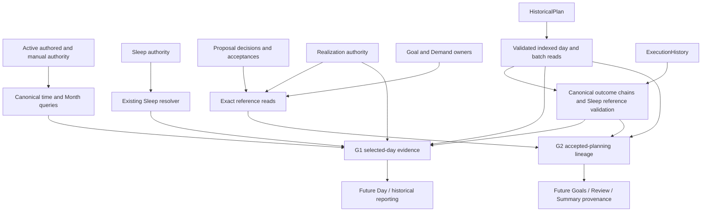

# Task 9.19 — Canonical Product Evidence Projection V1 RESULT

## 1. Executive Summary

Implemented G1 selected-day evidence and G2 accepted-planning lineage as independent, deterministic read models with lazy public store entry points. They retain owner-day/as-of separation, frozen publications, execution uncertainty, scoped protection, first-class Sleep layers, and exact accepted iteration identities. No navigation, UI, schema, persistence version or authority mutation behavior changed.

Discovery selected **MODEL B**. The final full suite passes **149 files / 1,493 tests** (18 new tests). Initial gzip is **161,583 bytes**, below the unchanged 170,000-byte limit, with **8,417 bytes** headroom. Both bundle advisories are reported in §86. Day Worksurface and Summary convergence remain future product work.

## 2. Scope and Governing Constraints

Task 9.19, Task 9.17's accepted authority contracts, and Task 9.18's compatibility foundation govern this implementation. Discovery preceded implementation. Changes are confined to pure evidence composition, lazy read adapters, two validated indexed HistoricalPlan read methods, tests and architecture/result documentation.

No persistence schema/version, write command, migration, subscription, dependency, routing, Calendar/Today merge, Summary redesign, HistoricalPlan recovery, found-time semantics, recurring Demand or Progress inference was introduced. Projections are disposable and cannot create, repair or mutate authority.

## 3. Pre-Task Repository State

A fresh root-relative 936-file hash/content baseline was captured in `/tmp/dayframe-919-baseline/` before edits. The repository was already dirty with Tasks 9.9–9.18 code and documents, first-class Sleep modules and a dogfood PDF. Task 9.18 files had been renamed by the user to the repository's current TASK_9.18 names; they were preserved.

Fresh baseline: 146 files / 1,475 tests passed in 60.93 seconds. Baseline production metrics: initial raw 615,328; initial gzip 161,183; largest lazy 59,666; total JavaScript 1,127,979 bytes. Task-relative hashes, rather than HEAD-only diff statistics, identify this task's changes. The initial code-directory capture was replaced with a complete repository-root capture before editing.

## 4. Task 9.17 / 9.18 Inputs Consumed

Consumed `TASK_9.17_PLANNER_SUMMARY_PRODUCT_CONVERGENCE_MOBILE_UX_SPECIFICATION_V1_RESULT.md` and `TASK_9.18_PLANNER_SUMMARY_NAVIGATION_FOUNDATION_V1_RESULT.md`. Relevant contracts: selected day is independent of real as-of; planned/published/actual/Progress are separate; frozen offsets and provenance survive source changes; G1 precedes Day replacement; G2 precedes unified accepted-planning Summary; compatibility surfaces retire only after parity.

The actual query implementations, authority records, indexed HistoricalPlan reader, execution target materializer, Sleep resolver/validator, realization identities, Proposal authority and existing tests were inspected before selecting the architecture.

## 5. G1 Discovery

G1 needs authored setup/manual events and canonical boundaries, existing current Preview/Month evidence, accepted realized facts, required Sleep resolution, retained HistoricalPlan publications, and effective execution chains. Today already composes published current-day outcomes, but accepts only a real evaluation instant; it is not an arbitrary-day API. Month supplies current/manual context but not the complete published/execution/Sleep layers. PlanningReview supplies review-specific classifications, not a replacement historical day model.

HistoricalPlan already has a validated owner/as-of index. Its old public day reader returns only the effective publication. G1 needs retained versions as well, especially for Sleep execution and frozen provenance. A bounded read adapter can expose those validated candidates without new persistence or publication semantics.

## 6. G2 Discovery

G2's durable chain already exists: AcceptedAllocation records identify exact Proposal revision, decision and option; realized facts carry origin IDs plus Goal/Demand revision lineage; Realization records list scheduled fact and claim IDs; V3 publication freezes the entire realized fact. Execution's planned reference can match the canonical realized reference. Goal and exact Demand-revision lookups provide separately labeled source context.

No accepted-allocation supersession/revocation authority was discovered. Proposal lifecycle/successor metadata concerns Proposals and cannot silently replace a retained acceptance. Accepted allocations may remain persisted as `realization: unrealized` even after a separate Realization record exists; the Realization owner must determine realization state.

## 7. G1 / G2 Architecture Classification

**MODEL B — Separate G1 and G2 projections sharing only low-level references/types.**

A: G1 consumes authored/current schedule, canonical time, realization, Sleep, publication and execution owners. B: G2 consumes Goal/Demand context, Proposal/acceptance, realization, publication and execution owners. C: lawful shared vocabulary is scoped availability and existing reference/evidence types. D: the output contracts remain separate. E: neither projection calls or depends on the other. F: no missing semantic decision, schema evolution or dependency is required. Missing currentness is represented as not represented; unreadable source records are not reconstructed.

Models C/E and their stop conditions were not triggered. Existing partial readers are reused, but do not already provide both complete product contracts, so Model D was not selected.

## 8. Canonical Authority Owners Discovered

| Owner | Authority retained |
|---|---|
| Active authored setup / manual-event owner | Current source definitions, incarnations, explicit manual events |
| Canonical user-day resolver | Effective segment boundaries and owner windows |
| Preview + monthly query | Disposable current planning, day-scoped attention and manual display geometry |
| Goal / GoalPlanning surfaces | Current Goal and exact retained Demand revision |
| Proposal surface | Proposal revisions, decisions and Accepted Allocations |
| Realization surface | Immutable accepted footprint realization and fact identities |
| Sleep requirement/resolution | Current requirement, joint placement, guards and protection |
| HistoricalPlan surface | Validated immutable publication batches/days, protection and durability |
| ExecutionHistory / Sleep validator | Assertions, correction/retraction chains and publication-reference integrity |
| Progress owner | Remains independent; not queried to manufacture progress |

## 9. Existing Query / Read-Model Inventory

Reused: `resolveUserDayContainingInstant`, `resolveUserDayWindowForLabel`, `addUserDayLabels`, `queryMonthlyPlanner`, `resolveRequiredSleep`, `visibleInterval`, `createDurableOccurrenceReference`, `materializeHistoricalPlanExecutionTarget`, `publishedSleepExecutionTarget`, `buildExecutionHistoryItems`, `validateSleepExecutionPublications`, `realizedScheduleReference`, exact Goal/Demand lookups, Proposal/Realization read exports, and HistoricalPlan's existing indexed candidate/batch validation.

Inspected but deliberately not used as substitutes: queryToday (would conflate selected day with evaluation instant), full history export for each day (unbounded unrelated reads), full scheduling generation for ordinary navigation, and component-local presentation joins. Existing consumer queries remain intact.

## 10. Projection Architecture Decision

Separate pure builders receive evidence snapshots; adapters obtain canonical records and status, read indexed history, and delegate composition. No everything-model is introduced. G1 exposes family-scoped availability and native Sleep qualification. G2 exposes iterations, facts, source coverage, partial/complete fact coverage, lookup knowledge and current source context.

The new HistoricalPlan methods are read-only extensions using existing physical validation. Sleep execution protection remains global across retained Sleep references: exact referenced batches are fetched by ID before calling the existing validator. Unrelated publications are not exported or scanned.

## 11. Module Placement

Pure composition and low-level vocabulary live under `code/src/core/productEvidence/`. The G1 type references the repository's existing DayFrameState read snapshot, consistent with existing Month/read-model dependencies; it performs no storage access. Adapters live under `code/src/state/`, accept read-only source capabilities, and return explicit invalid/error states.

DayFrameStore exposes dynamically imported `querySelectedDayEvidence` and `queryAcceptedPlanningEvidence`. The shell imports neither implementation and gains no subscription. HistoricalPlan retains physical validation ownership.

## 12. Shared Evidence Vocabulary

`Evidence<T>` distinguishes readable values from protected, unavailable, incomplete and not-applicable families. Unavailable variants carry a reason and no counterfeit empty value. PublicationEvidence retains canonical batch/day/durability; ActualEvidence retains ExecutionHistoryItem chains. `stableKey`, ID sorting and canonical owner-label validation are small shared utilities.

An available payload means that family is readable; consumers must additionally honor native qualification (notably Sleep), freshness, and explicit G2 fact coverage. There is no single universal product-truth or time-ownership object.

## 13. G1 Public Contract

Public entry: `store.querySelectedDayEvidence({ ownerDay, asOf })`. Implementation: `state/selectedDayEvidenceQuery.ts`; pure builder: `core/productEvidence/selectedDayEvidence.ts`.

Top-level states: `projected`, `invalidQuery`, or adapter `error`. Projected output contains `ownerDay`, `asOf`, `mode`, `currentCanonicalContext`, `authored`, `manual`, `planning`, `realized`, `sleepPlanning`, `publicationCoverage`, `published`, `actual`, `completeness: scopedByEvidenceFamily`, and `nextOwnerDay`.

A consumer selects the families its claim requires. Readable empty publication history means not published; a retained empty publication is still published. Protected/unavailable data is never represented by an empty family value. No overall claim that an entire day is complete is made.

## 14. G1 Input Semantics

`ownerDay` must be a valid canonical local owner label. `asOf` must be an exact canonical ISO UTC instant, validated through the existing Today instant validator, without invoking Today. Invalid input returns before source reads. The query does not set any planning/review/publication range.

Current authored/Preview/Sleep context is a read of current source state, not a historical reconstruction as of that instant. Publication visibility and execution-chain projection are evaluated at as-of. This distinction is explicit in the contract and output layer names.

## 15. Owner-Day / As-Of Separation

The complete top-level temporal contract is below. Nested frozen/source records retain their native time fields unchanged; the projection does not reinterpret them.

| G1 field / claim | Governing coordinate |
|---|---|
| ownerDay, nextOwnerDay | ownerDay only |
| asOf | Real evaluation instant only |
| mode | Both: selected label versus current canonical owner at as-of |
| currentCanonicalContext.selected | ownerDay + current effective authored boundaries |
| currentCanonicalContext.current | asOf + current effective authored boundaries |
| authored | Neither selector: explicitly current source snapshot |
| manual | ownerDay selection; current authored event/geometry, not as-of reconstruction |
| planning | ownerDay / physical intersection; current Preview; generatedAt is source metadata |
| realized | ownerDay / physical intersection; retained current realization authority |
| sleepPlanning | ownerDay range; current requirement/authority, native guard-owner output |
| publicationCoverage / published | Both: owner selection and publishedAt ≤ asOf |
| published effective | Latest canonical retained publication visible at as-of |
| published snapshot, frozenDay, timing, identity | Frozen record; neither coordinate rewrites it |
| published actual match / outcomeKnowledge | Both, via selected publication identity and execution recordedAt cutoff |
| published reporting target | Frozen subject/materializer + current protection; commands recheck admission |
| actual | Both: frozen assertion owner, complete subject chains with recordedAt ≤ asOf |
| family status / reason, completeness marker, version | Source qualification / contract, not date-derived truth |

Unlike G2's explicit acceptedAt/realizedAt visibility, G1's realized layer is labeled current accepted/realized context. It does not claim to reconstruct historical mutable setup.

## 16. Canonical Day Boundary Semantics

Canonical resolver functions own effective boundaries and day transitions. A 03:00 global boundary and a 06:00 effective segment boundary are covered in tests. 05:59 and 06:01 around the effective boundary resolve differently without UTC date slicing or fabricated Today time.

Physical intersection can expose an adjacent-owner current fact, but its `ownerDay` and `membership` remain explicit. Full geometry and visible clipping are separate. Published snapshots retain frozen offsets/boundaries; current setup changes never reclip or relabel frozen publication.

## 17. G1 Evidence Families

Implemented families: current authored Work/Commitment definitions and preferences; explicit manual events; current Preview Work/Commitment evidence and canonical day-scoped friction/unplaced items; productive/support/protection realized facts; current Sleep resolution and guards/buffers; all retained selected-owner publications including Sleep; effective actual/execution chains including unplanned Sleep; scoped protection and subject-specific published action targets.

Without Preview, planning is unavailable rather than synthesized by running the scheduling engine. Authored/manual, realization, publication and actual evidence do not depend on Preview freshness. Attention is limited to evidence the existing Month query can assign to the day; it is not a new global friction/readiness aggregate.

## 18. G1 Authority Layers

G1 keeps separate authored/manual, `derivedCurrentPlanning`, `acceptedRealized`, current Sleep, immutable published and actual families. Historical publications are retained rather than overwritten by a latest current schedule. Protected/unknown states qualify their own family or subject.

There is no flattened `events[]` claiming that a generated block, manual event, frozen published item and actual assertion have equal authority.

## 19. G1 Product Subjects

Existing subjects are preserved: Work; legacy/current Commitment blocks; manual events; productive Goal work; support activity; buffer protection; first-class Sleep. Realized roles use their canonical `scheduleRole` values. Publications retain their discriminated snapshot versions/source families, including V3 accepted realization and V4 Sleep.

A second exhaustive semantic subject enum was unnecessary. Generic imported/rule-derived blocks retain their native fact/source and reference-construction qualification; they are not granted report authority because they appear in Preview.

## 20. G1 Identity / Provenance

Manual identity is the existing event ID plus incarnation in its canonical target. Derived Work/Commitments retain occurrence identity and durable-reference construction result; failure to construct a durable reference stays explicit. Realized facts retain `id`, `origin`, `lineage` and original owner.

Published identity combines publication batch with the frozen reference; Sleep additionally retains snapshot ID in the frozen Sleep payload. Actual identity is the canonical subject ID and record/revision chain. No title, start time, array index, display order or new persisted ID establishes identity.

## 21. G1 Productive / Support / Protection Semantics

Realized `productiveGoalWork`, `supportActivity`, and `bufferProtection` remain distinct. Full fact timeSemantics/executionEligibility are retained; buffers are protection, not activities. The published target materializer rejects buffer reporting.

Sleep buffers remain native footprint/protection geometry on the Sleep resolution/snapshot, not extra productive activities. Legacy composition metadata is preserved on its existing source facts/snapshots rather than reverse-engineered from adjacency.

## 22. G1 Sleep Evidence

G1 invokes the canonical Sleep resolver once for a one-owner requested range. Its native output includes notConfigured/notApplicable, satisfied occurrences, infeasible conflicts, searchIncomplete, protected/contextIncomplete/invalid qualification, required/guard owners and full footprint geometry. An available outer query payload does not override that native qualification.

Published Sleep is a separate frozen V4 layer, with native sleepCoverage or legacyUnavailable. Actual Sleep uses canonical ExecutionHistory chains and frozen publication validation; explicit skipped, corrected, retracted and unplannedSleep subjects remain distinguishable. Current Sleep requirement deletion does not erase frozen Sleep or actual evidence. Legacy Commitment category heuristics are not used to construct first-class Sleep.

## 23. G1 Published Evidence

Indexed owner/as-of candidates include all retained publications for the selected owner, sorted by publishedAt and stable batch ID. Each retains batch identity, published-at, durability, frozen day, sleep coverage, frozen item snapshots and timing semantics. The last canonical visible publication is marked effective; older retained versions remain available for provenance/actual interpretation.

No publication is generated, repaired, normalized, rewritten or substituted with Preview. Known-empty publication and no publication are different states.

## 24. G1 Actual / Execution Evidence

The execution adapter preserves whole subject chains, selects frozen owner labels, then projects records visible at as-of using `buildExecutionHistoryItems`. It exposes currentOutcome, currentRecord, snapshot, subject and revisions. Retractions yield unknown current outcome while retaining the retraction record; skipped is explicit evidence, not absence.

All retained publishedSleep references are validated using the existing validator, including subjects outside the selected day/as-of. Only exact referenced batches are fetched. Execution quarantine/protection/unavailability propagates before exposing actionable reporting targets.

## 25. G1 Manual Evidence

Manual events use the existing Month projection's geometry and edit target, retain current authored source records and their explicit owner, and are labeled `notExecutionEvidence`. They are available without a Preview. Cross-midnight event ownership stays with the existing manual owner label.

Any existing source association is retained in the source record; duration is not turned into Progress or labeled Found Time. An actual assertion about an item remains a separate execution record.

## 26. G1 Historical Evidence

Historical evidence is read from retained publication and execution owners. Source titles, Goal labels, realized lineage, Sleep context and frozen offsets remain as recorded. Current setup/Goal context may coexist in a separately named family; it does not rewrite history.

Arbitrary selected days use the same G1 contract, with mode and availability differences. Generic historical reporting can later consume its canonical target materializations without abusing Today.

## 27. G1 Protection Semantics

Protection propagates by dependency. Unreadable HistoricalPlan produces a protected/unavailable published family rather than empty items; independent readable manual/authored context can remain available. Execution protection suppresses published report targets and explicit outcome claims. Foundational protection remains visible in realized/current Sleep qualification.

The additional batch reader preserves existing global Sleep execution-reference validation, even when a broken reference belongs to another selected day. No history recovery or weakened admission path was added.

## 28. G1 Completeness / Availability

`completeness: scopedByEvidenceFamily` requires consumers to check each needed family. `available` with an empty list is readable empty evidence for that family only. Planning noPreview/outsidePreview is unavailable; stale Preview is explicitly stale. Sleep retains its more precise native incomplete/infeasible/protected states. Publication has published/notPublished/protected/unavailable distinctions.

G2 separately exposes overall source completeness, per-source status and fact `coverage: complete|partial`. A readable partial historical fallback does not imply that missing current lineage is absent.

## 29. G1 Reporting Eligibility

Generic published reportability comes only from `materializeHistoricalPlanExecutionTarget`; Sleep targets come from `publishedSleepExecutionTarget`. Buffer protection remains notReportable. Unpublished planning and current realized facts carry no generic completion permission.

`targetAvailable` means a canonical target can be supplied to the named existing command, with `admission: commandRechecksAuthority`. It is not `canComplete`, not a promise that a future write will succeed, and not a bypass of command-level concurrency/protection checks. When execution evidence is protected/unavailable, reporting is unavailable.

## 30. G1 Action References

Published generic targets retain reference and frozen execution snapshot for `recordExecution`. Sleep targets retain publicationBatchId/snapshotId/reference through the canonical publishedSleep subject for the existing reportPublished command. Mapping those fields to the command is mechanical, not semantic reconstruction.

Actual items expose subjectId/currentRecord.id and revision chains required by existing correction/retraction controls. Manual targets retain event ID/incarnation; realized lineage retains Goal/accepted IDs for navigation. The projection calls none of these actions and invents no unsupported action for buffers, unpublished items or unknown lineage.

## 31. G1 Past-Day Contract

Past mode exposes frozen retained publications and as-of execution, plus clearly labeled current authored/manual/planning/realized/Sleep context when readable. Current source changes do not reconstruct a missing past plan. No publication remains notPublished; protected history remains protected. Corrected/retracted execution is projected at the real cutoff.

## 32. G1 Current-Day Contract

Current mode combines readable current source/planning/realized/Sleep families with any published plan and actuals visible so far. Every layer retains its authority and qualification. Current generated planning is never automatically published or executed.

## 33. G1 Future-Day Contract

Future mode exposes lawful current source, manual, planning, realized and Sleep context. Future-owner publication can be visible if publishedAt is already at/before as-of. Actuals come only from explicit canonical records; the query infers neither future completion nor future Progress and fabricates no future evaluation instant.

## 34. G1 Determinism

Explicit inputs determine output. Core builders do not call Date.now, allocate IDs, read component state or mutate arguments. Current boundaries, ordered references and source snapshots determine projection. Sleep uses the existing deterministic resolver. Tests repeat queries and reorder realization/acceptance input arrays; semantic results remain equal.

Output is cloned so consumer mutation cannot edit authoritative input. Historical source arrays are filtered by owner/range/as-of and ordered before composition.

## 35. G1 Read-Only Audit

Public store G1/G2 calls were measured after real-store bootstrap. LocalStorage writes, durable database mutations and authority command entry points were observed; queries wrote nothing and left authored state equal. The adapters receive read-only capabilities, and pure builders import no persistence/writer surface.

Read-time integrity detection can report existing protected authority. That is not repair or persistence. The full store's pre-existing bootstrap behavior is awaited before the mutation-isolation measurement.

## 36. G2 Public Contract

Public entry: `store.queryAcceptedPlanningEvidence({ startUserDayDate, endUserDayDateExclusive, asOf, select? })`. Pure builder: `buildAcceptedPlanningEvidence`; adapter: `state/acceptedPlanningEvidenceQuery.ts`.

Top-level states: projected, invalidQuery, error. Projected output includes query, iterations, facts with coverage, unresolvedHistorical, completeness, sourceCoverage, lookup (found/notFoundInRange/unknown), `progress: notInferred`, and adapter currentSourceContext. Iterations retain full accepted authority and exact Proposal/decision references; facts retain role, origin, lineage, source verification and independent publication/execution relations.

## 37. G2 Query Directions

One bounded query supports owner range plus optional selector `{ kind: goal|acceptedAllocation|scheduledFact, id }`. No selector returns accepted planning in the range; Goal selector retains distinct accepted iterations; allocation and fact selectors narrow by exact canonical IDs. All directions require an explicit owner range (maximum 366 labels), including historical-only fact lookup.

This supports Day detail, Goal/Review provenance and future Summary without an unbounded global everything query. notFoundInRange is scoped absence, not proof no matching object exists anywhere.

## 38. G2 Goal / Demand Relationship

Accepted claims and realized lineage identify `goalId`, `demandId`, `demandRevision`, and `demandProjectionId`. The state adapter reads current Goal by exact ID and retained Demand by exact ID/revision, labels them `currentGoalAndExactDemandRevisionNotFrozenPublication`, and preserves unavailable/protected/notFound results.

Current source context is optional evidence alongside durable origin. Missing current Goal/Demand cannot erase retained acceptance or frozen publication, and cannot justify guessing lineage from a current title.

## 39. G2 Proposal Provenance

Accepted allocation `proposalId`, `proposalRevision`, `sourceOptionId` and `decisionId` join exact stored Proposal revision and decision. Fact origin supplies the same reference chain. Projected Proposal detail keeps ID/revision, generatedAt, lifecycle, scope, predecessor/successor and provenance.

Proposal lifecycle is current record metadata, not a reconstructed lifecycle at historical as-of. Superseded Proposal metadata does not imply revoked accepted authority. Missing exact Proposal records are unavailable/protected rather than recreated from current Goal state.

## 40. G2 Accepted Allocation Provenance

Each AcceptedAllocation ID/revision stays distinct, with acceptedAt, decisive snapshot, accepted claims, scope, assignments and productive/support/buffer/resource amounts. Visibility uses acceptedAt ≤ asOf. Iteration ordering is stable ID order, not “newest wins.” Fact detail provides the exact acceptance reference; full accepted detail remains on the iteration.

Network+ A retains 600 productive minutes and B retains 1,200; they are never merged into a 1,800-minute synthetic acceptance.

## 41. G2 Realization Provenance

Realization joins exact realization ID and accepted allocation ID/revision, with Proposal/decision/claim identities retained. Realization owner records, not the accepted record's legacy unrealized marker, determine realized versus acceptedButUnrealized. Visibility uses realizedAt ≤ asOf.

A protected/unavailable realization source yields unknown realization state, not acceptedButUnrealized. Existing atomic realization semantics mean no new partially-realized authority label is needed.

## 42. G2 Scheduled-Fact Provenance

Scheduled fact ID is durable. `origin` links realization, acceptance/revision/claim, Proposal/revision/option and decision. `lineage` links Goal/Demand/revision/projection, productive opportunity, parent candidate and support/protection relationship.

`verification: resolved` requires exact available Proposal/decision/acceptance/claim/realization links to agree. Historical-only references remain `retainedReferenceOnly`; source records are not fabricated. Fact publication and execution relationships are separate evidence fields.

## 43. G2 Productive / Support / Protection Lineage

Productive, support and protection facts share canonical origin while keeping distinct roles, IDs, geometry and relationships. Support's productiveClaimId and protection's support/productive relationship come from stored lineage, never adjacency. Buffer facts remain non-executable and cannot contribute invented Progress.

## 44. G2 Accepted-but-Unrealized State

A visible accepted allocation with no canonical realization returns acceptedButUnrealized and no manufactured schedule facts. Protected or unavailable realization authority returns unknown. The regression includes acceptance C alongside realized A/B, proving unscheduled acceptance is retained as an iteration rather than hidden.

## 45. G2 Publication Relationship

V3 publication snapshots freeze the full realized fact and origin/lineage; G2 links them by scheduled fact ID and retains frozen snapshot, batch ID, publishedAt and frozen owner/boundary/offset metadata. Publications do not create acceptance. Multiple retained versions remain visible within the requested owner range/as-of.

Older legal V1/V2 accepted snapshots without a V3 frozen fact appear in `unresolvedHistorical` with `legacyLineageUnavailable`; coverage is partial and an otherwise empty lookup is unknown. Goal selectors retain this uncertainty because labels cannot reconstruct missing origin. Historical-only V3 facts can supply provenance when current records are unavailable. Verification remains limited to retained references until exact source records are readable. Full unrelated day contents are not repeated in every fact's publication detail.

## 46. G2 Execution Relationship

Execution joins planned subjects through `durableOccurrenceReferencesEqual` against `realizedScheduleReference(fact)`. Exact subject/record chains are returned as execution evidence. Executed, accepted, realized, published and Progress are not synonyms. Corrections/retractions affect execution projection, not accepted origin or frozen publication.

## 47. G2 Progress Boundary

G2 explicitly returns `progress: notInferred` globally and per fact. It computes no Goal Progress from accepted, realized, published or executed duration. Existing Goal measurement/progress commands and storage remain unchanged and are not invoked by either query.

## 48. G2 Currentness Semantics

Lawful states are retained accepted authority, realized/acceptedButUnrealized/unknown realization, exact publication relationships and explicit execution records. Accepted currentness reports `supersession: notRepresented`. Proposal lifecycle is separately qualified as not revoking acceptance.

No latest timestamp, greater effort, title match, Goal revision, shared window or temporal geometry implies supersession. Current Goal and exact Demand context is separate from frozen historical evidence. Future consumers must not turn an unavailable source into stale/revoked/false without new canonical authority.

## 49. Network+ Multi-Acceptance Regression

The validated fixture uses one Goal reference (`goal-network`, displayed current context “Network+ Study”), distinct Proposal identities, Accepted Allocations A/B, 600/1,200 productive minutes, and separate canonical realizations with productive/support/protection facts. Acceptance C is intentionally unrealized. ProposalAuthority and RealizationAuthority validators both accept the fixture.

Tests prove exact fact→iteration resolution, distinct proposals, common role-specific provenance, no accepted supersession, three independent iterations, all selector directions, frozen publication relationships, and source Goal renaming without rewriting history. The matrix in §54 identifies the fixture's durable linkage without relying on display labels.

## 50. Authority-Source Matrix

| Projected Evidence | Canonical Source | Authority Layer | Mutable/Frozen | Can Be Protected? | Projection May Infer? |
|---|---|---|---|---|---|
| Current boundaries / authored setup | Active + canonical resolver | Authored context | Current | Yes | Only canonical resolver classification |
| Manual events | Manual owner + Month geometry | Authored | Current | Yes | No execution inference |
| Preview Work/Commitments | Existing Preview | Derived current planning | Disposable | Yes / unavailable/stale | No publication inference |
| Day attention | Month's owner-scoped friction/unplaced query | Derived corrective context | Disposable | Yes | No new readiness/Proposal merge |
| Realized roles | Realization owner | Accepted/realized | Retained records | Yes | Exact role/reference joins only |
| Sleep requirement/resolution | Sleep owner/resolver | Current derived foundation | Current/disposable | Yes | Existing resolver only |
| Published generic / Goal / Sleep items | HistoricalPlan | Published/historical | Frozen | Yes | No |
| Actual assertions/corrections/retractions | ExecutionHistory | Actual | Append/correct/retract chain | Yes | Canonical chain projection only |
| Proposal/acceptance iteration | Proposal authority | Proposed/accepted | Retained; lifecycle metadata current | Yes | No replacement inference |
| Goal / exact Demand context | Goal and GoalPlanning | Current source / retained revision | Separately labeled | Yes | No historical relabeling |
| Reporting targets | Existing target materializers | Subject command target | Frozen target/current admission | Yes | No generic completion permission |
| Progress | Existing independent owner | Measurement | Unchanged | Existing rules | NO; not inferred |

## 51. Temporal-Semantics Matrix

| Field / Claim | ownerDay | asOf | Frozen Historical Time | Current Source Time |
|---|---|---|---|---|
| G1 selected canonical window | Yes | No | No | Effective current preferences |
| G1 current owner / mode | Selected comparison | Yes | No | Effective current preferences |
| Current Preview / manual / realized / Sleep geometry | Owner/intersection | Not a historical reconstruction | No | Yes |
| G1 publication membership/effective version | Yes | publishedAt cutoff | Yes | No |
| Actual chain visibility | Frozen owner | recordedAt cutoff | Snapshot + assertion times | No inferred actual |
| Frozen publication timing / labels | Retained owner | Visibility only | Yes, including offsets | Never overwritten |
| G2 acceptance visibility | Explicit range membership | acceptedAt cutoff | Accepted snapshot | No title match |
| G2 realization visibility | Fact owner range | realizedAt cutoff | Realization origin | No latest-wins rule |
| G2 Proposal lifecycle/current Goal | Identity only | Not reconstructed as-of | Not a frozen claim | Yes, explicitly qualified |
| G2 publication/execution relationships | Requested owner range | Published/recorded cutoff | Yes | No |
| Protection / target admission | Relevant dependency scope | Existing retained-reference checks also inspect current authority | Preserved | Command rechecks at write |

See §15 for every G1 top-level field and nested interpretation. The half-open owner range is not a physical execution-time filter and does not become a planning horizon.

## 52. Identity / Provenance Matrix

| Product Subject | Durable Identity Source | Parent/Origin Reference | Historical Identity Available? | Heuristic Used? |
|---|---|---|---|---|
| Work | Existing occurrence/durable reference | Work cycle/segment/source incarnations | Yes, native snapshots | No |
| Commitment | Existing occurrence/durable reference | Template/recurrence incarnations | Yes | No |
| Manual Event | Event ID + incarnation | Explicit authored event target | Yes when canonically published | No |
| Productive Goal Work | Realized scheduled subject ID | acceptance/revision/claim + realization + Goal/Demand | Yes, V3 frozen fact | No |
| Support Activity | Distinct realized subject ID | Same origin; stored supportsProductive relationship | Yes, V3 | No |
| Protected Buffer | Distinct realized protection ID | Same origin; stored protection relationship | Yes, V3 | No |
| Sleep | Sleep occurrence reference | Requirement incarnation/revision + owner | Yes, V4 batch/snapshot identity | No |
| Execution | Subject ID + record ID/revision chain | Planned reference or explicit unplanned subject | Yes, frozen execution snapshot | No |

Some derived sources can fail durable-reference construction. Their native result is exposed; the projection does not manufacture durable identity from display geometry.

## 53. Availability-State Matrix

| Situation | Projection State | Items Returned? | Consumer Meaning |
|---|---|---|---|
| Readable family with evidence | available | Yes | Inspect this family's native qualification |
| Readable family with zero evidence | available + empty value | Empty | Known empty only within that family/scope |
| Retained plan with zero occurrences | publicationCoverage published; empty publication items | Empty plan | A publication exists |
| No retained plan at as-of | publicationCoverage notPublished; published available [] | No | No publication, not no activity |
| No Preview / outside Preview | planning unavailable + reason | No planning value | Planning evidence unavailable |
| Stale Preview | planning available, freshness stale | Qualified items | Current cached planning, not history |
| Sleep notConfigured/notApplicable | Native Sleep status in readable resolution | Native result | No applicable current Sleep requirement |
| Sleep searchIncomplete/contextIncomplete/invalid | Native explicit qualification | Native evidence only | Cannot claim complete Sleep planning |
| Protected family | protected + reason, or native Sleep protected | No authoritative substitute | Fail closed for dependent claims |
| Missing execution | available [] / outcomeKnowledge unknown | No assertion | Outcome unknown |
| Explicit nonexecution | Canonical skipped assertion | Yes | Explicit actual evidence |
| Retraction | currentOutcome unknown + retraction record | Chain retained | Prior assertion withdrawn |
| Older accepted publication without V3 lineage | unresolvedHistorical / legacyLineageUnavailable; partial coverage | Frozen reference retained | Cannot claim no accepted work |
| Missing exact lineage source | retainedReferenceOnly + unavailable/protected field | Frozen references may remain | Do not reconstruct missing records |
| Partial G2 sources | completeness partial; facts coverage partial | Readable subset | Empty subset cannot prove absence |
| Complete scoped G2 absence | lookup notFoundInRange | Empty | No matching evidence in requested range |
| Invalid request | invalidQuery | No | Fix owner/range/as-of input |
| Unexpected adapter read failure | error / evidenceQueryFailed | No | Query failed, not an empty result |

## 54. G2 Lineage Matrix

The following IDs are taken from the executable, canonically validated Network+ fixture. Both acceptances reference the same Goal and Demand revision 1; distinct Proposal/acceptance/realization identity remains intact.

| Scheduled Fact | Goal | Demand | Proposal | Accepted Allocation | Realization | Role |
|---|---|---|---|---|---|---|
| `4a50f7f907d94f21` | `goal-network` | `demand-a` | `884d40caa987d973` | `accepted-A` | `7ebb187d41eef988` | `supportActivity` |
| `877a400eb0b02c15` | `goal-network` | `demand-a` | `884d40caa987d973` | `accepted-A` | `7ebb187d41eef988` | `productiveGoalWork` |
| `85854e8691a8dd93` | `goal-network` | `demand-a` | `884d40caa987d973` | `accepted-A` | `7ebb187d41eef988` | `bufferProtection` |
| `9a689ebfd207fe0d` | `goal-network` | `demand-a` | `c29215a553b3b967` | `accepted-B` | `2ad97b4b4ea67d4b` | `supportActivity` |
| `0963b442468e643d` | `goal-network` | `demand-a` | `c29215a553b3b967` | `accepted-B` | `2ad97b4b4ea67d4b` | `productiveGoalWork` |
| `6fd926807baef43d` | `goal-network` | `demand-a` | `c29215a553b3b967` | `accepted-B` | `2ad97b4b4ea67d4b` | `bufferProtection` |

A's productive claim is `claim-A` (600 minutes); B's is `claim-B` (1,200 minutes). `support-A/B` and `buffer-A/B` are separate role-specific claims. C has a distinct accepted ID and no realized fact; it remains acceptedButUnrealized. These names are fixture references, not title-based joins.

## 55. Ordering and Determinism

Owner labels use canonical arithmetic/validation. Publications sort by publishedAt then batch ID; their items sort by stable canonical reference. Pending/durable representations of one publication are deduplicated by batch ID, retaining the pending qualification as in the existing effective-day reader. Realized/current planned items sort by physical start and stable reference/ID. Accepted iterations sort by ID; Demand references sort by Goal/Demand/revision.

Execution ordering and correction/retraction precedence come from the existing execution projection. G2 historical relationships sort by publication time, batch and owner. Sorting does not infer supersession, and no random IDs or insertion-order authority rule exists.

## 56. Protection Propagation

Read adapters check canonical ingress/migration/protection before exposing records. Historical physical validation remains on the HistoricalPlan surface. Execution validation uses all retained Sleep references, fetching each required immutable batch exactly, rather than weakening global Sleep protection to the current owner day.

Independent families may remain readable. G2 sourceCoverage and partial fact coverage make this explicit; a protected acceptance source cannot silently become no accepted planning. Queries do not invoke recovery/export-abandon/write flows.

## 57. Historical Immutability

Tests change current boundary preferences, delete current Sleep requirements and rename current Goal context while comparing frozen publication output. Frozen snapshots and exact lineage remain unchanged. Current context changes only its separate family. Output mutation-isolation tests also prove consumers cannot edit input authority through returned objects.

## 58. Unknown / Empty Discipline

The API never uses an empty array as the sole indication of unavailable evidence. Family status, publicationCoverage, execution currentOutcome/record kind, G2 lookup and partial coverage provide the distinction. A retraction's unknown outcome is still accompanied by a retained retraction record. Explicit skipped remains distinct from missing execution.

A validated older accepted snapshot lacking the V3 fact also preserves unknown lineage rather than a false no-lineage result. Current source absence does not prove no historical lineage; readable historical references can remain while source verification is unavailable.

## 59. Range Semantics

G1 selects exactly one owner label, plus explicit physical intersections in current planning/realized display context; original owners remain unchanged. It derives nextOwnerDay canonically for a one-owner Sleep request.

G2 requires an explicit half-open owner range, 1–366 labels. Accepted membership uses claim owner labels; fact membership uses fact owner labels, not physical-time overlap. Selector IDs narrow within that range. Publication and execution use the same owner scope and real as-of. No query changes Review Scope, Planning Data Horizon, Proposal Horizon or Publication Range.

## 60. Store / State Integration

DayFrameStore adds two lazy async read functions, with type-only public signatures in state/types.ts. G1 captures current state/readiness/foundation; G2 reads Proposal/Realization authority and exact Goal/Demand references. Neither adds a subscription or initializes a persistent cache.

HistoricalPlan adds `getHistoricalPlanDayEvidence` (retained versions through owner/as-of index) and `getHistoricalPlanBatchEvidence` (exact publication lookup for execution integrity). Both reuse existing physical validators. Existing effective-day/range readers and all writer commands remain unchanged.

## 61. Persistence Audit

No projection writes localStorage or IndexedDB. No new object store, persisted cache, key, transaction writer, checkpoint, backup field or restore behavior exists. Indexed reads may expose the canonical owner's existing protection status; they do not repair data.

Mutation-isolation coverage observes storage and commands after bootstrap. Explicit test-fixture authoring/publication/reporting occurs before isolation measurements and never touches the actual dogfood profile.

## 62. Schema Audit

No Active, Profile, Backup, HistoricalPlan, ExecutionHistory, PlanDecision or Sleep execution version changed. `state/types.ts` only declares read API functions; no persisted shape changed. Core authority/type files outside the new productEvidence directory are byte-for-byte unchanged relative to the captured task baseline.

## 63. Consumer-Reuse Assessment

| Consumer | Classification | Assessment |
|---|---|---|
| Calendar selected day | NEEDS LATER CONVERGENCE | G1 is ready; replace compatibility composition only with UI parity |
| Today | NEEDS LATER CONVERGENCE | G1 can support arbitrary owner day without fake Today time; current compatibility remains |
| Future Day Worksurface | READY TO CONSUME | Honor family qualification, frozen timing, owner/intersection and target admission |
| Review Plan provenance | READY TO CONSUME | G2 exact acceptance/fact directions support bounded detail; Review redesign deferred |
| Goals provenance | READY TO CONSUME | Goal selector + current source context; no new Progress inference |
| Summary | NEEDS LATER CONVERGENCE | G2 supports lineage; grouping/filtering and final product layout remain |
| Generic historical reporting | READY TO CONSUME | G1 canonical targets/protection are available; production mount/interaction still needed |
| HistoricalPlan recovery UI | BLOCKED BY OTHER GAP | Query identifies protection but cannot recover authority |
| Sleep inside G2 accepted lineage | NOT APPLICABLE | Sleep is not forced into Goal acceptance provenance |

## 64. Compatibility Assessment

All Task 9.18 compatibility surfaces remain mounted exactly as before. Calendar can later consume G1; Today can eventually retire into a G1-based Day surface after current-day report/correction parity. Historical reporting can use G1's retained publication and materialized targets. Review/Goals/Summary can consume G2 without title/time joins.

No compatibility component is retired here. Mobile Day layout, subject detail/edit/report adapters, navigation context and protection presentation still need product work. General historical recovery is separate from safely showing protected evidence.

## 65. Projection Dependency Graph



There is no G1→G2 or G2→G1 dependency and no product→authority write through these projections. Existing command owners remain separate.

## 66. Architecture Documentation / ADR Assessment

An ADR was warranted because these are canonical product query contracts, not just file organization: `docs/adr/ADR_CANONICAL_PRODUCT_EVIDENCE_PROJECTIONS.md`. It records Model B, owner/as-of distinctions, scoped availability, indexed history, global Sleep reference protection, independent Progress, compatibility consequences and lazy integration.

It explicitly states that projection is read-only/disposable, owns no time/persistence/authority, and cannot create or repair authority. No separate semantic authority or persistence ADR decision was invented.

## 67. Minimal Consumer Integration

No user-visible consumer wiring was necessary. Public store and pure-builder tests demonstrate consumability, selector directions, canonical action targets, current/frozen context and authority isolation. No diagnostic UI or permanent temporary route was added. This preserves the bounded task and avoids premature Day/Summary convergence.

## 68. Mobile Projection Suitability

Outputs contain structured identity, native geometry, subject/role, authority/availability and references rather than a desktop-specific preformatted page. Consumers can show compact item identity/status first and disclose publication, assertion and accepted lineage detail later. G2 keeps whole accepted detail at iteration level and reduces repeated publication owner metadata to the relevant frozen fields.

Phone and desktop receive the same semantic output. No mobile-specific truth, truncated provenance policy, hover-only action or layout-dependent query mode exists.

## 69. Mobile Acceptance Gate

**Mobile Acceptance Gate: NO NEW USER-VISIBLE INTERACTION; EXISTING 9.18 GATE RE-VALIDATED FOR REGRESSION.**

No UI/CSS/navigation file changed against the baseline. The full regression includes the existing navigation, product surface, Month, Today, Review and form-focus suites; the final focused run additionally includes NavigationFoundation's five tests. Thus the previously verified 320/390/768/1280 shell behavior has no changed rendering path to revalidate visually in this query-only slice.

No new browser screenshot/physical-device pass is claimed for 9.19. Projection structure and lazy bundle behavior satisfy this task's non-visible mobile gate; future visible consumers must repeat the full viewport/touch gate.

## 70. Accessibility Impact

No DOM, roles, labels, focus handling, keyboard behavior or controls changed. Existing accessibility-oriented navigation/Month/editor tests pass. New evidence fields preserve distinctions needed for meaningful future accessible labels, without introducing user-facing internal IDs or desktop-only controls.

## 71. Large-Dataset Assessment

The larger G1 fixture contains 500 manual events and 40 durable publication batches across owner days, with 10 repeated selected-day queries. It proves one selected owner's items/publication are returned, indexed reads are used, no full-history export/getAll occurs after bootstrap, and no scheduling generation/write is invoked.

G2's measured fixture contains one Goal, three accepted iterations (two realized), six productive/support/protection facts and one publication; 20 adapter calls are measured. This exercises exact lineage and source lookups, not a claimed large-Goal throughput benchmark. Existing authority exports are in-memory snapshots; no canonical indexed all-acceptance lookup exists to reuse. Execution integrity cost scales with retained Sleep references; referenced batches are read once per query, not all unrelated history.

## 72. Performance Evidence

Diagnostic local measurements (not performance promises):

| Query | Fixture / runs | Minimum ms | Median ms | Maximum ms |
|---|---|---:|---:|---:|
| G1 public store selected day | 500 manual events, 40 publications, 10 runs | 6.059 | 8.247 | 11.538 |
| G2 read adapter | 3 acceptances, 6 facts, 1 publication, 20 runs | 1.122 | 1.238 | 2.688 |

Artifacts: `/tmp/dayframe-919-performance.json` and `/tmp/dayframe-919-performance.json.lineage.json`. The latter also records exact fixture lineage IDs. Timing collection is optional via `DAYFRAME_EVIDENCE_PERF`; ordinary tests write no performance artifact. Runs share the local test environment and can include scheduler/compiler contention. No latency SLO or optimization claim follows from these measurements.

G1 never runs the full scheduling engine. Sleep is resolved once by its existing owner. Indexed day/batch readers avoid unrelated publication export. Full retained execution-reference validation is retained where correctness requires it.

## 73. Focused Test Inventory

| Test file | Semantic coverage |
|---|---|
| `core/productEvidence/acceptedPlanningEvidence.test.ts` (6) | Validated Network+ 10h/20h iterations and all three roles; accepted-unrealized; exact selectors; protected/retained/unknown versus notFound; deterministic input ordering/output isolation; as-of and invalid half-open ranges; legal older accepted snapshot uncertainty |
| `core/productEvidence/selectedDayEvidence.test.ts` (4) | Cross-midnight full/clipped realization geometry; buffer reporting exclusion; frozen boundaries; exact execution joins; known-empty versus no publication; execution protection; output isolation |
| `state/productEvidence.test.ts` (8) | Public past/current/future/as-of; effective boundaries and manual events without Preview; Sleep publication/skipped/correction/retraction/immutability; scoped protection; storage/command isolation; larger indexed-read fixture; current Goal context versus frozen Network+; global off-day Sleep-reference protection |
| Existing `ui/tests/NavigationFoundation.test.tsx` (5) | Two-destination/four-mode hierarchy, canonical current day, context/Back, no navigation writes and protected Today |

Final focused command includes these four files/directories: 23 tests pass. New projection-only coverage is 18 tests in three files. Fixture helpers are not counted as a test suite.

## 74. Owner-Day / As-Of Regression

The real store is queried for a fixed owner at several real evaluation instants and for adjacent owners at the same instant. Mode changes correctly, input asOf is retained, and publication/execution cutoff does not become the selected label. Neither adapter calls queryToday, and no fake selected-date evaluation instant exists.

## 75. Boundary Regression

Regression covers a non-midnight global boundary plus an effective cycle segment override. Before/after 06:00 selects the proper owner; manual cross-midnight end geometry does not change owner identity. Pure G1 tests also retain full Goal-work geometry crossing midnight separately from visible clipping, while frozen publication remains unchanged after current boundary edits.

## 76. Past / Current / Future Regression

Past, current and future labels at the same actual as-of share one G1 contract. A no-Preview state still exposes authored/manual and independent history/actual qualification. The tests assert mode, asOf, known empty manual/actual versus unavailable planning and invalid requests. No mode implicitly publishes or executes.

## 77. Published / Planned / Actual Regression

Sleep integration first produces separate current Sleep resolution and frozen publication with unknown actual, then an explicit skipped assertion, correction and retraction. Generic realized/publication tests join one explicit execution only to its canonical reference. Current planning/realized facts remain separate fields and never become Progress.

## 78. Protection Regression

A protected historical reader returns protected publication while independent manual evidence remains readable. Protected execution suppresses reporting targets and outcome claims. G2 distinguishes readable retained historical lineage from unreadable source records and unknown lookup from complete scoped absence. A broken retained Sleep reference on a different selected day still protects actual evidence through exact batch validation.

## 79. Unknown / Nonexecution Regression

Missing execution yields unknown/no assertion, not skipped. Explicit skipped is preserved. Retraction restores unknown outcome while retaining the retraction record and chain. G2 notFoundInRange requires readable sources; protection produces unknown/partial qualification instead of counterfeit empty authority.

## 80. Read-Only Mutation Regression

Both public store query entry points run under spies after bootstrap. Assertions cover no database mutation, no localStorage write, unchanged authored state, and no publish/report/Sleep report/realize/accept/author/save/abandon/Progress/profile/conversion/generate command invocation. Source capability types expose reads only to adapters. Historical integrity reads are permitted; recovery writes are not.

## 81. Accepted-but-Unrealized Regression

Network+ fixture C is accepted and visible without a Realization record. G2 returns acceptedButUnrealized and no scheduled facts for C, alongside the two realized iterations. When realization authority is protected, G2 returns unknown rather than asserting C is unrealized. No allocation is realized by querying.

## 82. Productive / Support / Protection Regression

Both projections retain canonical productiveGoalWork/supportActivity/bufferProtection roles and exact parent relationships. G1 verifies buffer snapshots are notReportable while published productive/support subjects receive canonical targets. G2 proves all three roles share their own accepted iteration/realization and do not cross-link A to B.

## 83. Historical Mutation Regression

Current Sleep deletion leaves frozen published Sleep intact. Current boundary edits change only current canonical context, not frozen offsets/geometry. Current Goal renaming changes the separately labeled source context without changing projected frozen Network+ fact/publication evidence. Consumer mutation cannot mutate source authority. No actual dogfood data is used.

## 84. Full Regression Results

Fresh baseline: **146 files / 1,475 tests**, 60.93 seconds. Final: **149 files / 1,493 tests**, 72.37 seconds, using `npm test -- --maxWorkers=2` from `code/`. The final regression includes all pre-existing authority, Sleep, publication, execution, restore, protection and navigation tests, plus 18 new tests.

Logs: `/tmp/dayframe-919-baseline-tests.log`, `/tmp/dayframe-919-full-tests.log`, `/tmp/dayframe-919-focused.log`. Timing differences are diagnostic and are not attributed to a speedup. The final duration is recorded in the final log; no timing comparison is used as a product performance claim.

## 85. Build / Static Validation

All required commands pass from `code/`: `npm run format`; `npx prettier --check .`; `npm run lint`; `npm run build` (including TypeScript); `npm run check:bundle`; focused and full tests. `git diff --check` passes from the repository root.

During development, fixture-only nullable/type/category/clock/setup issues were corrected before final validation. A few early npx commands ran from the repository root and were rerun from `code/`. No failing final check was ignored and no dependency/schema threshold was relaxed. Logs use `/tmp/dayframe-919-{format,prettier,lint,types,build,bundle}.log`.

## 86. Bundle Results

| Metric (bytes) | Baseline | Final | Change |
|---|---:|---:|---:|
| Initial raw JavaScript | 615,328 | 617,423 | +2,095 |
| Initial gzip JavaScript | 161,183 | 161,583 | +400 |
| Largest lazy JavaScript | 59,666 | 59,671 | +5 |
| Total JavaScript | 1,127,979 | 1,148,158 | +20,179 |
| Initial gzip hard-limit headroom | 8,817 | **8,417** | -400 |

The unchanged hard gate is 170,000 bytes. Both production projections load through dynamic imports; no heavy projection is imported by the shell. Small store wrappers and validated HistoricalPlan read methods add initial code. SetupScreen remains the largest lazy chunk. The 161,500 initial-gzip headroom advisory and 825,000 total-JavaScript architecture advisory are reported by the policy script; neither threshold was changed or suppressed. Total-size growth is the new read-model/test-excluded production code and shared chunk factoring, not a schema/dependency addition.

Build/bundle logs: `/tmp/dayframe-919-build.log`, `/tmp/dayframe-919-bundle.log`. The exact final initial gzip is **161,583 bytes**, leaving **8,417 bytes** below the hard limit.

## 87. Repository Hygiene

Only three pre-existing baseline files changed: DayFrameStore, state types and HistoricalPlan surface. All other task code is new under productEvidence or its read adapters/tests. No UI/CSS, writer/schema, dependency, existing authority-core file or old task document changed relative to this task's captured baseline.

During work, the specification was externally renamed from its leading-space filename and this result was externally renamed from the requested PHASE_9_TASK_9_19 name to TASK_9.19_CANONICAL_PRODUCT_EVIDENCE_PROJECTION_V1_RESULT.md. Those workspace renames were preserved; there is one result, not a duplicate. The specification content, dogfood PDF and other existing dirty work remain byte-for-byte intact. The actual dogfood browser database was not accessed. Temporary scripts/logs/performance evidence are under `/tmp`; there is one durable RESULT plus the architecture ADR. No commit or push occurred.

## 88. Changed Files

| File | Change |
|---|---|
| `code/src/state/dayFrameStore.ts` | Two lazy read-query entry points |
| `code/src/state/types.ts` | Read API signatures only |
| `code/src/state/historicalPlanSurface.ts` | Validated indexed retained-day and exact-batch read methods |
| `code/src/core/productEvidence/evidence.ts` (new) | Bounded availability/reference/ordering vocabulary |
| `code/src/core/productEvidence/selectedDayEvidence.ts` (new) | Pure G1 contract/composition |
| `code/src/core/productEvidence/acceptedPlanningEvidence.ts` (new) | Pure G2 contract/composition |
| `code/src/state/productEvidenceSources.ts` (new) | Read adapters for publication/actual integrity and scoped outcome chains |
| `code/src/state/selectedDayEvidenceQuery.ts` (new) | Lazy G1 source composition, native Sleep delegation, error handling |
| `code/src/state/acceptedPlanningEvidenceQuery.ts` (new) | Lazy G2 source composition and exact current Goal/Demand context |
| `code/src/core/productEvidence/evidenceTestFixtures.ts` (new) | Validated multi-acceptance/realization fixture |
| `code/src/core/productEvidence/acceptedPlanningEvidence.test.ts` (new) | Six G2 semantic regressions |
| `code/src/core/productEvidence/selectedDayEvidence.test.ts` (new) | Four G1 pure semantic regressions |
| `code/src/state/productEvidence.test.ts` (new) | Eight public/read-adapter regressions and optional diagnostic timing |
| `docs/adr/ADR_CANONICAL_PRODUCT_EVIDENCE_PROJECTIONS.md` (new) | Canonical projection architecture decision |
| `docs/implementation/phase-9/TASK_9.19_CANONICAL_PRODUCT_EVIDENCE_PROJECTION_V1_RESULT.md` (new) | This required result |

## 89. Pre-Existing Dirty Files

The exact pre-task Git status follows. Entries predate this task; only the baseline-relative deltas in §88 belong to 9.19. Captured files outside the three modified state files remain unchanged, including all prior Task 9.18 implementation and user-renamed documents.

```text
 M code/src/core/blocks/placeBlockCandidates.ts
 M code/src/core/blocks/types.ts
 M code/src/core/decisions/createPlanDecisionAcceptanceCandidate.ts
 M code/src/core/decisions/planDecision.ts
 M code/src/core/decisions/replayPlanDecisions.test.ts
 M code/src/core/decisions/replayPlanDecisions.ts
 M code/src/core/engine/generateSchedulePreview.ts
 M code/src/core/engine/reviseSchedulePreview.ts
 M code/src/core/engine/tests/generateSchedulePreview.test.ts
 M code/src/core/execution/executionRecord.ts
 M code/src/core/execution/executionSummary.ts
 M code/src/core/execution/historicalExecutionTarget.ts
 M code/src/core/friction/applySuggestedFix.ts
 M code/src/core/friction/types.ts
 M code/src/core/historicalIntelligence/completionDistribution.ts
 M code/src/core/historicalIntelligence/schedulingRealization.ts
 M code/src/core/historicalPlan/historicalPlan.ts
 M code/src/core/historicalPlan/historicalPlanFingerprint.ts
 M code/src/core/historicalPlan/historicalPlanValidation.ts
 M code/src/core/historicalPlan/materializePlanPublication.ts
 M code/src/core/occurrences/durableOccurrenceReference.ts
 M code/src/core/occurrences/occurrenceIdentity.ts
 M code/src/core/planning/acceptedAllocationRealization.ts
 M code/src/core/planning/allocation.ts
 M code/src/core/planning/capacity.ts
 M code/src/core/planning/competingDemand.ts
 M code/src/core/planning/goalFeasibility.ts
 M code/src/core/planning/proposal.ts
 M code/src/core/today/buildTodayReadModel.ts
 M code/src/state/activeV2.ts
 M code/src/state/activeV2Migration.test.ts
 M code/src/state/capacitySurface.ts
 M code/src/state/createInitialDayFrameState.ts
 M code/src/state/dayFrameBackup.ts
 M code/src/state/dayFrameBackupV3.ts
 M code/src/state/dayFrameProfiles.ts
 M code/src/state/dayFrameRestoreComposition.ts
 M code/src/state/dayFrameRestoreTranslation.ts
 M code/src/state/dayFrameStore.ts
 M code/src/state/executionHistorySurface.ts
 M code/src/state/historicalIntelligenceQuery.ts
 M code/src/state/historicalPlanSurface.test.ts
 M code/src/state/historicalPlanSurface.ts
 M code/src/state/lazyProposalSurface.ts
 M code/src/state/planDecisionSurface.ts
 M code/src/state/planningScopeQuery.test.ts
 M code/src/state/planningScopeQuery.ts
 M code/src/state/proposalSurface.ts
 M code/src/state/realizationSurface.ts
 M code/src/state/schedulePublication.test.ts
 M code/src/state/schedulePublication.ts
 M code/src/state/tests/dayFrameStore.test.ts
 M code/src/state/todayQuery.ts
 M code/src/state/types.ts
 M code/src/ui/DayFrameApp.tsx
 M code/src/ui/GoalSection.tsx
 M code/src/ui/HistoricalIntelligenceSummary.tsx
 M code/src/ui/HistoricalPlanReportingSection.tsx
 M code/src/ui/MonthlyPlannerSurface.tsx
 M code/src/ui/PlannerSurface.tsx
 M code/src/ui/PlanningReviewPanel.tsx
 M code/src/ui/PreviewScreen.tsx
 M code/src/ui/ScheduleReviewPanel.tsx
 M code/src/ui/SetupScreen.tsx
 M code/src/ui/TodaySurface.tsx
 M code/src/ui/acceptedDecisionPresentation.test.ts
 M code/src/ui/acceptedDecisionPresentation.ts
 M code/src/ui/dayFrameUi.css
 M code/src/ui/plannerReviewPresentation.ts
 M code/src/ui/scheduleReviewReadiness.ts
 M code/src/ui/tests/DayFrameApp.test.tsx
 M code/src/ui/tests/HistoricalPlanReportingSection.test.tsx
 M code/src/ui/tests/MonthlyPlannerSurface.test.tsx
 M code/src/ui/tests/PreviewScreen.test.tsx
 M code/src/ui/tests/ProductSurfaces.test.tsx
 M code/src/ui/tests/ScheduleReviewPanel.test.tsx
 M code/src/ui/tests/TodaySurface.test.tsx
 M code/src/ui/tests/scheduleReviewReadiness.test.ts
 M docs/architecture/ARCHITECTURE_CHARTER.md
 M docs/architecture/CAPACITY_ARCHITECTURE_SPECIFICATION_RESULT.md
 M docs/architecture/DAYFRAME_COMPLETE_ARCHITECTURE_SPECIFICATION_v1.0.0.md
?? DayFrame_Dogfood_Pass_02_Findings_Hydration.pdf
?? code/src/core/engine/generatePlanningSchedule.ts
?? code/src/core/engine/tests/preMigrationCorrectness.test.ts
?? code/src/core/engine/tests/workRelativeFootprint.test.ts
?? code/src/core/occurrences/sleepOccurrenceReference.ts
?? code/src/core/planning/deriveFoundationalSchedule.ts
?? code/src/core/planning/foundationalPlanning.ts
?? code/src/core/planning/sleepPlanningIntegration.test.ts
?? code/src/core/sleep/
?? code/src/core/time/physicalOccupancy.ts
?? code/src/state/activeV3.ts
?? code/src/state/activeV4.ts
?? code/src/state/backupTransferSurface.ts
?? code/src/state/constructivePlanningWorkflow.ts
?? code/src/state/dayFrameBackupV13.ts
?? code/src/state/dayFrameBackupV14.ts
?? code/src/state/dayFrameProfilesV3.ts
?? code/src/state/legacySleepConversion.test.ts
?? code/src/state/publicationEligibility.ts
?? code/src/state/sleepCorrectiveIntegration.test.ts
?? code/src/state/sleepExecutionCommand.ts
?? code/src/state/sleepFoundation.test.ts
?? code/src/state/sleepHistoryQuery.ts
?? code/src/state/sleepPlanningIntegration.test.ts
?? code/src/state/sleepPublicationExecution.test.ts
?? code/src/state/sleepPublicationStorage.test.ts
?? code/src/state/sleepResolutionQuery.test.ts
?? code/src/ui/GoalPlanningSection.tsx
?? code/src/ui/LegacySleepConversionSection.tsx
?? code/src/ui/ScheduledGoalFacts.tsx
?? code/src/ui/SleepHistorySection.tsx
?? code/src/ui/plannerNavigation.ts
?? code/src/ui/planningResultCopy.ts
?? code/src/ui/tests/ConstructivePlanningWorkflow.test.tsx
?? code/src/ui/tests/LegacySleepConversionSection.test.tsx
?? code/src/ui/tests/NavigationFoundation.test.tsx
?? code/src/ui/tests/SleepHistorySection.test.tsx
?? docs/adr/ADR_FIRST_CLASS_SLEEP_DOMAIN_AND_PERSISTENCE_FOUNDATION.md
?? "docs/implementation/phase-9/ TASK_9.19_CANONICAL_PRODUCT_EVIDENCE_PROJECTION_V1.md"
?? docs/implementation/phase-9/TASK_9.10_FIRST_CLASS_SLEEP_ARCHITECTURE_SPECIFICATION.md
?? docs/implementation/phase-9/TASK_9.10_FIRST_CLASS_SLEEP_ARCHITECTURE_SPECIFICATION_RESULT.md
?? docs/implementation/phase-9/TASK_9.11_FIRST_CLASS_SLEEP_DOMAIN_AND_PERSISTANCE_FOUNDATION.md
?? docs/implementation/phase-9/TASK_9.11_FIRST_CLASS_SLEEP_DOMAIN_PERSISTENCE_FOUNDATION_RESULT.md
?? docs/implementation/phase-9/TASK_9.12_FIRST_CLASS_SLEEP_DERIVATION_AND_FEASIBILITY_FOUNDATION.md
?? docs/implementation/phase-9/TASK_9.12_FIRST_CLASS_SLEEP_DERIVATION_FEASIBILITY_FOUNDATION_RESULT.md
?? docs/implementation/phase-9/TASK_9.13_FIRST_CLASS_SLEEP_CAPACITY_AND_PLANNING_INTEGRATION_V1.md
?? docs/implementation/phase-9/TASK_9.13_FIRST_CLASS_SLEEP_CAPACITY_PLANNING_INTEGRATION_V1_RESULT.md
?? docs/implementation/phase-9/TASK_9.14_FIRST_CLASS_SLEEP_FRICTION_AND_CORRECTIVE_AUTHORITY_V1.md
?? docs/implementation/phase-9/TASK_9.14_FIRST_CLASS_SLEEP_FRICTION_CORRECTIVE_AUTHORITY_V1_RESULT.md
?? docs/implementation/phase-9/TASK_9.15_FIRST_CLASS_SLEEP_PUBLICATION_EXECUTION_AND_HISTORICAL_AUTHORITY_V1.md
?? docs/implementation/phase-9/TASK_9.15_FIRST_CLASS_SLEEP_PUBLICATION_EXECUTION_HISTORICAL_AUTHORITY_V1_RESULT.md
?? docs/implementation/phase-9/TASK_9.16_FIRST_CLASS_SLEEP_LEGACY_CONVERSION_AND_PRODUCT_TRANSITION_V1.md
?? docs/implementation/phase-9/TASK_9.16_FIRST_CLASS_SLEEP_LEGACY_CONVERSION_PRODUCT_TRANSITION_V1_RESULT.md
?? docs/implementation/phase-9/TASK_9.17_PLANNER_SUMMARY_PRODUCT_CONVERGENCE_MOBILE_UX_SPECIFICATION_V1_RESULT.md
?? docs/implementation/phase-9/TASK_9.17_Planner_SUMMARY_PRODUCT_CONVERGENCE_AND_MOBILE_UX_SPECIFICATION_V1.md
?? docs/implementation/phase-9/TASK_9.18_PLANNER_SUMMARY_NAVIGATION_FOUNDATION_V1.md
?? docs/implementation/phase-9/TASK_9.18_PLANNER_SUMMARY_NAVIGATION_FOUNDATION_V1_RESULT.md
?? docs/implementation/phase-9/TASK_9.8A_POST_DOGFOOD_PRODUCT_REACHABILITY_AND_WORKFLOW_AUDIT.md
?? docs/implementation/phase-9/TASK_9.8A_POST_DOGFOOD_PRODUCT_REACHABILITY_AUDIT_RESULT.md
?? docs/implementation/phase-9/TASK_9.8B_CONSTRUCTIVE_PLANNING_REACHABILITY_AND_PRE_MIGRATION_CONVERGENCE_V1.md
?? docs/implementation/phase-9/TASK_9.8B_CONSTRUCTIVE_PLANNING_REACHABILITY_PRE_MIGRATION_CONVERGENCE_RESULT.md
?? docs/implementation/phase-9/TASK_9.8C_POST_DOGFOOD_PRODUCT_REACHABILITY_AND_WORKFLOW_AUDIT.md
?? docs/implementation/phase-9/TASK_9.8C_POST_DOGFOOD_PRODUCT_REACHABILITY_AUDIT_RESULT.md
?? docs/implementation/phase-9/TASK_9.9_PRE_MIGRATION_CORRECTNESS_AND_AUTHORITY_CONVERGENCE_V1.md
?? docs/implementation/phase-9/TASK_9.9_PRE_MIGRATION_CORRECTNESS_AUTHORITY_CONVERGENCE_V1_RESULT.md
```

## 90. Deferred Work

Deferred: final Day Worksurface, Calendar/Today/historical-reporter merger, accepted-planning Summary, provenance UI, Review redesign, general HistoricalPlan recovery, full Sleep authoring UX, found time, recurring Demand and any new Progress semantics. G1 deliberately does not generate a fresh schedule solely to fill absent Preview evidence.

Also deferred: unbounded/global lineage queries, a full historical reconstruction of mutable Goal/Proposal lifecycle, a persistent projection cache, generalized reporting permissions and a cross-family universal completeness claim. These would introduce scope or authority claims not supported here.

## 91. Newly Discovered Risks

No new architecture decision or schema prerequisite emerged. Important constraints were confirmed: accepted realization state must come from the separate Realization owner; Proposal lifecycle cannot revoke acceptance; Sleep execution integrity includes retained references outside the selected day; pending/durable copies of one batch must not be counted twice; native Sleep incomplete/protected status must survive an otherwise readable query payload.

Remaining performance limits are explicit: current authority exports and retained execution records are in-memory scans; exact publication validation can read several referenced batches; G2's range is bounded to 366 labels; no large-Goal SLO was measured. Initial gzip crosses the 161,500 advisory but remains safely under the unchanged hard cap. These are documented constraints, not hidden stop conditions.

## 92. Day Worksurface Readiness Assessment

1. Arbitrary selected owner can now be queried without Today: **yes**, through G1.
2. Past/current/future share a foundation with mode differences: **yes**; current context is not historical reconstruction.
3. Planned/published/actual remain distinct: **yes**, separate qualified families.
4. Protected evidence remains protected: **yes**, including global retained Sleep-reference integrity.
5. Manual events remain authored rather than execution: **yes**.
6. Sleep planning/publication/actual layers remain distinct: **yes**, with native qualification and frozen provenance.
7. Future React consumers can use G1 without reconstructing authority: **yes**, for represented evidence and canonical targets.
8. Remaining work: bounded mobile Day composition, item/detail/edit/report adapters, explicit unknown/protected/loading presentation, native target→command wiring, historical/current interaction parity, and compatibility retirement only after tests. Missing Preview is an explicit unavailable planning family, not a prompt for React to invent a schedule.

## 93. Summary Convergence Readiness Assessment

1. Goal/Demand through scheduled fact is traceable: **yes**, exact IDs/revisions and retained reference qualification.
2. Multiple accepted iterations stay distinct: **yes**.
3. Accepted-but-unrealized is represented: **yes**, with unknown when source coverage prevents a claim.
4. Productive/support/protection preserve common lineage and distinct roles: **yes**.
5. Publication/execution relationships remain independent: **yes**.
6. Summary can consume G2 without title/timestamp heuristics: **yes**.
7. Remaining Summary work: product grouping, period filters, explanatory copy, progressive disclosure, existing historical intelligence integration and measurement-owner Progress views. Any new aggregate metric requires its own lawful read-model contract; G2 is provenance, not a replacement universal Goal summary.

## 94. Task 9.20 Dependency Assessment

1. **G1 complete?** Yes for the specified evidence contract, including explicit unavailable/native incomplete states rather than invented schedule/history.
2. **G2 complete?** Yes for bounded range and exact Goal/allocation/fact directions, retained provenance and lawful currentness limits.
3. **Independent or shared?** Independent Model B projections sharing low-level evidence vocabulary and read helpers.
4. **Is recovery a prerequisite?** Not for a bounded Day view that preserves protected states and disables dependent actions. General recovery remains a separate prerequisite only for a task promising recovery operations or universal access to protected history.
5. **Planner ready?** Yes; G1 is lazy and the 9.18 hierarchy/context remains unchanged.
6. **Summary ready?** Yes to consume G2 in a later bounded UI slice; no new accepted supersession semantics may be inferred.
7. **Smallest next task?** A bounded G1 Day consumer slice with explicit authority layers, mobile item/detail disclosure and canonical reporting adapters, retaining compatibility until parity. Its exact title/scope should be set by the next task; no implementation is included here.
8. **Mobile gate inherited?** 320/390/768/≥1024 reachability, no horizontal overflow or desktop-only gestures, practical touch controls, preserved day/Back/focus, progressive disclosure and identical evidence across layouts. Visible consumer changes require a fresh browser pass.
9. **Bundle headroom?** Exact final headroom is in §86; preserve lazy query/feature boundaries and the unchanged 170,000-byte hard cap.

No projection split or new persistence decision blocks that bounded next slice.

## 95. Completion Assessment

All applicable discovery, G1/G2, read-only authority, immutability, protection, persistence/schema, compatibility, non-visible mobile, regression/static, bundle and repository-hygiene criteria are satisfied. The exact 95-section result and architecture ADR document the contracts, measurements, limits and next-task assessment.

The completion claim is for canonical evidence projections. It does not claim completion of the future Day Worksurface, Summary convergence or historical recovery.

Task 9.19 — Canonical Product Evidence Projection V1 is COMPLETE.
